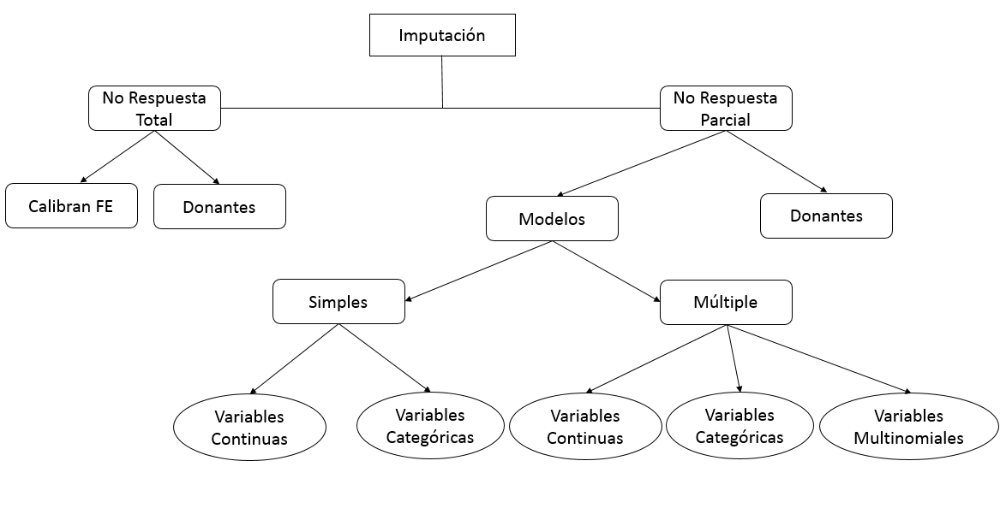

<!-- 


\AddToShipoutPictureFG{
  \AtPageCenter{% or \AtTextCenter
    \makebox[0pt]{\rotatebox[origin=c]{45}{%
      \scalebox{5}{\texttransparent{0.3}{BORRADOR}}%
    }}
  }
}
 --> 

\large
```{r setup, include=FALSE}
knitr::opts_chunk$set(echo = TRUE, warning = FALSE, message = FALSE, fig.pos = "H", out.extra = "")
```
```{r, echo=FALSE}
rm(list = ls())
```


\newpage


# Introducción

## Definición

La guía con lineamientos y orientaciones metodológicas para la imputación de datos estadísticos es un documento que identifica y describe las herramientas y métodos de imputación, considerando aspectos de la imputación por donantes, imputación basada en modelos y entre ellas, tanto los métodos de imputación simple como los métodos de imputación múltiple. Se incluyen ejemplos de imputación en oficinas de estadísticas considerando encuestas conocidas por el público.

Adicionalmente, se realiza un diagnóstico y se revisan antecedentes bibliográficos de los métodos de imputación de datos aplicados institucionalmente. Esta información es clave para el desarrollo del documento, la cual permite conocer espacios de mejora y reconocimiento de métodos actualizados para la producción estadística.

Dentro del alcance de la guía se establecen los límites donde se inicia la imputación de datos faltantes, de esta forma facilita al lector la implementación de estos métodos y que resguarden el vínculo con los procesos de procesamiento de datos del subproceso de "imputar".

En resumen, la guía con lineamientos y orientaciones metodológicas para la imputación de datos estadísticos es un documento de referencia para las oficinas de estadísticas que les permite conocer y aplicar las mejores prácticas en materia de imputación de datos.

## La Imputación

La imputación de datos es una técnica crucial en la recopilación y procesamiento de información tanto en encuestas como en registros administrativos, porque dichos constructos pueden presentar problemas de datos faltantes, lo que compromete la calidad y la integridad de la información a procesar. La imputación se utiliza para estimar y completar los valores faltantes utilizando diversas técnicas estadísticas y de modelamiento.

En el caso de las encuestas, los datos faltantes pueden surgir debido a respuestas omitidas por parte de los encuestados o por no conocer la respuesta a una pregunta en particular o porque se nieguen a contestar. La imputación desempeña un papel fundamental al proporcionar valores estimados para estos datos faltantes, permitiendo así obtener resultados más completos y precisos.

Por otro lado, los registros administrativos, como bases de datos administrativas, también pueden contener datos faltantes debido a errores de ingreso, registros incompletos o fallas en la recopilación de información. Por lo tanto, una contramedida es someter a controles de calidad estadística a los registros administrativos antes de que queden a disposición para ser usados. Esto en atención a que estos registros son valiosos para la producción de estadísticas, pero la presencia de datos faltantes, afecta su utilidad y confiabilidad. De manera que la imputación de datos en registros administrativos es esencial para llenar las brechas y garantizar que se disponga de datos completos y confiables para el análisis estadístico.

En ambos casos, la imputación busca minimizar los sesgos y preservar la integridad de los datos. Se utilizan diversos métodos y enfoques, como la imputación simple, la imputación múltiple y técnicas avanzadas basadas en modelos, para estimar los valores faltantes de manera precisa y robusta.

El el siguiente documento, buscamos realizar un primer diagnostico de como se aborda el problema de los datos faltantes (o perdidos) en nuestro INE. Los abordajes métodologicos los realizaremos tanto con notación matematica, basandonos en el lenguaje de programación @Rsoftware y diversos paquetes disponibles que iremos ilustrando en los diferentes apartados. Adicionalmente, hemos recopilado datos mediante una breve encuesta realizada en la institución, la cual nos ha permitido conocer aspectos relevantes en cuanto al empleo de métodos de imputación.

## Breve cuestionario


Durante el período de septiembre a octubre de 2023, se administró un breve cuestionario con el objetivo de comprender los métodos empleados por los productores estadísticos en la institución y evaluar su nivel de familiaridad con diversas técnicas utilizadas en la producción estadística.

A continuación, presentamos algunos de los resultados obtenidos a través de esta encuesta.

De un total de 21 informantes identificados, 14 de ellos informaron que aplican métodos de imputación en algunos de los productos estadísticos de la institución.

El Departamento de Estadísticas Económicas se destacó al recibir la mayoría de las respuestas, seguido por el Departamento de Estadísticas Sociales y Demográficas en segundo lugar. El método más mencionado con mayor frecuencia fue el de hot-deck, utilizado tanto en los equipos de Estadísticas Económicas como en los de Estadísticas Sociales.

En cuanto a la existencia de documentación relacionada con los métodos de imputación, 8 de los encuestados confirmaron que la tenían, mientras que 6 indicaron que no disponían de documentación asociada. Respecto al software utilizado para implementar estos métodos, R fue la opción más mencionada, seguida por Excel en segundo lugar y STATA en tercera posición.

En relación a los métodos de imputación más populares en nuestra institución, destaca el Hot-deck, luego sigue el Vecino más cercano, que en realidad corresponde a la misma clasificación, pues ambos usan información del mismo set de datos. La tabla siguiente explicita los métodos según su uso.

```{r echo=FALSE}
library(kableExtra)
text_tbl<-readxl::read_excel("tablas/tabla_metodos.xlsx")
kbl(text_tbl, caption = "Tabla resumen de métodos de imputación declarados", booktabs = T) %>%
kable_styling(latex_options = c("striped", "hold_position")) %>%
footnote(general = "Esta tabla busca ilustrar la realidad de uso de estos métodos y señalar la frecuencia con que son usados, marcando la necesidad de documentación oficial, por una parte y por otra, consolidar dichos métodos a nivel institucional.", threeparttable = T,general_title = "Nota: ")
```
\newpage


Además, es importante destacar que los participantes expresaron la necesidad de contar con instancias más centralizadas para compartir experiencias, métodos y técnicas, así como la creación de repositorios que faciliten la utilización e implementación de talleres.


## Mapa conceptual 

Conociendo nuestra realidad quedamos en posición de poder orientarnos usando como directrices los alcances y logros presentes en el estado del arte de esta importante técnica, que nos permitímos exhibir mediante el siguiente diagrama conceptual, para dar el contexto necesario acerca de que hacemos y la preponderancia de los métodos usados en la institución. 





# El problema de los datos faltantes

El análisis de datos puede presentar dificultades cuando faltan valores en el conjunto de ellos. Cuando existen valores faltantes, los cálculos y las inferencias estadísticas pueden verse afectados. En el software R, los valores faltantes se indican con el símbolo `NA`.

En el análisis univariado, calcular la media de un conjunto de números es sencillo usando R. Sin embargo, cuando hay valores faltantes, el resultado de la media se vuelve indefinido. Afortunadamente, R ofrece la opción de eliminar los valores faltantes antes de calcular la media. Este parametro así calculado, puede difererir con la presencia de los valores reales.

En el análisis multivariado, el problema se vuelve más complicado. Por ejemplo, al ajustar un modelo de regresión lineal para predecir los niveles de una variable de interés que se mide diariamente, si hay valores faltantes, R no puede continuar con el análisis. Una forma de solucionar esto es eliminar los registros incompletos antes de ajustar el modelo y nos exponemos a la misma conclusión que el parrafo anterior.

La eliminación de casos incompletos se conoce como eliminación de casos completos. Esto permite que los cálculos se realicen, pero puede introducir complejidades adicionales en la interpretación de los resultados, tal como hemos previsto en los parrafos anteriores.

Además de la eliminación de casos completos, existen otras formas de abordar los datos faltantes. Algunas de estas estrategias incluyen la imputación de valores faltantes, donde se estiman dichos valores en función de los datos existentes, y eventualmente se puede hacer uso de modelos estadísticos para resolver esta misma cuestión.

Es importante tener en cuenta que el enfoque elegido para tratar los datos faltantes puede afectar los resultados finales. No existe una solución única que funcione en todos los casos, por lo que es fundamental comprender las ventajas y limitaciones de cada enfoque. Ello demanda tener una comprensión global de los métodos disponibles y eventualmente proponer innovaciones metodológicas.

  


## Introducción

Es tarea del Instituto Nacional de Estadística (INE) y otros organismos productores de  estadística, proporcionar información estadística de alta calidad sobre muchos aspectos de la sociedad, lo más actualizada y precisa posible. Una de las dificultades para realizar esta tarea surge del hecho de que las fuentes de datos que se utilizan para la producción de resultados estadísticos, tanto las encuestas tradicionales como los datos provenientes de registros administrativos, contienen inevitablemente errores que pueden influir en las estimaciones de las cifras que se publicarán. 

Atendiendo lo anterior, este CDC, esencialmente viene establecer la comprensión y aplicación de metodologías relacionadas con la imputación. El objetivo es que el INE pueda proporcionar información estadística de alta calidad sobre diversos aspectos de la sociedad, manteniéndola actualizada y precisa. Sin embargo, debemos tener en cuenta que el principal desafío radica en el hecho de que las fuentes de datos utilizadas para la producción de resultados estadísticos, tanto encuestas tradicionales como registros administrativos, siempre contienen valores faltantes. Por lo tanto, un esfuerzo atendible  es intentar corregir estas ausencias, siempre y cuando existan las condiciones adecuadas, pero siempre teniendo presente que esto debe hacerse con precaución para evitar distorsiones en las estimaciones de las cifras a publicar.

Para evitar sesgos e inconsistencias sustanciales en las cifras de publicación, las oficinas de estadística llevan a cabo un extenso proceso de verificación de los datos recopilados.

Siendo así, que esta problematica es un obstaculo serio para el cumplimiento exitoso de la tarea de los INE y otros institutos de estadística y que caracterizaemos como la frecuente ausencia de datos. Esta falta puede considerarse como una forma simple de datos incorrectos, en el sentido de que los valores perdidos son fáciles de identificar. Sin embargo, estimar valores adecuados para estos datos faltantes es complicado.

Una vez que se han recopilado los datos, estos debe ser procesados, ya sea ingresandolos a un sistema, codificandolos e imputandolos. Los errores que surgen durante esta etapa se conocen como errores de procesamiento.

Además de los errores, también pueden surgir datos faltantes en la recopilación de datos. Estos datos faltantes pueden deberse a que un encuestado no conoce la respuesta a una pregunta o se niega a proporcionarla.

La falta de datos es un problema bien conocido que deben afrontar básicamente todos los institutos que recopilan datos sobre personas o empresas. En la literatura estadística, por lo tanto, se presta mucha atención a los datos faltantes. La solución más común para manejar los datos faltantes en conjuntos de datos es la imputación, donde los valores faltantes se estiman y se completan. Siendo relevante que la  imputación preserve la distribución estadística del conjunto de datos, siendo por lo tanto, un problema complejo, especialmente para datos de alta dimensión.


### El proceso estadístico

Los procesos para manejar datos faltantes, forman parte del quehacer de la producción estadistica y que observan en la práctica los INE. Este proceso de producción de información estadística consta de varias etapas, independientemente de la naturaleza de la encuesta (sociales, económicas, de género, seguridad, etc). @willeboordse1998handbook distingue las siguientes fases en el proceso estadístico:


- Establecimiento de objetivos de la encuesta.
- Diseño de cuestionarios y diseño muestral.
- Recolección de datos y entrada de datos.
- Tratamiento y análisis de datos.
- Publicación y difusión de datos.

Siendo necesario detallar lo siguiente: 

- **Establecimiento de los objetivos de la encuesta.** En la primera fase, se identifican los grupos de usuarios para la información estadística en consideración, se evalúan las necesidades de los usuarios, se exploran las fuentes de datos disponibles, se consulta a los encuestados potenciales sobre su disposición a cooperar, la encuesta se integra en el marco general de las encuestas, se especifican la población objetivo y las variables objetivo del producto previsto, y se diseña la tabla de resultados.

- **Diseño de cuestionarios y diseño muestral.** En la segunda fase se determina la utilidad potencial de los registros administrativos disponibles, se compara la población marco en el llamado Registro Estadístico  con la población objetivo, se define el marco muestral, se selecciona el diseño muestral y el método de estimación, y el cuestionario diseñado. Existe un proceso de decisión sobre cómo recolectar los datos: cuestionarios en papel, entrevistas personales, entrevistas telefónicas o intercambio electrónico de datos.

- **Recolección e ingreso de datos.** En la tercera fase, se extrae la muestra, se recopilan datos de las unidades muestreadas y se ingresan en el sistema informático en la oficina de estadística. Durante esta fase, la oficina de estadística intenta minimizar la carga de respuesta y minimizar su ausencia.

- **Procesamiento y análisis de datos.** En esta fase es cuando se imputan los datos faltantes,  se determinan las ponderaciones correspondientes, se estiman las cifras, se itengran los datos, para luego ser analizados (por ejemplo, si se trata de una encuesta económica, se busca ajustar los efectos estacionales; si se tratase de una encuesta de migraciones, incorporar los flujos de entradas y salidas de localidades). 

- **Publicación y difusión de datos.** Esta fase incluyeel establecimiento de políticas de publicación y difusión, la protección de los datos finales (tanto los datos tabulares como los microdatos, es decir, los datos de los encuestados individuales, mediante Control a Divulgación Estadística) contra la divulgación de información sensible y, por último, la publicación de los datos protegidos.


### Tipos de Datos Perdidos: MCAR, MAR y MNAR {#meca}

En el campo del análisis de datos, los datos faltantes son un problema común y demandan eventualmente ser abordados. Los datos perdidos pueden ocurrir por diversos motivos, y por lo tanto, comprender la naturaleza de la falta de datos es crucial para una imputación adecuada de los mismos. @rubin1976inference introdujo los conceptos de MCAR, MAR y MNAR para clasificar los problemas de datos perdidos según los mecanismos subyacentes.

- MCAR (Faltantes Completamente al Azar):
Cuando la probabilidad de que los datos estén perdidos es la misma para todos los casos y no está relacionada con los datos en sí, se denomina MCAR. En otras palabras, la falta de datos ocurre al azar y no hay un patrón sistemático o relación con los datos observados. Aunque MCAR simplifica el problema, a menudo es irrealista para la mayoría de los conjuntos de datos. Por ejemplo, si una balanza se queda sin batería y esto resulta en mediciones de peso faltantes, se puede considerar un ejemplo de MCAR. Ignorar los datos faltantes en un escenario MCAR conduce a la pérdida de información, pero no introduce sesgo en el análisis.

- MAR (Faltantes al Azar):
MAR es una clase más amplia que MCAR y asume que la probabilidad de falta de datos depende solo de los datos observados. En otras palabras, una vez que se tienen en cuenta los datos observados, la falta de datos es aleatoria. MAR reconoce que la falta de datos puede tener un patrón, pero ese patrón puede explicarse mediante variables observadas. Por ejemplo, si una balanza produce más valores faltantes cuando se coloca sobre una superficie blanda en comparación con una superficie dura, la falta de datos no es MCAR. Sin embargo, si conocemos el tipo de superficie y asumimos que la falta de datos no está relacionada con otros factores no observados dentro de cada tipo de superficie, entonces se puede considerar MAR. Los métodos modernos de manejo de datos perdidos a menudo parten del supuesto MAR.

- MNAR (Faltantes No al Azar):
Cuando la falta de datos depende de factores no observados o desconocidos que no están relacionados ni con los datos observados ni con los datos faltantes en sí, se clasifica como MNAR. MNAR implica que la probabilidad de falta de datos varía por razones que no se entienden ni se miden. Es el tipo más complejo y desafiante de datos perdidos. Un ejemplo de MNAR es cuando el mecanismo de una balanza se desgasta con el tiempo, lo que resulta en más datos faltantes a medida que pasa el tiempo. Si se miden objetos más pesados más tarde, la distribución de las mediciones estará distorsionada. MNAR también incluye situaciones en las que ciertos grupos tienen menos probabilidades de responder, lo que conduce a resultados sesgados. El manejo de MNAR requiere información adicional sobre las causas de la falta de datos o la realización de análisis de sensibilidad para evaluar el impacto de diversos escenarios en los resultados.

Comprender la distinción entre MCAR, MAR y MNAR es fundamental porque diferentes métodos para imputar datos perdidos funcionan bajo diferentes supuestos. Soluciones simples, como la imputación de la media o el análisis de casos completos, generalmente asumen MCAR, lo cual puede no ser válido en conjuntos de datos del mundo real. Ignorar MAR o MNAR puede conducir a estimaciones sesgadas e inferencias estadísticas inválidas. Por lo tanto, es importante considerar el mecanismo de falta de datos y elegir estrategias adecuadas de imputación en consecuencia.


## Definciones importantes acerca de datos incompletos
(https://stefvanbuuren.name/fimd/sec-idconcepts.html)


Existen diversas técnicas estadísticas que abordan problemas relacionados con datos incompletos. Supongamos que nuestro interés radica en conocer el ingreso promedio $Q$ de una determinada población. Si tomamos una muestra de dicha población, es probable que las unidades no incluidas en la muestra presenten valores faltantes,porque no han sido medidos. De manera que se determine de forma inmediata el promedio de la población, que se vuelve imposible, dado que la existencia de uno o más valores faltantes hacen indefinido el cálculo del promedio. Así, tenemos qué el enfoque de datos incompletos se presenta como un marco conceptual necesario para analizar los datos como un problema de datos faltantes.

La estimación de un promedio en una población es un problema ampliamente conocido, el cual también puede resolverse sin hacer referencia a datos faltantes. No obstante, resulta útil reflexionar acerca de qué acciones tomaríamos si los datos estuvieran completos y cómo podríamos obtener datos completos. El enfoque de datos incompletos es de naturaleza general y abarca entre otros, el problema del muestreo, el modelo de contrastes orientado a la inferencia causal, el modelado estadístico de los datos faltantes y las técnicas de computación estadística (que contemplen las capacidades necesarias y suficientes para un debido procesamiento).

En el campo de la estadística, existen diversas fuentes de conocimiento que profundizan en la importancia y la amplitud del enfoque de datos perdidos. Los libros de @gelman2004bayesian, capítulo 7 y @gelman2004applied brindan discusiones detalladas sobre la generalidad y riqueza de esta perspectiva. Además, @little2013praise enumera diez ideas poderosas para el científico estadístico^[El artículo "En alabanza de la simplicidad, no de la matematización: Diez ideas simples y poderosas para el científico estadístico" de Roderick J. Little argumenta que la estadística debe ser vista como una herramienta para resolver problemas del mundo real, en lugar de como una rama de las matemáticas. Little identifica diez ideas simples y poderosas que han influido en su pensamiento sobre la estadística, en sus áreas de interés de investigación: datos faltantes, inferencia causal, muestreo de encuestas y modelado estadístico en general. El tema principal del artículo es que la estadística es un problema de datos faltantes, y el objetivo es predecir desconocidos con las medidas de incertidumbre adecuadas. Little concluye argumentando que la estadística es una herramienta poderosa que se puede utilizar para resolver problemas del mundo real. Sin embargo, advierte contra la tentación de ver la estadística como una rama de las matemáticas y de favorecer la complejidad matemática sobre la simplicidad. Él cree que la simplicidad es a menudo la clave para un análisis estadístico eficaz.], y su consejo final es especialmente relevante:

*My last simple idea is overarching: statistics is basically a missing data problem! Draw a picture of what’s missing and find a good model to fill it in, along with a suitable (hopefully well calibrated) method to reflect uncertainty.*


*(Mi última idea simple es general: ¡las estadísticas son básicamente un problema de datos faltantes! Hacen un dibujo de lo que falta y encuentra un buen modelo para completarlo, junto con un método adecuado (con suerte bien calibrado) para reflejar la incertidumbre.)*

## Circunstancias en la creación de datos perdidos

Existe una amplia distinción entre dos tipos de datos perdidos: datos perdidos intencionales y datos perdidos no intencionales. Los datos perdidos intencionales son planificados por el recolector de datos. Por ejemplo, los datos de una unidad pueden estar ausentes porque se excluyó a esa unidad de la muestra. Otra forma de datos perdidos intencionales es el uso de diferentes versiones del mismo instrumento para diferentes subgrupos, enfoque conocido como muestreo en matriz. Ahora para tener una idea cabal de esta situación, consulte a @gonzalez2007multiple o a @graham2012missing para obtener una visión general al respecto. Además, los datos perdidos que ocurren debido al enrutamiento (sucesión programada de las respuestas) en un cuestionario son intencionales, al igual que los datos (por ejemplo, tiempos de supervivencia) que son datos censurados en algún momento porque el evento (por ejemplo, la muerte) aún no ha ocurrido. Un término relacionado en un contexto multinivel es el de datos sistemáticamente perdidos, que se refiere a variables que están ausentes para todos los individuos en un grupo porque la variable no se midió en ese grupo @resche2018multiple.

Aunque a menudo se prevén, los datos perdidos no intencionales son no planificados y no están bajo el control del recolector de datos. Algunos ejemplos son: el encuestado omitió un ítem (negarse a responder el monto del ingreso), hubo un error en la transmisión de la información que provocó la pérdida de datos (intermitencia en la señal de internet), algunas unidades fueron excluidas antes de que pudiera completar el estudio (exclusión territorial por causas de seguridad o sanitarias), lo que resulta en datos parcialmente completos, o el encuestado fue seleccionado pero se negó a cooperar, tambien encontramos en un contexto multinivel la acepción de datos perdidos de forma esporádica, que dice relación para variables con valores faltantes para algunos pero no todos los individuos en un grupo.

Otra distinción importante es la *falta de respuesta de ítems* frente a la *falta de respuesta de unidades*. La falta de respuesta de ítems se refiere a la situación en la que el encuestado omitió uno o más ítems en la encuesta. La falta de respuesta de unidades ocurre si el encuestado se negó a participar, por lo que todos los datos de resultado están ausentes para este encuestado. Históricamente, los métodos para la falta de respuesta de ítems y la falta de respuesta de unidades han sido bastante diferentes, con la falta de respuesta de unidades abordada principalmente mediante métodos de ponderación, y la falta de respuesta de ítems abordada principalmente mediante técnicas de edición e imputación.


<!-- 
Este chunk es de la tabla que luego se debe ver con echo= TRUE
 --> 

```{r, echo=FALSE, message=FALSE}
library(readxl)
dt <- read_excel("tablas/tabla1.xlsx")
dt<-as.data.frame(dt)
colnames(dt)<-c("","Intencional","No-intentional")
dt[is.na(dt)] <- ""
```


```{r, echo=FALSE, message=FALSE}

kbl(dt, caption = "Ejemplos de motivos para la falta de datos en combinacion con datos faltantes intencionales/no intencionales con falta de respuesta de elementos/items.",align = "c",
    booktabs = T) %>%
kable_styling(latex_options = c("striped", "hold_position")) %>%
footnote(general = "La tabla muestra un cruce de ambas distinciones y proporciona algunos ejemplos típicos en cada una de las cuatro celdas. La distinción entre datos perdidos intencionales/no intencionales es la más importante. La distinción entre falta de respuesta de ítems/unidades indica cuánta información falta, mientras que la distinción entre datos perdidos intencionales y no intencionales indica por qué falta cierta información. Conocer las razones por las cuales los datos están incompletos es el primer paso hacia la solución.", threeparttable = T,general_title = "Nota: ")
```


## Mecanismo de Datos Faltantes (MA)

Previamente habiamos anunciado y descrito los tipos de datos perdidos, y ahora corresponde profundizar y contextualizar lo señalado en el parrafo \@ref(meca). Cabe consignar un antes y un después del trabajo de Rubin [@Rubin1976], porque los análisis estadísticos con datos faltantes eran realizados a partir de suponer, implícita o explícitamente, que el mecanismo que genera los datos faltantes podía ser *ignorado*, pero sin dar respuesta a la importante pregunta sobre: *¿cuándo es apropiado ignorar el mecanismo que genera los datos faltantes?* [@Rubin1976, pag. 581]. Rubin, sin embargo, logró establecer las *condiciones necesarias* (*weakest conditions*) sobre el mecanismo que genera los datos faltantes, tal que *siempre* es apropiado *ignorar* dicho mecanismo al momento de realizar inferencia sobre la distribución de los datos [@Rubin1976, pag. 582]. Esto, dentro la literatura que aborda el problema de la falta de datos, se conoce como situación de *ignorabilidad* del mecanismo. En este sentido, en esta sección, junto con introducir uno de los dos conceptos fundamentales en que se basan los métodos basados en modelos, se presentan las *condiciones necesarias* sobre el *mecanismo* que genera los datos faltantes y que dan paso al importante concepto de *ignorabilidad*.   

### Patrón y Mecanismo de Datos Faltantes

Dentro de la literatura, dos conceptos que suelen prestarse para la confusión son los de: *patrón de datos faltantes* y *mecanismo de datos faltantes*. El *patrón de datos faltantes* se refiere a la configuración o disposición de los datos observados y los no observados (*missing data*) dentro un conjunto de datos. En tanto, el *mecanismo de datos faltantes* describe las posibles relaciones entre los datos y la *propensión* que tienen de ser no observados. En términos generales, el *patrón de datos faltantes* describe *dónde* están los campos vacios en los datos, mientras que el *mecanismo de datos faltantes* describe *cómo* se generan los datos faltantes [@Enders2022, pag. 2], y en particular, si la falta de datos está relacionada con los valores subyacentes de las variables en el conjunto de datos. Hacer esta clara diferencia entre ambos conceptos es importante, pero entender el concepto de *mecanismo* resulta crucial, puesto que las propiedades de los métodos de imputación basados en modelos dependen en gran medida de la naturaleza de las *dependencias* al interior del *mecanismo* [@LittleRubin2020, pag. 13].

Con el propósito de formalizar lo antes señalado, consideremos la siguiente notación^[Esta misma notación se encuentra en [@Buuren2012Flexible, pag. 30; @He2022multiple, pag. 7] y, con algunas diferencias, en [@Enders2022, pag. 4-5; @LittleRubin2020, pag. 8-9].]. Denotemos por $Y = \left\{ {y}_{ij} \right\}$, la matriz de $n \times p$ que contiene los valores de los *datos completos*. Los *datos faltantes* ocurren cuando el valor de algunos datos, ${y}_{ij}$, son *no observados* (*missing*). Para describir lo anterior, se define la *matriz indicadora de respuesta*^[Como se menciona en [@LittleRubin2020, pag. 9], alternativamente, la matriz indicadora de respuesta, $R$ puede ser denotada por la *matriz indicadora de falta de respuesta*, $M = \left\{ {m}_{ij} \right\}$, donde ${m}_{ij} = 0$, si el valor de ${y}_{ij}$ es observado y ${m}_{ij} = 1$, si ${y}_{ij}$ es no observado. El uso de $M$ se encuentra, entre otros textos, en [@LittleRubin2020, pag. 9; @Enders2022, pag. 5]; en tanto, el uso de $R$, y que sigue este documento, se encuentra en [@Buuren2012Flexible, pag. 30; @He2022multiple, pag. 7], entre otros.], $R = \left\{ {r}_{ij} \right\}$, matriz de $n \times p$ de ceros y unos que define el *patrón* de los datos faltantes. De este modo, los elementos de $Y$ y $R$ se denotan por ${y}_{ij}$ y ${r}_{ij}$, respectivamente, donde $i = 1, \dots, n$ y $j = 1, \dots, p$. Si el valor de ${y}_{ij}$ es observado, entonces ${r}_{ij} = 1$ y si ${y}_{ij}$ es no observado, ${r}_{ij} = 0$. Luego, $Y$ denota los *datos completos*, esto es, los *datos observados*, ${Y}_{obs}$, y los *datos no observados*, ${Y}_{miss}$. Entonces, $Y = \left({Y}_{obs}, {Y}_{miss}\right)$.

Siguiendo el trabajo de Rubin, el papel crucial que toma el *mecanismo* dentro del análisis estadístico con datos faltantes puede ser formalizado a través de tomar la *matriz indicadora de respuesta*, $R$, como una variable aleatoria y asignarle una distribución de probabilidades [@LittleRubin2020, pag. 9]. De esta forma, para todo dato se establece una cierta probabilidad de ser un dato *no observado*; es decir, un *dato faltante* (*missing*). Luego, el proceso aleatorio que gobierna las probabilidades de (no) observar el valor de un dato se denomina *mecanismo de respuesta* (o *mecanismo de falta de datos*) [@Buuren2012Flexible, pag. 6]. Luego, el *mecanismo* puede ser formulado como un modelo estadístico para la matriz indicadora de respuesta, $R$, dado los datos, $Y = \left({Y}_{obs}, {Y}_{miss}\right)$^[Es decir, un modelo que establece la relación entre $R$ e $Y$, donde una parte de $Y$, son *datos observados*, ${Y}_{obs}$ y, otra parte, son *datos no observados*, ${Y}_{miss}$. En tanto, $R$ es completamente observado. Un otro concepto que suele mencionarse dentro la literatura es el de *modelo de respuesta* o *modelo de falta de datos* y se refiere al modelo particular del *mecanismo* [@Buuren2012Flexible, pag. 6].]. Sin pérdida de generalidad, el *mecanismo* que genera los datos faltantes es caracterizado por la distribución condicional de $R$ dado $Y$, es decir, $f\left(R | {Y}_{obs}, {Y}_{miss}, \phi\right)$; donde $\phi$ denota los parámetros (desconocidos) del modelo formulado para $R$ y la función $f\left( \cdot | \cdot \right)$ denota una distribución de probabilidades [@LittleRubin2020, pag. 13].

Tomando el trabajo de Rubin [@Rubin1976], Little y Rubin [@LittleRubin2020, secc. 1.3] introdujeron un sistema de clasificación para el problema de datos faltantes que es virtualmente universal en la literatura. Este trabajo describe tres tipos de *mecanismos* o *procesos aleatorios* que describen diferentes maneras en las que la probabilidad de los *datos faltantes* se relaciona con los datos: *falta de datos completamente aleatoria* (*Missing Completly At Random, MCAR*), *falta de datos aleatoria* (*Missing At Random, MAR*) y *falta de datos no aleatoria* (*Missing Not At Random, MNAR*). Desde una perspectiva práctica, estos diferentes tipos de mecanismo son de vital importancia, porque funcionan como supuestos estadísticos para un análisis de datos faltantes [@Enders2022, pag. 3-4]; lo que hace importante un análisis formal de cada uno de estos.

### Missing Completly At Random (MCAR)

Si la probabilidad de no observar el valor de un dato; es decir, ser un dato faltante ($R = 0$), es la misma para todas las observaciones, se dice que la *falta de datos es completamente aleatoria*, esto es, el mecanismo es del tipo *MCAR* [@Buuren2012Flexible, pag. 7]. El mecanismo del tipo *MCAR* establece que la probabilidad de ser un dato faltante *no* esta relacionada con los *datos completos* (i.e., datos observados y no observados) [@Enders2022, pag. 6]. La definición formal involucra la distribución condicional de $R$ dado $Y$. Entonces, la distribución para un mecanismo *MCAR* [@He2022multiple, pag. 13], es^[Si se utiliza la *matriz indicadora de falta de respuesta*, $M$, equivalentemente, la distribución para un mecanismo *MCAR* [@Enders2022, pag. 6], es:
\begin{eqnarray}
f\left(M = 1 | {Y}_{obs}, {Y}_{miss}, \phi\right) & = & f\left(M = 1 | \phi\right) \nonumber
\end{eqnarray}]:
\begin{eqnarray} \label{eq:MA1}
f\left(R = 0 | {Y}_{obs}, {Y}_{miss}, \phi\right) & = & f\left(R = 0 | \phi\right)
\end{eqnarray}

Esto es, la probabilidad de los datos faltantes *no* está relacionada con los datos y solo depende de los parámetros $\phi$. En palabras simples, el lado derecho de la ecuación dice que todos los casos o elementos tienen la misma probabilidad de ser un dato faltante, y los parámetros $\phi$ [@Enders2022, pag. 6]. Una consecuencia muy importante de un proceso de este tipo es que se pueden ignorar muchas de las complejidades que surgen debido a la falta de datos, a parte de la pérdida obvia de información. No obstante, como ya se ha mencionado, aún cuando esta situación resulta sumamente conveniente, el mecanismo *MCAR* es una situación poco realista [@LittleRubin2020, pag. 78; @Buuren2012Flexible, pag. 7].

### Missing At Random (MAR)

Si la probabilidad de no observar el valor de un dato; es decir, ser un dato faltante, es la misma solo dentro de grupos definidos por los datos *observados*, se dice que la *falta de datos es aleatoria*, esto es, el mecanismo es del tipo *MAR* [@Buuren2012Flexible, pag. 7]. El mecanismo del tipo *MAR* establece que la probabilidad de ser un dato faltante esta relacionada con los *datos observados*, pero *no* con los *datos no observados* [@Enders2022, pag. 8]. La definición formal involucra la distribución condicional de $R$ dado $Y$. Entonces, la distribución para un mecanismo *MAR* [@He2022multiple, pag. 13], es^[Si se utiliza la *matriz indicadora de falta de respuesta*, $M$, equivalentemente, la distribución para un mecanismo *MAR* [@Enders2022, pag. 8], es:
\begin{eqnarray}
f\left(M = 1 | {Y}_{obs}, {Y}_{miss}, \phi\right) & = & f\left(M = 1 | {Y}_{obs}, \phi\right) \nonumber
\end{eqnarray}]:
\begin{eqnarray} \label{eq:MA2}
f\left(R = 0 | {Y}_{obs}, {Y}_{miss}, \phi\right) & = & f\left(R = 0 | {Y}_{obs}, \phi\right)
\end{eqnarray}

Esto es, la probabilidad de los datos faltantes está relacionada *solo* con las parte observada de los datos y de los parámetros $\phi$. En palabras simples, el lado derecho de la ecuación dice que los valores que se hubieran observado en ${Y}_{miss}$, no contiene información adicional sobre los datos faltantes, distinta a la aportada por los datos observados ${Y}_{obs}$ [@Enders2022, pag. 8]. Este mecanismo es más general que el primero y resulta un supuesto más realista que suponer un mecanismo del primer tipo. Como veremos, los métodos modernos de imputación, generalmente, suponen que la falta de datos es generado por un mecanismo del tipo *MAR*.

### Missing Not At Random (MNAR)

Si la probabilidad de no observar el valor de un dato; es decir, ser un dato faltante, *no* es la misma para todas las observaciones, se dice que la *falta de datos es no aleatoria*, esto es, el mecanismo es del tipo *MNAR*. El mecanismo del tipo *MNAR* establece que la probabilidad de ser un dato faltante esta relacionada con los *datos observados* y, también, con los *datos no observados* [@Enders2022, pag. 11]. La definición formal involucra la distribución condicional de $R$ dado $Y$. Entonces, la distribución para un mecanismo *MNAR* [@Buuren2012Flexible, pag. 31], es^[Si se utiliza la *matriz indicadora de falta de respuesta*, $M$, equivalentemente, la distribución para un mecanismo *MNAR* [@Enders2022, pag. 11], es:

\begin{eqnarray}
f\left(M = 1 | {Y}_{obs}, {Y}_{miss}, \phi\right) \nonumber
\end{eqnarray}]:
\begin{eqnarray} \label{eq:MA3}
f\left(R = 0 | {Y}_{obs}, {Y}_{miss}, \phi\right)
\end{eqnarray}

A diferencia de los mecanismos anteriores, la distribución condicional de $R$ dado $Y$ no se simplifica.

## Ignorabilidad (MA)

Hasta aquí, poco se ha dicho sobre los parámetros $\phi$ del modelo formulado para $R$. La razón es bastante simple, esos parámetros no tienen algún valor en si mismos y, generalmente, son desconocidos. En tal sentido, el análisis de los datos faltantes se simplificaría si se pudiera simplemente *ignorar* estos parámetros. Por su parte, la importancia práctica de haber realizado una distinción clara entre los diferentes tipos de mecanismo (*MCAR*, *MAR* y *MNAR*) es que esto permite clarificar las condiciones bajo las cuales es posible estimar con precisión los parámetros que si son de nuestro interés, sin necesidad de conocer los parámetros $\phi$.

En el trabajo desarrollado por Rubin [@Rubin1976] se presentan dos modelos: el modelo que es el foco del análisis y un modelo que describe el mecanismo de datos faltantes. Sin pérdida de generalidad, supongamos que estos modelos tienen parámetros $\theta$ y $\phi$, respectivamente. Los parámetros en $\phi$, cualesquiera que sean, son esencialmente una *molestia*, porque no están relacionados con los objetivos que motivaron la investigación de las unidades que conforman la muestra de datos. Entonces, cabe preguntarse *¿en qué situaciones podemos estimar simplemente $\theta$ a partir de los datos observados sin preocuparnos de estimar el modelo para los datos faltantes o los parámetros en $\phi$?*. Esto es la esencia del concepto de *ignorabilidad* del mecanismo; es decir, volvemos a la importante pregunta planteada por Rubin: *¿cuándo es apropiado ignorar el mecanismo que genera los datos faltantes?* [@Rubin1976, pag. 581]. 

El trabajo de Rubin logró establecer las *condiciones necesarias* (*weakest conditions*) sobre el *mecanismo* que genera los datos faltantes, tal que *siempre* es apropiado *ignorar* dicho mecanismo al momento de realizar inferencia sobre la distribución de los datos [@Rubin1976, pag. 582]. De este modo, se dice que el *mecanismo* puede ser ignorado si:
1. Los datos faltantes siguen un mecanismo del tipo *MAR*, y 
2. Los parámetros $\phi$ no contienen información sobre los parámetros de interés $\theta$ (es decir, $\phi$ y $\theta$ son distintos).

Como se verá en las secciones siguientes, el concepto de *ignorabilidad* tiene implicancias muy importantes en cuanto a la aplicación de los métodos de imputación basados en modelos. En este sentido, las condiciones que dan paso al concepto de ignorabilidad, son igual de importantes.   


# Métodos de Imputación Simple y Métodos tradicionales de Imputación

## Introducción {#introimp}

Con frecuencia, faltan valores en las encuestas. En muchos casos, un encuestado no respondió una o más preguntas en una encuesta que se suponía que debía responder, mientras que sí respondió las otras preguntas. Esto se conoce como falta de respuesta de ítem (o algunas veces como falta de respuesta parcial). Hay varias razones para no responder una pregunta. El entrevistado puede no entender la pregunta, puede no saber la respuesta a la pregunta, puede olvidarse de responder la pregunta, puede negarse a responder la pregunta porque considera que la respuesta a la pregunta es información privada, puede negarse a responder la pregunta porque toma demasiado tiempo responder el cuestionario completo, etc. Además, en los registros, los valores perdidos ocurren con frecuencia para elementos que se supone que no faltan. Por último, es posible que los valores se hayan establecido como perdidos durante la fase de edición o que los datos simplemente se hayan perdido mientras se procesan en el instituto de estadística.

Es posible que algunas unidades de población a las que se les pidió que respondieran a un cuestionario no respondieran en absoluto. De manera similar, algunas unidades pertenecientes a la población sobre la que el instituto de estadística quisiera informar pueden faltar por completo en un registro. Estos casos, en los que faltan registros completos de posibles encuestados o unidades potenciales en un registro, se denominan no respuesta de unidad. A menos que, dicho de otra manera, siempre que hagamos referencia a valores perdidos en este documento, nos referiremos a valores perdidos debido a la falta de respuesta del elemento en lugar de la falta de respuesta de la unidad.

En el caso de una respuesta parcial, el investigador tiene que decidir si se ha dado un número suficiente de respuestas para considerar el registro como una respuesta y, por lo tanto, los elementos que faltan como una no respuesta del elemento, o si no se han dado suficientes respuestas y el registro debe ser considerado como falta de respuesta de la unidad. En el caso de la falta de respuesta de la unidad, ponderar la respuesta de la encuesta o las unidades disponibles en los registros es un enfoque válido para reducir el efecto de la falta de respuesta en las estimaciones de población (ver @bethlehem2009applied).

Otra forma de lidiar con los valores perdidos es *imputar*, es decir, estimar y completar, un valor factible para un valor faltante en el conjunto de datos. Esto se conoce como imputación. La imputación es parte del proceso de producción, es decir, el proceso que abarca toda la edición, la imputación y otras acciones realizadas para transformar los datos sin procesar en un conjunto de datos estadísticos listos para su análisis y tabulación. Sin embargo, la imputación no es un paso necesario en el proceso de producción: uno puede decidir dejar algunos valores faltantes y tratar de resolver el problema de estimación más tarde ponderando la encuesta o aplicando técnicas de análisis.

Hacemos una distinción entre imputación y *derivación*. Cuando se derivan variables, se crean nuevas variables. Estas variables pueden verse como funciones de las variables que ya están contenidas en el conjunto de datos. Al imputar valores perdidos, se crean valores en variables ya existentes.

Durante el proceso de edición estadística, los errores se detectan y corrigen. Cuando un valor se considera erróneo y se considera que el valor en sí no participa en el proceso de corrección, la sustitución de este valor por uno mejor, se considera imputación. En algunos casos, sin embargo, se considera que el valor original erróneo juega un papel importante en la estimación de un mejor valor. La modificación de tales valores no se llama imputación sino *corrección*.

Algunos valores perdidos faltan correctamente y deben reconocerse como tales para evitar que se imputen. Por ejemplo, los hombres no tienen que responder, ni pueden, responder a la pregunta cuando dieron a luz a su primer hijo, y las personas sin trabajo no responden ni pueden responder dónde están empleados. Respuestas como "no sé", "sin opinión" y "desconocido" también son valores válidos si se trata de respuestas a preguntas sobre el conocimiento o la opinión del encuestado.

Incluso cuando faltan valores injustificadamente, se puede decidir no imputar estos valores perdidos. Como ya mencionamos, en lugar de resolver el problema de los valores perdidos en el conjunto de datos por medio de la imputación, se puede intentar resolver este problema en una fase de estimación o análisis posterior. En el caso de los datos categóricos, también se tiene la opción de introducir una categoría especial para los datos faltantes: "desconocidos". Esta es una razón por la que la imputación se aplica con más frecuencia a las variables numéricas que a las categóricas y, por lo tanto, con mayor frecuencia a las variables de estadísticas económicas que para las estadísticas sociales.

Las razones importantes para imputar los datos faltantes en lugar de dejar los campos vacíos son obtener un conjunto de datos completo y mejorar la calidad de los datos. Un conjunto de datos completo, con registros completos, hace que sea más fácil agregar microdatos, construir tablas a partir de estos microdatos y garantizar la coherencia entre las tablas construidas. Por ejemplo, los valores perdidos en una variable Ocupación pueden resultar en una distribución diferente de una variable Edad en la tabla "Edad × Ocupación" que en una tabla "Edad × Sexo", a menos que los valores perdidos de Ocupación estén codificados como una categoría especial "desconocida". Cuando en una encuesta faltan valores para una variable numérica Ingreso, entonces solo se puede estimar un Ingreso para la subpoblación de personas que respondieron al cuestionario y no para la población en su conjunto. La imputación puede superar este problema, pero solo cuando los valores imputados sean de calidad suficientemente alta.

Cuando se quiere aplicar la imputación para mejorar la calidad de los datos, se debe tener claro qué aspecto de la calidad de los datos se quiere mejorar realmente. A menudo, el objetivo principal de un instituto de estadística es estimar medias y totales. En otros casos, el objetivo principal es estimar la distribución de una variable lo mejor posible, por ejemplo, la distribución de la renta entre varios grupos de la población. En otros casos más, se desea tener un conjunto de microdatos que los investigadores puedan utilizar para realizar muchos tipos diferentes de análisis estadísticos. Diferentes propósitos pueden llevar a diferentes imputaciones "óptimas". Sin embargo, es posible que los institutos nacionales de estadística (INE) generalmente prefieren (como máximo) un valor imputado por valor faltante para garantizar la coherencia entre las diversas tablas y otros resultados que publican. En general, el instituto de estadística recopila y procesa datos pueden determinar mejores estimaciones de los valores perdidos que otras organizaciones, ya que el instituto de estadística generalmente tiene mucha más información de respaldo que se puede utilizar como datos auxiliares en el proceso de estimación para producir las imputaciones.

A veces, el valor "verdadero" de un valor perdido se puede determinar con certeza a partir de las otras características de la unidad. En tal caso, se puede aplicar la imputación deductiva. Para la imputación deductiva, se pueden utilizar las restricciones de edición que también se utilizan en el proceso de edición. Si se puede utilizar la imputación deductiva, se prefiere este método a cualquier otro método de imputación. A veces, este método de imputación también se utiliza cuando el valor real no puede estimarse con certeza, sino solo con una probabilidad (muy) alta.

Cuando no se puede aplicar la imputación deductiva, a menudo todavía hay información adicional disponible (auxiliares o variables $x$) que permite predecir los valores perdidos en una variable y objetivo con bastante precisión. Si se puede construir un modelo que prediga bien la variable objetivo, se puede usar la *imputación basada en modelos* para mejorar la calidad del conjunto de datos o de las estimaciones de los parámetros (de población) de interés. Los valores predichos según el modelo seleccionado son las imputaciones o estimaciones de los valores perdidos. Los modelos de regresión, principalmente para variables numéricas, son los modelos de imputación más utilizados. La imputación basada en un modelo de regresión se denomina *imputación por regresión*.

Aparte de los modelos paramétricos (de regresión), los enfoques no paramétricos también se utilizan a menudo para obtener valores imputados. En particular, los métodos de donante hot-deck que copian el valor de otro registro para completar el valor faltante son alternativas populares que se pueden aplicar tanto a variables numéricas como categóricas. El objetivo de estos métodos es similar a la regresión, pero son algo más fáciles de aplicar cuando se deben imputar varios valores perdidos relacionados en un registro, y uno tiene como objetivo preservar las relaciones entre las variables. Cuando se aplica la imputación de donante, para cada no encuestado $i$ se busca un registro de donante $d$ que sea lo más similar posible al registro $i$ con respecto a ciertas características de fondo que se (se consideran) relacionadas con la variable objetivo $y$. 

La imputación de valores perdidos no implica necesariamente que los datos después de la imputación sean internamente coherentes, en el sentido de que se satisfacen todas las restricciones de edición. Se pueden agregar restricciones de edición como restricciones al proceso de imputación y, por lo tanto, garantizar que solo se imputen los valores permitidos y que no surjan inconsistencias después de la imputación. Un enfoque alternativo es imputar primero los valores faltantes sin tener en cuenta las restricciones, y luego ajustar los valores imputados para que se satisfagan todas las restricciones de edición.


## Problemas generales en la aplicación de métodos de imputación
### Modelos de imputación por subpoblación

Se puede construir un modelo de imputación para toda la población o para subpoblaciones, por ejemplo, definido por "rama de la industria" por "clase de tamaño" para las estadísticas comerciales, por separado. Distinguiendo ese tipo de clases de imputación (grupos de imputación) puede ser beneficioso cuando hay poca variación dentro de estas clases con respecto a los puntajes de la variable objetivo $y$, y los puntajes entre clases difieren fuertemente. Para la imputación por regresión, se puede ver la distinción de subpoblaciones como parte del proceso de modelado, ya que el análisis de regresión puede tener en cuenta variables $x$ categóricas en el modelo de imputación. Esto se puede realizarse incorporando las variables categóricas (y sus términos de interacción) correspondientes a estas subpoblaciones como variables *dummy* en el modelo de regresión. La imputación por donantes hot-deck está destinada a las variables $x$ categóricas, es decir, a las subpoblaciones.

### Ponderación

En la mayoría de los métodos de imputación, se tiene la opción de ponderar a los encuestados de los ítems, por ejemplo, estableciendo sus ponderaciones iguales a los recíprocos de las probabilidades de muestreo, o al aumento de ponderaciones que se obtienen después de corregir el muestreo,  ponderaciones para la falta de respuesta selectiva de la unidad [véase, por ejemplo @sarndal2005estimation, @bethlehem2009applied]. En el caso de la imputación por regresión lineal, esto implica que se utiliza la estimación por mínimos cuadrados ponderados en lugar de la estimación por mínimos cuadrados ordinarios para estimar los parámetros del modelo, y en el caso de la imputación aleatoria de donantes hot-desk implica que los donantes potenciales con un peso mayor tienen una mayor probabilidad de ser seleccionado como donante que los posibles donantes con un peso menor. El uso de ponderaciones no tiene ningún efecto sobre la imputación deductiva.

No hay un consejo claro sobre si usar poderación o no. Desde una perspectiva basada en modelos, cada registro se mide con la misma precisión, asumiendo residuos distribuidos de manera idéntica, independientemente de las probabilidades de muestreo o las probabilidades de respuesta. Desde esta perspectiva, si se cree en la validez del modelo de imputación, por lo tanto, no es necesario utilizar ponderaciones, y es incluso mejor no utilizar ponderaciones, porque la ponderación infla los errores estándar. Si se incluye la variable que contiene las ponderaciones (o las variables que se han utilizado para calcular estas ponderaciones) como variables explicativas en el modelo, la ponderación es innecesaria de todos modos. Al seleccionar las variables auxiliares para el modelo de imputación, se debe tener esto en cuenta.

Sin embargo, desde el punto de vista de la teoría del muestreo, las respuestas de una unidad de muestra son *"representativas"* para algunas unidades de población que no están incluidas en la muestra. Implícitamente, se asume más o menos que estas unidades de población habrían dado las mismas respuestas que la unidad muestral. Desde este punto de vista, y suponiendo que la unidad no responda selectivamente, la ponderación es necesaria para obtener resultados insesgados basados en el diseño de muestreo. La cuestión de la inferencia basada en modelos versus la inferencia basada en el diseño se analiza ampliamente en @skinner1989analysis.

@andridge2009use muestran mediante simulación que cuando se utiliza la imputación de donantes por hot-deck para imputar valores faltantes de una variable numérica, con el objetivo de estimar la media poblacional de esta variable, el mejor enfoque es utilizar la ponderación muestral como una estratificación junto a variables auxiliares adicionales al formar clases de imputación.

### Imputación Masiva

A veces, uno quiere imputar valores no solo para los ítems que no respondieron, pero para todas las unidades que no están en la muestra. Esto se conoce como imputación masiva, incluso si solo se va a imputar una variable objetivo. Después de la imputación masiva, es fácil calcular los totales y las medias de la población para la variable objetivo $y$, los totales se obtienen simplemente sumando todos los valores (observados o imputados) para $y$ y las medias dividiendo estos totales por el número de unidades de la población. Para la imputación Hot Deck ponderada, esto corresponde al uso del llamado estimador de postestratificación, y para la imputación por regresión con estimación por mínimos cuadrados ponderados; véase, por ejemplo, @sarndal2005estimation, @bethlehem2009applied.

En cuanto a la imputación de solo los ítems que no respondieron, para la imputación masiva nuevamente tenemos que la ponderación se vuelve menos importante si se incluyen más variables utilizadas para determinar la variable de ponderación como variables auxiliares en el modelo de imputación. Sin embargo, en ocasiones esto es imposible porque las variables que se utilizan para determinar la variable de peso solo están disponibles para las unidades de la muestra. En ese caso, la ponderación es una opción a considerar.

Las experiencias con la imputación masiva reportadas en la literatura conducen a diferentes conclusiones. Mientras que @kaufman1997applying informan que estaban decepcionados con el desempeño de la imputación masiva y que hasta el momento no ha cumplido con sus expectativas, @KrotkiMassImputation concluyen que "la imputación masiva se está convirtiendo en una herramienta más en el conjunto de herramientas de los estadísticos de encuestas para los cuales existe una demanda cada vez mayor”. @shlomo2009mass informan buenos resultados de evaluación para la imputación masiva en un estudio de evaluación limitado. Nuestra conclusión general es que la imputación masiva es todavía un área relativamente inexplorada que ofrece muchas oportunidades para futuras investigaciones, pero lamentablemente aún no es una solución a todos los problemas para la falta de respuesta.

### Selección de variables auxiliares

En este documento no tratamos en detalle cómo seleccionar variables e interacciones auxiliares adecuadas. Al igual que el análisis de regresión, la selección de variables auxiliares e interacciones adecuadas para el modelo de regresión es parte del análisis multivariante sobre el que existe una amplia literatura. La idea básica es buscar variables auxiliares o $x$ que estén fuertemente correlacionadas con la variable objetivo $y$. Por lo general, es una cuestión de prueba y error en combinación con el análisis estadístico y el sentido común para seleccionar variables auxiliares e interacciones adecuadas para el modelo de regresión, pero también se pueden usar procedimientos de búsqueda hacia adelante o hacia atrás para agregar automáticamente variables auxiliares al modelo de regresión y eliminarlas del modelo de regresión, respectivamente. En general, estos procedimientos de búsqueda automática son de naturaleza no paramétrica.

En primer lugar, se seleccionan aquellas variables como variables auxiliares para el modelo de imputación para las que se puede esperar que también sean relevantes para el ítem no encuestados. En general, se utilizará el ítem encuestados para comprobar si las variables auxiliares son capaces de explicar bien la variable objetivo, ya que una prueba del modelo de imputación para los ítems no encuestados es imposible.

En segundo lugar, no incluir demasiadas variables auxiliares en un modelo de regresión. Las estimaciones de los parámetros de dicho modelo tendrían errores estándar grandes. Para obtener buenos valores imputados, es preferible un modelo con pocas variables auxiliares. Debemos considerar el principio de parsimonia.

En tercer lugar, cuando se aplica la imputación por donantes, no importa si se distinguen muchas subpoblaciones. Incluso agregar variables que no tienen valor explicativo para la variable objetivo con el único propósito de obtener un donante único no es un problema. De hecho, esto puede verse como una alternativa para extraer un donante aleatorio de una clase de imputación. En este caso, hay que tener cuidado de no atraer al mismo donante con demasiada frecuencia.

Cuarto, al agregar variables secuencialmente al modelo de imputación, usar medidas de calidad como el aumento de $R^2$, la $prueba-F$, $AIC$ y $BIC$ [consulte, por ejemplo,@burnham2002model para obtener más información sobre AIC y BIC] para determinar los beneficios de agregar otra variable al modelo frente a no agregar esta variable. Cabe señalar que cuando se agregan secuencialmente variables al modelo de imputación, el orden de agregar variables al modelo es parte del proceso de selección del modelo.

En quinto lugar, a menudo es importante incluir variables de diseño, por ejemplo, variables que definen estratos de muestreo que tienen probabilidades de inclusión diferenciales.

### Puntos atípicos

Si se producen valores atípicos en una variable objetivo numérica y entre los encuestados del ítem, se puede considerar limitar su influencia en el proceso de imputación. Por ejemplo, se puede realizar un análisis de regresión robusto, o dar a un donante potencial con un valor atípico en la variable objetivo $y$, es decir, atípico dados los valores de las variables auxiliares, una menor probabilidad de ser seleccionado como donante. Hay que tener en cuenta que los valores atípicos durante el proceso de imputación conducen a errores estándar más pequeños, pero puede dar lugar a resultados sesgados. Por lo tanto, hay que tener cuidado al tener en cuenta los valores atípicos durante el proceso de imputación y hay que considerar cuidadosamente qué estimaciones se quieren obtener. Por ejemplo, los métodos robustos suelen ser apropiados para pequeñas subpoblaciones porque, de lo contrario, los errores estándar pueden volverse demasiado grandes; para poblaciones grandes, los métodos robustos suelen ser menos apropiados o beneficiosos. Por ejemplo, cuando alguien gana un millón de dolares al año, se puede utilizar a esta persona como donante para obtener resultados de todo un país. Sin embargo, si esta persona vive en un barrio pobre de un pequeño pueblo, obviamente no es una buena idea utilizar a esta persona como donante para obtener resultados para este barrio. Para decidir cómo tratar los valores atípicos, se debe utilizar el conocimiento de la materia en combinación con el análisis estadístico.

### Marcación de los datos imputados

Para la imputación, es importante que los valores faltantes estén claramente indicados en el conjunto de datos. Esto se puede hacer dando a los valores que faltan un código especial, como **-1**, **9** o **99**, si esto no genera confusión con los posibles valores correctos. Se considera una mala práctica codificar los valores faltantes por ceros cuando los ceros pueden ser respuestas correctas, o viceversa codificar ceros por valores faltantes. Ambas situaciones ocurren a veces en las encuestas económicas. Si se hace esto, no se puede hacer ninguna distinción entre los valores perdidos y los ceros verdaderos.

Cuando un instituto de estadística imputa valores faltantes para obtener un conjunto de datos completo que luego se entrega a investigadores externos, es importante documentar qué valores se han imputado y qué métodos se han aplicado para hacerlo, incluidas las variables auxiliares incluidas en el modelo de imputación y los parámetros del modelo utilizado. Esto es necesario para que el investigador pueda determinar por sí mismo, si quiere usar los valores imputados por el instituto de estadística o si es mejor para sus objetivos de investigación imputar los valores que originalmente le faltaban. Además, para determinar los errores estándar correctos, el investigador puede necesitar saber qué valores se han imputado y qué método de imputación se ha aplicado.

## Imputación de regresión {#impregresion}

### El modelo de imputación de regresión

Cuando se aplica la *imputación de regresión*, se utiliza un modelo de regresión adecuado, basado en cero, una o varias variables auxiliares $x$, para predecir un valor para un valor faltante $y_i$ de la variable objetivo $y$ en el registro $i$. Se obtiene una imputación del valor faltante, basada en la predicción del modelo. El modelo de regresión lineal está dado por:


\begin{equation}
    y=\alpha + \beta_1 x_1 + ... + \beta_p x_p + \epsilon = \alpha + x^{T}\beta + \epsilon , (\#eq:71)
\end{equation}

donde $\alpha$, $\beta$,..., $\beta_p$ denota los parámetros del modelo, y $\epsilon$ denota los residuos. Sustituyendo estimaciones de los parámetros produce una variable predicha:

\begin{equation}
    \hat{y}=\hat{\alpha}+x^{T}\hat{\beta} (\#eq:72)
\end{equation}

Esta variable predicha $\hat{y}$ se define tanto para los encuestados del ítem como para los no encuestados del ítem.

Para cada elemento que no responde en la variable objetivo $y$, se puede imputar la mejor predicción o se puede agregar un residuo aleatorio. Es decir, existen dos opciones básicas para determinar un valor imputado $\hat{y}$ para un ítem que no responde:

1. Sin residuos

\begin{equation}
    \tilde{y_i}=\hat{y_i}=\hat{\alpha}+x_i^{T}\hat{\beta}. (\#eq:73)
\end{equation}


2. Con residuos
 
\begin{equation}
    \tilde{y_i}=\hat{y_i}+\epsilon_i =\hat{\alpha}+x_i^{T}\hat{\beta}+\epsilon_i . (\#eq:74)
\end{equation}
 
 
Si en la fórmula \@ref(eq:71) no se utilizan variables auxiliares $x$, esta fórmula se convierte en $y= \mu + \epsilon$ el valor esperado de $y$, y la fórmula \@ref(eq:73) se reduce a $\tilde{y}=\tilde{\mu} = \overline{y}$. Esto es imputación media. Tratamos este método por separado debido a su popularidad en la práctica. La imputación sin utilizar información auxiliar sólo puede justificarse cuando existen pocos ítems que no respondan y las imputaciones apenas tienen efecto sobre los parámetros a estimar.

Si no se usa un término constante y solo una variable auxiliar numérica $x$, la fórmula \@ref(eq:71) se convierte en $y=R_x+\epsilon$ , y \@ref(eq:73) se reduce a la imputación de razón.

Cuál de las dos opciones \@ref(eq:73) o \@ref(eq:74) debe elegirse depende del objetivo de la imputación. Con el fin de estimar medias y totales, no es necesario agregar un residual aleatorio al valor predicho, e incluso puede dar lugar a resultados sesgados, a menos que la expectativa de los residuales sea igual a cero, pero si el objetivo también es estimar la variación de la variable objetivo $y$, la opción preferida es agregar un residuo aleatorio a las imputaciones.

Si se imputa la mejor predicción posible de acuerdo con el modelo de regresión para todos los valores faltantes, los datos imputados se suavizan mucho; es decir, todos los valores imputados se ajustan perfectamente a la regresión. Aparte de estimar totales y medias, los datos imputados serán bastante inútiles para otros tipos de análisis de los microdatos o, en algunos casos, incluso de datos tabulares. Un ejemplo simple es una estadística demográfica nacional de la población, donde para cada edad desconocida del esposo o la esposa se usa el modelo de imputación de que el esposo es 2 años mayor que la esposa. Tal modelo de imputación puede ser un buen modelo para la distribución de edades de esposos y esposas, pero si investigadores externos examinaran los microdatos más tarde, podrían descubrir un pico inesperado en la distribución de la diferencia de edad entre hombres y mujeres. 

En general, la imputación de la mejor predicción posible según el modelo de regresión conduce a una subestimación de la variación de las puntuaciones (“regresión hacia la media”). Conduce a distribuciones con picos y colas que son demasiado delgadas, especialmente cuando la variable objetivo $y$ tiene muchos valores faltantes y el modelo de regresión explica poco de la varianza de $y$. El efecto es más fuerte para la imputación media. Esto no genera ningún problema cuando solo se desea estimar medias y totales, pero sí lo es cuando se desea estimar distribuciones o medidas de dispersión.

Si también se desea estimar la distribución en lugar de solo los totales y las medias, se recomienda agregar un residuo aleatorio al mejor valor predicho posible. Para la imputación de regresión, el residuo $\epsilon$ en \@ref(eq:74) se puede determinar de dos maneras:

**(a)** $\epsilon_i = \epsilon_d$ con $\epsilon_d$ el residual de un donante arbitrario o especialmente seleccionado.

**(b)** $\epsilon_i$ es construido desde una distribución estocastica. Por ejemplo, una distribución normal.

En el caso **(b)** la expectativa de la distribución normal generalmente es igual a cero, y la varianza a menudo se estima mediante el error residual del modelo de regresión \@ref(eq:71).

La imputación de regresión se puede aplicar a grupos separados o clases de imputación, es decir, subpoblaciones. En ese caso, para cada grupo estimamos parámetros de modelo separados o incluso desarrollamos un modelo de imputación separado. Cada grupo se define aquí en términos de variables auxiliares.

Por lo general, se usa un modelo lineal \@ref(eq:71), pero, en principio, también se pueden usar modelos no lineales. Un tipo específico de modelo no lineal es el modelo lineal generalizado [ver @mccullagh1989generalized], que tiene la forma:


\begin{equation}
    y= f(x^T\beta ). (\#eq:75)
\end{equation}

El término residual $\epsilon$ se puede agregar explícitamente al modelo \@ref(eq:75) o puede ser parte del modelo implícitamente.

Las variables auxiliares del modelo de regresión pueden ser variables continuas o variables dummy para representar las categorías de variables categóricas. Cuando solo se incluyen variables auxiliares categóricas, el análisis de regresión lineal a veces también se denomina "análisis de varianza".

Cuando se imputa $\hat{y_i}$ mediante la fórmula \@ref(eq:73), las imputaciones no tienen efecto en la estimación del total poblacional, si se utiliza el denominado estimador de regresión con el mismo modelo que el modelo de imputación; véase @sarndal2005estimation). 

La imputación de regresión se aplica principalmente cuando $y$ es una variable numérica. Cuando $y$ es una variable categórica, también se puede usar un enfoque de regresión, pero luego se aplica una transformación de la variable objetivo, como en una regresión logística binaria o multinomial [ver, por ejemplo, @draper1998applied, @mccullagh1989generalized]. Para una variable binaria y con puntuaciones posibles de 0 y 1, el modelo de regresión logística es:

\begin{equation}
    ln\frac{pr}{1-pr}=\alpha +\beta_1 x_1+...+\beta_p x_p\equiv \alpha +x^{T}\beta (\#eq:76)
\end{equation}


con $pr$ la probabilidad de que $y$ asuma la puntuación $1$, dadas las variables $x$ y el modelo planteado. Si falta un valor de $y$, se puede estimar el parámetro $\beta$ — por ejemplo, mediante el enfoque de máxima verosimilitud— y posteriormente estimar la probabilidad $\hat{pr}$ donde el valor de marca $1$ es imputado por:

\begin{equation}
    y=\frac{e^{\hat{\alpha}+x^{T}\hat{\beta}}}{1+e^{\hat{\alpha}+x^{T}\hat{\beta}}}=\frac{1}{1+e^{-\left (\hat{\alpha}+x^{T}\hat{\beta}  \right )}} (\#eq:77)
\end{equation}

Estas probabilidades se pueden calcular fácilmente mediante varios paquetes de software estadístico, como SPSS y R.

Más adelante señalamos la posibilidad de un análisis de regresión ponderado, si se quiere que el análisis de regresión refleje que algunos encuestados poseen un mayor peso que otros. La heterogeneidad de los términos residuales puede ser otra razón para realizar un análisis de regresión mediante estimación por mínimos cuadrados ponderados, en lugar de estimación por mínimos cuadrados ordinarios (no ponderados).

En este documento no discutimos la teoría del análisis de regresión en general. Hay muchos libros excelentes disponibles que tratan el análisis de regresión en detalle, [p. ej., @draper1998applied]. Con respecto a la selección del modelo, se hicieron algunos comentarios generales previamente.

#### Ejemplos de imputación de regresión

##### Ejemplo 1: Estadísticas de hogares holandeses

Cada año, Oficina de Estadísticas de Holanda recibe una versión de la denominada Administración de base municipal. La Administración de Base Municipal contiene para cada domicilio los datos de las personas que viven en el domicilio, incluyendo las relaciones familiares. Sin embargo, falta información sobre cómo se componen exactamente los hogares que viven en la dirección. Para las Estadísticas de Hogares anuales es esencial saber qué personas viven en la misma dirección que constituyen un hogar de acuerdo con la definición aplicada en Estadísticas de los Países Bajos. A partir de 1999 se utiliza la Administración de Base Municipal para determinar las principales variables *Número de hogares* y *Composición del hogar* a partir de la estructura de la familia o familias que habitan en el domicilio. Para más del 90% de las direcciones de la Administración de Base Municipal se puede construir la información de estas variables derivadas. Sin embargo, para las direcciones restantes, no se puede derivar ni el número de hogares ni la composición exacta del hogar. Para estas direcciones se utiliza la imputación, con modelos de imputación separados para diferentes situaciones.

En este ejemplo, discutimos el tipo más simple de direcciones con una composición del hogar desconocida: direcciones con dos personas no emparentadas, es decir, dos personas que no están casadas ni registradas como pareja entre sí y que no son familiares entre sí. Para estas direcciones se desconoce si las dos personas juntas constituyen un hogar o si son solteros y cada uno tiene su propio hogar.

En primer lugar, se aplica la imputación deductiva, mediante una regla deductiva: Cuando ambas personas comenzaron a vivir en el domicilio en la misma fecha según la Administración de Base Municipal, entonces se considera que constituyen un solo hogar. Esto conducirá a una ligera sobreestimación del verdadero número de hogares. Las direcciones restantes están vinculadas a la *Encuesta de Población Activa*. Para 1999 se obtuvieron así 1662 domicilios con dos personas. A partir de estos datos se construyó un modelo de imputación.

Mediante la información obtenida de los entrevistadores de la Encuesta de población activa y los datos reales recopilados por medio de la Encuesta de población activa, para cada una de las 1662 direcciones se determinó si la dirección contenía uno o dos hogares. A veces esto era bastante complicado por falta de respuesta o porque resultaba que había una diferencia entre la ocupación real y registrada de la dirección. La probabilidad de dos hogares resultó estar fuertemente correlacionada con la edad de ambas personas, en particular, con la diferencia de edad entre las dos personas, ya sea que las personas tuvieran o no el mismo género, independientemente del grado de urbanización e independientemente de el número de personas solteras en la dirección. Se desarrolló un modelo de regresión logística con estas variables como variables auxiliares.

A continuación, se utilizó la fórmula \@ref(eq:77) para cada dirección con dos personas no emparentadas en la *Administración de Base Municipal* que no se vinculó a la *Encuesta de Fuerza Laboral* para estimar la probabilidad de que la dirección contenga dos hogares. La probabilidad estimada se usó para determinar “dos hogares” o “un hogar”.

Este es un ejemplo de imputación de registro: se imputan todas las direcciones con un score desconocido en el *Número de hogares*. Las puntuaciones desconocidas son, además, muy selectivas. Es decir, *Número de viviendas* es una variable derivada que solo para grupos específicos no se puede determinar desde la *Administración de Base Municipal*. Solo al vincular el registro a una encuesta, se dispone de información estocástica sobre el número de hogares para esos grupos.

##### Ejemplo 2: Encuesta de bibliotecas públicas holandesas

Para las variables continuas en las encuestas sociales, la imputación de regresión lineal se usaba, y se usa a menudo en la oficina de estadísticas de Holanda. Por otro lado, la imputación de regresión lineal, no ha sido utilizada, en estadísticas de los Países Bajos. Sin embargo, existen excepciones. Para la Encuesta de Bibliotecas Públicas se examinaron varios modelos de imputación de regresión, a saber, imputación de razón, imputación de regresión lineal e imputación de regresión no lineal [ver @de2001dutch]. El modelo de regresión lineal incluyó un término cuadrático, lo cual no es de uso común, lo que resultó en el modelo:


$$y=\alpha x^{2}+\beta x +\epsilon,$$
donde como es habitual $y$ es la variable objetivo, $x$ la variable auxiliar y $\alpha$ y $\beta$ los parámetros del modelo de regresión. El residual $\epsilon$ es un término de error estocástico con valor esperado cero y varianza $\sigma ^{2}$.

También se examinó el siguiente modelo de regresión no lineal:

$$y=\beta x^{\alpha}+\epsilon,$$

donde $y$, $x$, $\alpha$, $\beta$ y $\epsilon$ se definen de la misma manera que antes. Para este conjunto de datos en particular, los modelos de imputación lineal parecían dar mejores resultados que el modelo no lineal.

Este ejemplo, así como varios otros en este documento, han sido encontrados en @de2000brief. Aunque ha habido algunos cambios con respecto a los métodos de imputación aplicados en Oficina de Estadísticas de Holanda desde 1999, el panorama general no ha cambiado mucho. Las principales técnicas de imputación que se aplicaban en 1999 todavía se aplican en la actualidad. A menudo, las diferencias entre 1999 y ahora no son tanto con respecto a los métodos de imputación en sí mismos, sino más bien con respecto a las variables auxiliares utilizadas y la estimación de los parámetros del modelo.

### Calidad de la imputación de la regresión

Es importante medir la calidad de las imputaciones. Como se mencionó anteriormente, un problema fundamental es que generalmente se desconocen los valores verdaderos. En muchos casos, las medias antes y después de la imputación difieren entre sí. Esto no es necesariamente motivo de alarma porque la falta de respuesta del elemento puede haber sido selectiva. Si hay superposición con otras encuestas, se pueden realizar validaciones externas para tener una idea de la calidad de las imputaciones. Sin embargo, a menudo existen diferencias en las definiciones de las variables y en las poblaciones entre las encuestas. Esto significa que las posibilidades de tales validaciones son limitadas en la práctica.

Dado que, por lo general, la calidad de las imputaciones no se puede probar, los indicadores de calidad para la imputación de regresión que se describen a continuación solo se basan en el ajuste del modelo en los ítems que responden.

Para el análisis de regresión lineal basado en la estimación de mínimos cuadrados, se puede usar la conocida medida $R^2$ para medir el ajuste del modelo en los encuestados del ítem. Esta medida de ajuste se puede utilizar para comparar diferentes modelos de imputación entre sí. Un requisito previo es que se pueda comparar una ganancia en la medida $R^2$ con un aumento en el número de grados de libertad. Esta medida de ajuste también se puede aplicar para la imputación de donantes, porque la imputación de donantes puede verse como una regresión en variables dummy. Para algunos
 modelos no lineales la probabilidad o una cantidad derivada de la probabilidad, como AIC y BIC [ver, p. ej., @burnham2002model] o el $R^2$ de Nagelkerke [ver, p. ej., @nagelkerke1991note], pueden usarse como un indicador de el ajuste. Observamos que es teóricamente posible que aunque el modelo **A** tiene un mejor ajuste que otro modelo **B** para los ítems que respondieron, el modelo **A** tiene un peor ajuste que el modelo **B** para los ítems que no respondieron, es decir, que los residuos de las predicciones del modelo y el los valores verdaderos son en promedio mayores para el modelo **A** que para el modelo **B** para los que no respondieron.

Otra opción para tener una idea de la calidad de un modelo de imputación es realizar un experimento de simulación. Para un experimento de este tipo, se utiliza un conjunto de datos totalmente observados, donde se conocen los valores reales de las variables objetivo para todos los elementos de la población. Dicho conjunto de datos se obtiene considerando un conjunto de datos realistas previamente editado como "la población objetivo" o creando un conjunto de datos sintéticos a partir de un modelo estadístico. En el estudio de simulación, algunos de los valores verdaderos se eliminan temporalmente y se imputan nuevos valores para los valores eliminados. Si los valores imputados $\hat y_i$ están cerca de los valores originales $y_i$, es probable que la calidad del método de imputación sea alta. Al definir una métrica de distancia adecuada, se puede seleccionar el modelo de imputación o los parámetros del modelo más adecuados. Un ejemplo de una métrica de distancia de este tipo, es la desviación absoluta media entre los valores imputados y los verdaderos,

$$\frac{1}{I}\sum \left | \hat y_i -\hat y \right |$$
con $I$ el número de registros imputados. A nivel agregado, se puede utilizar como métrica de distancia la media sobre los experimentos de simulación de la desviación absoluta media entre los valores agregados con y sin imputación,

$$\frac{1}{T}\sum_{t=1}^{T}\left | \tilde Y_t -  Y \right |,$$
donde $\tilde Y_t$ es la suma de los valores de la variable $y$ después de la imputación en el experimento $t-ésimo$, $Y$ es la suma de los valores verdaderos de la variable $y$, y $T$ es el número de experimentos de simulación realizados. @chambers2004evaluation presenta un gran número de medidas de evaluación para diferentes aspectos de la calidad de la imputación. Por otro lado, en @nordholt1998imputation se describen otros ejemplos de experimentos de simulación.

En la oficina de estadísticas de Canada, se ha desarrollado un programa SAS llamado Generalized Simulation System (GENESIS) para realizar estudios de simulación; [Por ejemplo, Haziza (2003)]. En GENESIS, el usuario proporciona un archivo de población y elige un diseño de muestreo, un mecanismo de datos faltantes, una técnica de imputación y el número requerido de iteraciones. A continuación, el programa ejecuta la simulación solicitada.
  Se calculan varias métricas para evaluar la calidad de las imputaciones. @haziza2006genesis brinda una excelente introducción al diseño y uso de estudios de simulación.

### Conexión entre imputación y ponderación

Suponga que una población objetivo consta de elementos numerados $1, ... , N$. Estamos interesados en estimar, digamos, la población total de la variable objetivo $y$:

\begin{equation}
  Y=\sum_{i=1}^{N} y_i (\#eq:78)
\end{equation}

Se extrae una muestra $s$ de la población objetivo $y$, por conveniencia notacional, suponemos que esta muestra consta de los elementos numerados $1, . . . , n$. Usamos "obs" y "mis" para referirnos, respectivamente, a las partes de la muestra que responden y que no responden. Nuevamente, por conveniencia, asumimos que los elementos $1, . . . , r$ son quienes contestan y que los elementos $r + 1, ... , n$ son quienes no contestan.

En esta situación, el modelo de regresión lineal \@ref(eq:71) se puede utilizar (al menos) de tres maneras diferentes para obtener una estimación de \@ref(eq:78):


I. Ponderar los datos de los encuestados aplicando el llamado estimador de regresión.
II. Imputar las personas que no respondieron en la muestra utilizando la imputación de regresión, luego ponderar los datos de la muestra aplicando el estimador de regresión.
III. Imputar tanto los elementos que no respondieron como los que no fueron muestreados utilizando la imputación de regresión.

Nos referiremos a estas estrategias como el *enfoque de ponderación*, el *enfoque combinado* y el *enfoque de imputación masiva*. Dado que se utiliza el mismo modelo de regresión en estos enfoques, uno podría esperar intuitivamente que todos produzcan la misma estimación. En esta subsección, mostramos que esto es de hecho cierto, bajo ciertas condiciones. @sarndal2005estimation identifican las estimaciones basadas en la ponderación y la imputación desde un punto de vista ligeramente diferente.

Comenzamos introduciendo algo más de notación. El vector $y= (y_1,...,y_N)^T$ contiene los valores de $y$ en la población, mientras que el vector más pequeño $y_{obs}=(y_1,...,y_r)^T$ contiene los valores de $y$ en la parte que responde solamente de la muestra.
Además, un vector de información auxiliar, denotado por $x_i=(x_{i{1}},...,x_{i{p}})^T$, está disponible para todo $i=1,...,N$. Sea $X=(x_{ij})$ la matriz $N\times p$ con $x_i^T$ como la i-ésima fila, para $i = 1, ..., N$. Las submatrices correspondientes para los elementos muestreados, los que respondieron y los que no respondieron se denotan, respectivamente, por $X_s$, $X_{obs}$ y $X_{mis}$. Tenga en cuenta que "*mis*" se refiere al hecho de que $y_i$ no se observa para estos elementos de población, mientras que $x_i^T$
se observa completamente para todos los elementos de la población.

Por conveniencia, reescribimos ligeramente el modelo de regresión lineal como: $$y=X\beta +\epsilon$$
siendo $\beta = (\beta_1,...,\beta_p)^T$ y $\epsilon = (\epsilon_1,...\epsilon_N)^T$ los vectores de coeficientes de regresión y residuos, respectivamente. En esta notación, el término constante $\alpha$ toma como uno de los coeficientes $\beta$, correspondiente a una columna de unos en $X$.
  Usando mínimos cuadrados ordinarios (ols), se encuentra que los coeficientes de regresión son $$\beta = (X^TX)^{-1}X^{T}y.$$

Inicialmente, solo la parte observada de la muestra se puede utilizar para estimar los coeficientes de regresión. Teniendo en cuenta el diseño muestral con probabilidades de inclusión $\pi_i$, se obtiene una estimación asintóticamente insesgada de $\beta$ mediante mínimos cuadrados ponderados (wls):

\begin{equation}
\hat{\beta}_{obs}=(X_{obs}^{T}\Pi_{obs}^{-1}X_{obs})^{-1}X_{obs}\Pi_{obs}^{-1}y_{obs}, (\#eq:79)
\end{equation}

donde $\Pi_{obs}^{-1} = diag(1/\pi_1, . . . , 1/\pi_r)$ es una matriz diagonal de pesos de diseño para los elementos que responden [cf. @bethlehem1987linear; @knottnerus2003sample (págs. 118–123)]. En el caso especial en que una muestra se obtenga mediante un muestreo aleatorio simple (con $\pi_1 = ... = \pi_N = n/N )$, la matriz de pesos de diseño puede quedar fuera de esta expresión.

En el enfoque de ponderación, los coeficientes de regresión estimados se utilizan para calcular el llamado estimador de regresión:

\begin{equation}
\hat Y_W=\sum_{i=1}^{r}\frac{y_i}{\pi_i}+\left (  \sum_{i=1}^{N}x_i^T-\sum_{i=1}^{r}\frac{x_i^T}{\pi_i}\right )\hat \beta_{obs}(\#eq:710)
\end{equation}

[ver @knottnerus2003sample]. La lógica detrás del estimador de regresión es que la estimación directa para el total de $y$, con base en los pesos de diseño ($1/\pi_i$), se ajusta agregando un término de corrección, que predice el error en la estimación directa, utilizando el hecho de que el verdadero valor de $x_i$ se conoce para toda la población. Tenga en cuenta que el término entre paréntesis es solo la diferencia entre el vector de los totales reales de la población y el vector de estimaciones directas para las variables $x$.

El término de "ponderación" alude al hecho de que $\hat Y_W$ se puede escribir como una suma ponderada de los valores observados:
$$\hat Y_W= \sum_{i=1}^{r}w_iy_i,$$
con,
$$
w_i=\frac{1}{\pi_i}\left [ 1+\left ( \sum_{k=1}^{N}\mathbf{x}_k^T-\sum_{k=1}^{r}\frac{\mathbf{x}_k^T}{\pi_k}\right )\left (\mathbf{x}_{obs}^T\Pi_{obs}^{-1}\mathbf{x}_{obs} \right )^{-1}\mathbf{x}_i \right ]
$$

[ver, por ejemplo, @sarndal2003model]. Un tratamiento general del enfoque de ponderación queda fuera del alcance de este documento.

En el enfoque combinado, la imputación de regresión se utiliza para imputar los datos que faltan para los elementos de la muestra que no responden. Por ahora, asumimos que no se agregan residuos aleatorios a las imputaciones:


$$
\hat y_i=\mathbf{x}_i^T \boldsymbol{\hat{\beta}}_{obs}, \quad \quad i=r+1,...,n.
$$

Luego aplicamos el enfoque de ponderación, usando los datos observados e imputados para estimar los coeficientes de regresión:


\begin{equation}
\boldsymbol{\hat{\beta}_s}=\left ( \mathbf{X_s}^T\mathbf{\Pi}_s^{-1}\mathbf{X_s} \right )^{-1}\mathbf{X_s}^T\mathbf{\Pi_s^{-1}\mathbf{\tilde{y}_s}},(\#eq:711)
\end{equation}

con $\Pi_s^{-1}= diag(1/\pi_1,...,1/\pi_n)$ matriz diagonal de los pesos del diseño para los elementos muestreados, $\tilde y_s= y_1, ..., y_r, \tilde y_{r+1},...\tilde y_n$ . Esto produce el siguiente estimador de regresión para \@ref(eq:78):

$$
\hat Y_{IW}=\sum_{i=1}^{r}\frac{y_i}{\pi_i}+\sum_{i=r+1}^{n}\frac{\tilde y_i}{\pi_i}+\left ( \sum_{i=1}^{N}\mathbf{x_i^T}-\sum_{i=1}^{n}\frac{\mathbf{x_i^T}}{\pi_i} \right )\boldsymbol{\hat{\beta}_s}.
$$

Usando el hecho que $\tilde y_i= \mathbf{x_i^T}\boldsymbol{\hat{\beta}_{obs}}$, esta expresión puede ser escrita de la siguiente forma:

$$
\tilde Y_{IW}=\sum_{i=1}^{r}\frac{y_i}{\pi_i}+\left ( \sum_{i=1}^{N}\mathbf{x_i^T} -\sum_{i=1}^{r}\frac{\mathbf{x_i^T}}{\pi_i}\right )\boldsymbol{\hat{\beta}_s}+\sum_{i=r+1}^{n}\frac{\mathbf{x_i^T}}{\pi_i}\left ( \boldsymbol{\hat{\beta}_{obs}-\boldsymbol{\hat{\beta}_s}} \right ).
$$
Comparando \@ref(eq:710) y \@ref(eq:712) observamos que la estimación ponderada y la
estimación combinada son idénticas si se mantiene que $\boldsymbol{\hat{\beta}_s}=\boldsymbol{\hat{\beta}_{obs}}$.

Finalmente, en el enfoque de imputación masiva, el modelo de regresión se utiliza para imputar todos los valores no observados:

$$
\hat y_i=\mathbf{x}_i^T \boldsymbol{\hat{\beta}}_{obs}, \quad \quad i=r+1,...,N.
$$
Luego aplicamos el enfoque de ponderación, usando los datos observados e imputados para estimar los coeficientes de regresión:

$$\boldsymbol{\hat \beta_{s}}=(\boldsymbol{X_{s}}^{T}\boldsymbol{\Pi_{s}}^{-1}\boldsymbol{X_{s}})^{-1}\boldsymbol{X_{s}}\boldsymbol{\Pi_{s}}^{-1}\boldsymbol{\tilde y_{s}}$$

con $\pi_s^{-1} = diag(1/\pi_1, . . . , 1/\pi_n)$ una matriz diagonal de pesos del diseño para los elementos muestreados, y $\tilde y_s=(y_1,...,y_r,\tilde y_1,...,\tilde y_n)^T$. Esto produce el siguiente estimador de regresión para \@ref(eq:78) :

$$\hat Y_{IW}=\sum_{i=1}^{r}\frac{y_i}{\pi_i}+\sum_{i=r+1}^{n}\frac{\tilde y_i}{\pi_i}+\left ( \sum_{i=1}^{N}\mathbf{x_i^T}-\sum_{i=1}^{n}\frac{\mathbf{x_i^T}}{\pi_i} \right )\boldsymbol{\hat{\beta}_s}.
$$
Usando el hecho de que $\tilde y_i=\mathbf{x_i}^T\boldsymbol{\hat{\beta}}_{obs}$, esta expresión se puede escribir como:


\begin{equation}
\hat Y_{IW}=\sum_{i=1}^{r}\frac{y_i}{\pi_i}+\left ( \sum_{i=1}^{N}\mathbf{x_i^T}-\sum_{i=1}^{r}\frac{\mathbf{x_i^T}}{\pi_i} \right )\boldsymbol{\hat{\beta}_s}+\sum_{i=r+1}^{n}\frac{\mathbf{x_i^T}}{\pi_i}\left ( \boldsymbol{\hat{\beta}_{obs}}-\boldsymbol{\hat{\beta}_{s}} \right ).(\#eq:712)
\end{equation}

Comparando \@ref(eq:710) y \@ref(eq:712), observamos que la estimación ponderada y la estimación combinada son idénticas si se cumple que $\boldsymbol{\hat{\beta}_s}=\boldsymbol{\hat{\beta}_{obs}}$.

Finalmente, en el enfoque de imputación masiva, el modelo de regresión se utiliza para imputar todos los valores no observados:

$$
\tilde y_i=\mathbf{x}_i^T \boldsymbol{\hat{\beta}}_{obs}, \quad \quad i=r+1,...,N.
$$

No es necesario ponderar y obtenemos la siguiente estimación para \@ref(eq:78):

\begin{equation}
\hat Y_{I}=\sum_{i=1}^{r}y_i+\sum_{i=r+1}^{N}\mathbf{x_i^T}\boldsymbol{\hat{\beta}}_{obs}.(\#eq:713)
\end{equation}

En general, esta estimación no necesita ser idéntica a $\hat Y_W$ o $\hat Y_{IW}$.

El teorema \@ref(thm:primerteorema) a continuación establece condiciones generales tales que las tres estimaciones $\hat Y_W$,$\hat Y_{IW}$ y $\hat Y_i$ son idénticas. En la preparación de este resultado, observamos que si el vector $N$ de unos está contenido en el espacio de columna de $\mathbf{X}$, entonces la estimación ponderada \@ref(eq:710) se puede escribir de manera concisa como:


\begin{equation}
\hat Y_{W}=\sum_{i=1}^{N}\mathbf{x_i^T}\boldsymbol{\hat{\beta}}_{obs},(\#eq:714)
\end{equation}

Esto sigue del hecho bien conocido de que el vector de residuos observados $\boldsymbol{\hat\varepsilon}_{obs}=\boldsymbol{y}_{obs}-\mathbf{X}_{obs}\hat{\boldsymbol{\beta}}_{obs}$ es ortogonal a cada una de las columnas en $\mathbf{X}_{obs}$:

$$\mathbf{x}_{obs}^T\boldsymbol{\Pi}_{obs}^{-1}\hat{\boldsymbol{\varepsilon}}_{obs}=\boldsymbol{0}.$$

Tenga en cuenta que debido a que usamos wls (mínimos cuadrados ponderados) para obtener $\hat{\boldsymbol{\beta}}_{obs}$, la ortogonalidad no está definida con respecto a la métrica euclidiana habitual, sino con respecto a una métrica que involucra la multiplicación por $\boldsymbol{\Pi}_{obs}^{-1}$. Como hemos supuesto que el espacio columna de $\mathbf{X}$ contiene el vector de unos, se sigue en particular que:


\begin{equation}
\sum_{i=1}^{r}\frac{y_i-\mathbf{x}_i^T\boldsymbol{\hat{\beta}}_{obs}}{\pi_i}=\sum_{i=1}^{r}\frac{\hat{\boldsymbol{\varepsilon}}_{obs},_i}{\pi_i}=(1,...,1)\boldsymbol{\Pi}_{obs}^{-1}\boldsymbol{\hat{\varepsilon}}_{obs}=\boldsymbol{0}(\#eq:715)
\end{equation}

ver también (@knottnerus2003sample, p. 121). De manera similar, si el vector constante de unos está contenido en el espacio columna de $X$, se cumple que

$$\hat{Y}_{IW}=\sum_{i=1}^{N}\mathbf{x}_i^T\boldsymbol{\hat{\beta}}_s,$$


Al comparar \@ref(eq:714) y \@ref(eq:713), vemos inmediatamente que

\begin{equation}
\hat{Y}_I-\hat{Y}_W=\sum_{i=1}^{r}y_i-\sum_{i=1}^{r}\mathbf{x}_i^T\boldsymbol{\hat{\beta}}_{obs}=\sum_{i=1}^{r}\boldsymbol{\hat{\varepsilon}}_{obs,i}. (\#eq:716)
\end{equation}

Para el muestreo aleatorio simple, esta expresión es igual a cero por \@ref(eq:715), y concluimos que la estimación de ponderación y la estimación de imputación de masa son idénticas bajo el supuesto de que el espacio de columna de $\boldsymbol{X}$ contiene el vector de unos. Sin embargo, esto no se aplica a los diseños de muestreo generales, porque la suma no ponderada de los residuos observados no tiene por qué ser igual a cero bajo wls.

Presentamos ahora el resultado general.


```{theorem, primerteorema}
Para todos los diseños de muestreo y todos los modelos de regresión lineal, siempre se cumple que $\hat{Y}_W = \hat{Y}_{IW}$. Además, si tanto el vector constante de unos como el vector de probabilidades de inclusión $\boldsymbol{\pi}=(\pi_1,...,\pi_N)^T$ están contenidos en el espacio columna de la matriz auxiliar $\mathbf{X}$, entonces también se cumple que  $\hat{Y}_W = \hat{Y}_{IW}=\hat{Y}_I$.
```

**Demostración**. Para probar la primera afirmación, ya observamos que basta demostrar que $\boldsymbol{\hat{\beta}}_s = \boldsymbol{\hat{\beta}}_{obs}$. Intuitivamente, está claro que las estimaciones de los parámetros de un modelo de regresión no deberían cambiar si agregamos observaciones a las ecuaciones de regresión que se ajustan exactamente a un modelo previamente ajustado. Una prueba formal procede de la siguiente manera. Por definición, la estimación wls $\boldsymbol{\hat{\beta}}_s$ minimiza la función cuadrática $\left ( \boldsymbol{\tilde{y}}_s-\mathbf{x}_s\boldsymbol{\hat{\beta}}_s \right )^T\boldsymbol{\Pi}_s^T\left ( \boldsymbol{\tilde{y}}_s-\mathbf{x}_s\boldsymbol{\hat{\beta}}_s \right )$ . Esta función se puede expresar como:

$$
\left ( \boldsymbol{y}_{obs}-\mathbf{x}_{obs}\boldsymbol{\hat{\beta}}_s \right )\boldsymbol{\Pi}_{obs}^{-1}\left ( \boldsymbol{y}_{obs}-\mathbf{x}_{obs}\boldsymbol{\hat\beta}_{s} \right )+\left (  \boldsymbol{\hat\beta}_{obs}-\boldsymbol{\hat\beta}_s  \right )^T\boldsymbol{X}_{mis}^T\boldsymbol{\Pi}_{mis}^{-1}\boldsymbol{X}_{mis}\left ( \boldsymbol{\hat{\beta}}_{obs}-\boldsymbol{\hat{\beta}}_{s} \right ),
$$
  
  
  
  Con $\boldsymbol\Pi_{mis}^{-1}=diag(1/\pi_{r+1},...,1/\pi_n)$. El primer término es una función cuadrática que se minimiza eligiendo $\boldsymbol{\hat\beta}_{s}=\boldsymbol{\hat\beta}_{obs}$. El segundo término es una función cuadrática que es igual a cero para esta elección de $\hat{\boldsymbol{\beta}}_s$. Dado que ambos términos no son negativos, concluimos que $\hat{\boldsymbol{\beta}}_s=\hat{\boldsymbol{\beta}}_{obs}$ es la estimación wls (por minimos cuadrados ponderados) con el enfoque combinado. Por lo tanto, la primera afirmación está probada.

Para probar la segunda afirmación, usamos la expresión \@ref(eq:716). Bajo el supuesto de que el espacio columna de $\mathbf{X}$ contiene $\boldsymbol{\pi}$, la propiedad de ortogonalidad implica que

$$
\sum_{i=1}^{r}\boldsymbol{\hat{\varepsilon}}_{obs,i}=\left ( \pi_1,...,\pi_r \right )\boldsymbol{\Pi}_{obs}^{-1}\boldsymbol{\hat{\varepsilon}}_{obs}=0
$$

y de ahí se concluye que $\hat{Y}_I=\hat{Y}_{IW}$.

Una manera obvia de satisfacer la condición de que el vector constante de unos está contenido en el espacio columna de $\mathbf{X}$ es incluir el término constante en las ecuaciones de regresión. De manera similar, la condición de que $\pi$ esté contenido en el espacio de columnas de $\mathbf{X}$ se puede satisfacer agregando las probabilidades de inclusión al modelo de regresión. **Para el muestreo estratificado, basta con incluir todas las variables auxiliares que se utilizaron para construir los estratos en el modelo de regresión**. Tenga en cuenta que para el muestreo aleatorio simple, las dos condiciones son equivalentes.

##### Ejemplo 3

Considere un diseño de muestreo aleatorio simple (sin respuesta) y un modelo de regresión que involucre solo el término constante. De \@ref(eq:79) se encuentra que el coeficiente de regresión estimado es

$$
\hat\beta_{obs}=\frac{1}{r}\sum_{i=1}^{r}y_i,
$$

es decir, la media observada de $y$. Usando este modelo en el enfoque de ponderación, la estimación de regresión es

$$
\hat Y_{W}=\frac{N}{r}\sum_{i=1}^{r}y_i.
$$


Por lo tanto, los pesos de diseño $N/n$ se ajustan por falta de respuesta por un factor constante $n/r$.

En el enfoque combinado, a los que no respondieron se les imputa primero la media observada de $y$. En este caso, la parte de ponderación del enfoque combinado equivale a utilizar únicamente las ponderaciones de diseño $N/n$, porque el modelo de regresión no utiliza información externa a la muestra. Encontramos

$$
\hat Y_{IW}=\frac{N}{r}\sum_{i=1}^{r}y_i+\frac{N}{r}\sum_{i=r+1}^{r}\tilde y_i= \frac{N}{n}\left ( 1+\frac{n-r}{r} \right )\sum_{i=1}^{r}y_i= \frac{N}{r}\sum_{i=1}^{r}y_i
$$

Finalmente, para el enfoque de imputación masiva, cada valor no observado de $y$ se imputa con la media observada de $y$. Encontramos

$$
 \hat Y_I= \sum_{i=1}^{r}y_i+ \sum_{i=r+1}^{N}\tilde y_i=\left ( 1+\frac{N-r}{r} \right )\sum_{i=1}^{r}y_i=\frac{N}{r}\sum_{i=1}^{r}y_i.
$$

Así, bajo muestreo aleatorio simple, el modelo de regresión que incluye solo el término constante produce la misma estimación para los tres enfoques.

##### Ejemplo 4

En este ejemplo, consideramos un diseño de muestreo general con una estimación basada en *post-estratificación*. La post-estratificación se usa ampliamente en la inferencia basada en encuestas por muestreo [ver, por ejemplo, @bethlehem2009applied; o @sarndal184e]. Esta técnica corresponde a un modelo de regresión que involucra, digamos, $L$ variables dummy: $\mathbf{x}_i=\left ( x_{i1},...,x_{iL} \right )^T$ con $x_{il}=1$ si el i-ésimo elemento de población cae en el l-ésimo post-estrato, y $x_{il}=0$ en caso contrario. Asumiendo que los postestratos son mutuamente excluyentes, tenemos $\sum_{l}^{L}x_{il}=1$ para todo $i$. Esto muestra que el vector constante de unos está contenido en el espacio columna de $\mathbf{X}$, aunque no está explícitamente incluido en el modelo.

De \@ref(eq:79) el vector de coeficientes de regresión estimados es

$$
\hat{\boldsymbol\beta}_{obs}=\left ( \hat{\beta}_{obs,1},...,\hat{\beta}_{obs,L} \right )^T
$$
con

$$
\hat \beta_{obs,l}=\frac{\hat Y_{obs,l}}{\hat N_{obs,l}}=\frac{\sum_{i=1}^{r}x_{il}y_i/\pi}{\sum_{i=1}^{r}x_{il}/\pi}.
$$

Usando el enfoque de ponderación con estratificación posterior, obtenemos la siguiente estimación de \@ref(eq:78):

$$
\hat Y_W=\sum_{l=1}^{L}N_l\frac{\hat Y_{obs,l}}{\hat N_{obs,l}}.
$$

Bajo el enfoque combinado, los elementos que no responden de la muestra, $i = r + 1, . . . , n$, se imputan con $\tilde y_i= \sum_{l=1}^{L} x_{il} \hat Y_{obs,l}/\hat N_{obs,l}.$

A continuación, se calcula el estimador de regresión con posestratificación en función de la muestra imputada. El teorema \@ref(thm:primerteorema) garantiza que el vector de coeficientes de regresión estimados $\hat {\boldsymbol\beta}_s=(\hat{\beta}_{s,1},...,\hat {\beta}_{s,L})^T$ es idéntico a $\hat \beta_{obs}.$

De hecho, esto es fácil de verificar directamente:

$$
\hat \beta_{s,l}=\frac{\sum_{i=1}^{r}x_{il}y_i/\pi_i+\sum_{i=r+1}^{n}x_{il}\tilde y_i/\pi_i}{\sum_{i=l}^{n}x_{il}/\pi_i}
$$
$$
=  \frac{\hat Y_{obs,l}+\left ( \hat Y_{obs,l}/\hat N_{obs,l} \right )\sum_{i=r+1}^{n}x_{il}/\pi_i}{\hat N_{obs,l}+\sum_{i=r+1}^{n}x_{il}/\pi_i}
$$

$$
=\frac{\hat Y_{obs,l}+\left ( \hat Y_{obs,l}/\hat N_{obs,l} \right )\sum_{i=r+1}^{n}x_{il}/\pi_i}{\hat N_{obs,l}+\sum_{i=r+1}^{n}x_{il}/\pi_i}
$$

$$
=\frac{\hat Y_{obs,l}}{\hat N_{obs,l}}=\hat{\beta}_{obs,l}.
$$

Resulta que

$$
\hat Y_{IW}=\sum_{l=1}^{L}N_l=\frac{\hat Y_{obs,l}}{\hat N_{obs,l}},
$$

por lo tanto, el enfoque de ponderación y el enfoque combinado producen la misma estimación posestratificada.
Usando el enfoque de imputación masiva, cada elemento de población no observado, $i = r + 1, . . . , N$, se imputa con $\hat y_i= \sum_{l=1}^{L}x_{il}\hat Y_{obs,l}/\hat N_{obs,l}.$

Esto produce la siguiente estimación de \@ref(eq:78):

$$
\hat Y_i=\sum_{i=l}^{r}y_i+\sum_{l=1}^{L}\left ( N_l-r_l \right )\frac{\hat Y_{obs,l}}{\hat N_{obs,l}},
$$

donde $r_l$ denota el número de encuestados en el postestrato $l-ésimo$, con $\sum_{l=1}^{L}r_l=r$.

En general, esta estimación no tiene por qué ser igual a las dos estimaciones anteriores. Supongamos, sin embargo, que estamos tratando con una muestra estratificada, donde los post-estratos son más pequeños que los estratos de muestra, y cada post-estrato cae exactamente en un estrato de muestra. En este caso común, todos los elementos en un estrato posterior tienen la misma probabilidad de inclusión, lo que significa que el vector de probabilidades de inclusión está contenido en el espacio de columna de $\mathbf{X}$, y el teorema \@ref(thm:primerteorema) establece que la estimación de ponderación y la estimación de imputación de masa son idéntico. También podemos verificar esto directamente. Señalando que:

$$
\frac{\hat Y_{obs,l}}{\hat N_{obs,l}}=\frac{1}{r_e}\sum_{i=1}^{r}x_{il}y_i.
$$
en este caso, encontramos que

$$
\hat Y_W=\hat Y_{IW}=\sum_{l=1}^{L}\frac{N_l}{r_l}\sum_{i=1}^{r}x_{il}y_i
$$

y

$$
\hat Y_I=\sum_{l=1}^{L}\left ( \sum_{i=1}^{r}x_{il}y_i + \frac{N_l-rl}{rl}\sum_{i=1}^{r}x_{il}y_i\right )=\sum_{l=1}^{L}\frac{N_l}{rl}\sum_{i=1}^{r}x_{il}y_i.
$$

Entonces, en este caso especial, se mantiene que $\hat Y_W=\hat Y_{IW}=\hat Y_I$ para las estimaciones posestratificadas.

Hasta ahora, solo hemos considerado la imputación sin residuos agregados. Si se utiliza la imputación estocástica, con un residuo aleatorio agregado a cada valor predicho, los tres enfoques ya no producen estimaciones idénticas. Suponiendo que los residuos se extraen de una distribución con media cero, aún se mantiene que las estimaciones del enfoque combinado y el enfoque de imputación masiva son iguales a $\hat Y_W$ en expectativa, bajo las condiciones del teorema \@ref(thm:primerteorema).

## Imputación de razón {#razon}

### El modelo de imputación de razón

En la práctica cotidiana de los institutos de estadística, un caso especial importante de imputación de regresión es la imputación de razón (o proporción). Cuando se aplica la imputación de razón para la variable objetivo $y$, se utiliza una sola variable auxiliar $x$ para la cual la razón con la variable objetivo $y$ es aproximadamente constante. Si R denota la relación entre $y$ y $x$, entonces se imputa un valor faltante $y_i$ mediante

\begin{equation}
\tilde y_i= Rx_i (\#eq:717)
\end{equation}

Generalmente, R no se conoce y se estima utilizando los registros para los que se conocen tanto $x$ como $y$:


\begin{equation}
\hat R=\frac{\sum_{k\in obs}y_k}{\sum_{k\in obs}x_k} (\#eq:718)
\end{equation}

donde, como antes, “obs” denota el conjunto de unidades observadas. La razón estimada $\hat R$, por lo tanto, es igual a la razón de las medias de la variable objetivo $y$ y $x$ para los encuestados del ítem para la variable $y$. Un ejemplo es cuando se estima una facturación desconocida ($y$) en función del número de empleados ($x$). Para R, entonces se usaría la rotación media por empleado. Para estimar la relación R, se puede decidir ponderar a los encuestados de los ítems con sus ponderaciones crecientes.

Sustituyendo \@ref(eq:718) en \@ref(eq:719) da

\begin{equation}
\tilde y_i=\hat Rx_i=\frac{\sum_{k\in obs}y_k}{\sum_{k\in obs}x_k}x_i (\#eq:719)
\end{equation}

La situación que ocurre con más frecuencia en la práctica es que $x$ mide la misma característica que $y$, pero en un momento anterior. En este caso, escribimos las variables $y$ y $x$ como $y^{(t)}$, respectivamente $y^{(t-1)}$. La fórmula \@ref(eq:717) se convierte entonces en

\begin{equation}
\tilde y_i^{(t)}=Ry_i^{(t-1)} (\#eq:720)
\end{equation}

donde R es el aumento (o disminución) relativo de la variable $y$ desde el momento $t - 1$ hasta $t$, y 

$$
\hat R=\frac{\sum_{k\in obs}y_k^{(t)}}{\sum_{k\in obs}y_k^{(t-1)}}
$$

Se puede considerar la fórmula \@ref(eq:717) como una ecuación de regresión sin intersección. Si un modelo con un intercepto conduce a un mejor ajuste, o si se desea agregar más variables auxiliares al modelo, el método de imputación de regresión más general puede ser más adecuado. En los INE, como La Oficina de Estadísticas de Holanda, generalmente no se agrega ningún residuo a \@ref(eq:717), porque para muchas estadísticas en las que se aplica la imputación de razón, las medias y los totales son los productos más importantes.

Sin embaro, incluso en los INE hay algunas excepciones. En el pasado, La Oficina de Estadísticas de Canada publicaba para algunas ramas de la industria una tabla con el número de empresas con una facturación más alta en comparación con el año anterior frente al número de empresas con una facturación más baja. Si se aplicara la imputación \@ref(eq:720) y se estimara $R$ en, digamos, 1.01, entonces para todos los items que no respondieron se supondría que su rotación habia crecido desde el momento $t-1$ hasta $t$ lo cual es muy poco probable. Por lo tanto, para tales tablas es necesario un residuo a \@ref(eq:720)

o imputación de razón, no se requiere software complejo. Las fórmulas \@ref(eq:719) y \@ref(eq:720) son fáciles de calcular una vez que se ha estimado $R$.

### Ejemplo para la imputación de razón {#ejemplo5}

#### Ejemplo 5 (Estadísticas Económica Estructural de Holanda)

En La Oficina de Estadísticas de Holanda, para las estadísticas económicas estructurales se utiliza un procedimiento de imputación automatizado para las pequeñas y medianas empresas. Este procedimiento de imputación se basa principalmente en la imputación de razón. La disponibilidad de información auxiliar se examina en un orden fijo. Este orden, desde la información auxiliar más preferida hasta la información auxiliar menos preferida, viene dado por:

1. observación de la misma empresa en el año anterior $t-1$ (para todas las variables);
2. observación de la misma empresa en las Estadísticas Coyunturales del año $t$ (solo si la Facturación es la variable objetivo $y$);
3. observaciones de unidades en el mismo estrato (definido por **"tamaño de la empresa"**$\times$ **"rama de la indistria"**) en el año $t$.

En otras palabras, si la falta de respuesta del ítem ocurre para una determinada empresa, primero se examina si la empresa tuvo una puntuación válida en la variable correspondiente en el año anterior. Si es así, se aplica la fórmula \@ref(eq:720) con $y^{(t)}$ su valor de la variable correspondiente en el año $t$, $y^{(t-1)}$ el valor en el año anterior y $R$ una corrección de tendencia estimada. Para *Facturación*, la corrección de tendencia es igual al crecimiento (o reducción) de la facturación total.

Sin embargo, si $y^{(t-1)}_i$ es desconocido, por ejemplo, porque la empresa
no se incluyó en la muestra del año anterior, se elige la segunda o la tercera opción, dependiendo de la variable objetivo. Estas opciones no son imputaciones de razón. En la segunda opción, el volumen de negocios total de la empresa bajo consideración en el año $t$ como se observa en las *Estadísticas Coyunturales* se utiliza para imputar la observación faltante para el *Volumen de Negocios* en las *Estadísticas Estructurales de Empresas*. La opción 3 es un ejemplo de imputación por la media del grupo, con una combinación de "tamaño de la empresa" y "rama de la industria" como tipo de imputación.

## Imputación media (Grupo)

### El modelo de imputación media (Grupal)

Cuando se aplica la *imputación media*, un valor perdido se reemplaza por el valor medio de la variable correspondiente de las unidades que tienen un valor válido. Es decir, el valor imputado $\tilde y_i$ para un valor desconocido $y_i$ viene dado por la media observada


\begin{equation}
\tilde y_i=\overline{y}_{obs}\equiv \frac{\sum_{k\in obs}y_k}{r}, (\#eq:721)
\end{equation}

donde $y_k$ es el valor observado del $k-ésimo$ elemento que responde, "obs" es el conjunto de unidades observadas y $r$ es el número de elementos que responden para la variable objetivo $y$.

Si se desea, se puede dar un peso diferente a los valores observados de la variable objetivo $y$, por ejemplo, porque estos datos se recopilan con un diseño de muestreo con diferentes pesos de inclusión. Sea $w_i$ el peso (aumentado) del ítem-respondedor $i$. La imputación media resultante viene dada por


\begin{equation}
\tilde y_i=\overline{y}_{obs}^{(w)}\equiv \frac{\sum_{k\in obs}y_k}{\sum_{k\in obs}w_k}.(\#eq:722)
\end{equation}

En general, este es un mejor estimador, es decir, menos sesgado, para la media de la población.


Cuando se aplica la imputación media, no se utiliza información auxiliar. El método solo se recomienda cuando se carece de información auxiliar, o cuando la información auxiliar disponible no está o apenas está relacionada con la variable objetivo $y$. Si la fracción de valores perdidos en una determinada variable es muy pequeña y las imputaciones difícilmente afectarán los parámetros (por ejemplo, el total de la población) a estimar, la imputación media puede ser un buen método. En muchos casos, sin embargo, el enfoque es demasiado simplista y conduce a datos de calidad inferior.

Como ya mencionamos, la imputación media conduce a una distribución pico.

Por lo tanto, el método solo se puede aplicar con éxito si solo se desea estimar las medias y los totales de la población. Sin embargo, la imputación media no es adecuada para estimar una distribución, por ejemplo, ingresos o para estimar una desviación estándar.

Cuando no se dispone de variables auxiliares adecuadas para una variable objetivo categórica $y$, se puede imputar el valor más común (la moda) o extraer de las categorías probabilidades proporcionales a las frecuencias observadas de estas categorías. Por lo general, no se recomienda imputar la moda porque esto suele conducir a estimaciones sesgadas de las frecuencias de la población. Extraer de las categorías con probabilidades proporcionales a las frecuencias observadas de estas categorías es lo mismo que usar la imputación aleatoria de donantes.

Cuando se aplica la *imputación de medias grupales*, un valor faltante se reemplaza por el valor medio de la variable correspondiente de las unidades que tienen un valor válido y además pertenecen al mismo grupo que el ítem que no responde. En el caso de la imputación de la media del grupo, primero se determinan las clases de imputación apropiadas, es decir, los grupos. El valor imputado para un valor faltante en el grupo $h$ viene dado por

\begin{equation}
\tilde y_{hi}=\overline{y}_{h;obs}\equiv \frac{\sum_{k\in h \cap obs}y_k}{r_h}, (\#eq:723)
\end{equation}

donde $y_k$ es el valor observado para el $k-ésimo$ encuestado, y $r_h$ es el número de ítems encuestados para la variable $y$ en $h$.

Cuando se aplica la imputación de la media del grupo, la distribución tiene menos picos que para la imputación de la media, porque la variación entre grupos se tiene en cuenta al imputar los datos faltantes; sólo se desprecia la variación dentro de los grupos.

En otras palabras, mientras que la imputación de la media conduce a un gran pico, la imputación de la media de grupo conduce a varios picos más pequeños en la distribución de los datos imputados. Si la relación entre la varianza y la varianza interna es grande, el método también se puede usar para estimar medidas de dispersión con una precisión razonable, asumiendo la validez del modelo de imputación.

La imputación de la media de grupo conduce a los mismos totales generales y medias que el llamado estimador posterior a la estratificación, cuando los estratos del estimador posterior a la estratificación se utilizan como clases de imputación [ver, por ejemplo; @bethlehem2009applied y el Ejemplo 4 anterior].

En el caso de la imputación de medias grupales, se utiliza información auxiliar, a saber, una o más variables categóricas para construir los grupos. Cuanto más homogéneos sean los grupos —también denominados subpoblaciones, clases de imputación o estratos de imputación— con respecto a la variable a imputar, mejor será la calidad de las imputaciones. En la práctica, solo se puede probar la homogeneidad de los grupos para los que respondieron el ítem y, a menudo, se supone que los grupos no solo son homogéneos para los que respondieron el ítem, sino también para los que no respondieron. Distinguir diferentes grupos generalmente tiene más efecto para la imputación de medias (de grupo) que para la imputación de razón, porque las razones de los grupos son generalmente más homogéneas que las medias de los grupos.

Como de costumbre, la imputación media (de grupo) también se puede aplicar con un término de error estocástico.
En cuanto a la imputación de razón, una de las principales ventajas de la imputación media (de grupo) es que no se necesita ningún software especial debido a la simplicidad del método.
La imputación de la media (de grupo) se puede aplicar con casi cualquier paquete de software estadístico y con muchos otros paquetes de software.

#### Ejemplos de imputación media (grupal)

##### Ejemplo 5 (Estadísticas económicas estructurales holandesas)

Como se explicó anteriormente, en las Estadísticas económicas estructurales holandesas, si falta información auxiliar sobre una empresa con una respuesta incompleta, se utiliza la imputación de la media del grupo. En ese caso, para un valor faltante, digamos, *Facturación*, se imputa la facturación media en la clase de imputación correspondiente. Las subpoblaciones se definen mediante combinaciones de *"tamaño de la empresa"* y *"rama de la industria"*. La fracción de muestreo es demasiado pequeña para distinguir todas las combinaciones de "tamaño de la empresa" y "rama de la industria". El procedimiento de imputación difiere algo para las empresas grandes y las menos grandes. La imputación de la media del grupo a menudo se utilizará para, por ejemplo, nuevas empresas para las que obviamente no se dispone de información auxiliar de un período anterior.

##### Ejemplo 6 (Encuesta de automatización holandesa)

En la Encuesta de automatización holandesa se aplicó la imputación media (ver; @de2000brief). En este caso particular, los grupos de imputación no se basaron en los datos en sí, sino en la salida. Es decir, las celdas de publicación de las tablas que se liberaban definían los grupos de imputación. En algunos casos, se imputó la media general en lugar de la media del grupo, por ejemplo, cuando solo había unas pocas observaciones por celda de publicación.

## Imputación de donantes Hot Deck

### Introducción

Cuando se aplica la *imputación de donante Hot Deck*, para cada elemento que no responde $i$, se busca el registro de donante $d$ en el conjunto de datos que tiene características que son lo más similares posible al elemento que no responde $i$, en la medida en que estas características están (se considera que están) correlacionadas con la variable objetivo $y$. Del donante seleccionado, la puntuación, $y_d$, se utiliza para imputar el valor faltante para el elemento que no responde $i$:

\begin{equation}
\tilde y_i=y_d (\#eq:724)
\end{equation}

El elemento que no responde se denomina "receptor". La imputación del donante se puede aplicar tanto para una variable objetivo numérica como categórica $y$. Si faltan varios valores en un registro, en principio, se utiliza el mismo donante para imputar todos estos valores faltantes. Una excepción puede ser cuando los datos tienen que satisfacer restricciones.

Hay diferentes maneras de encontrar un donante. Estas formas se pueden subdividir en

1. métodos que utilizan clases de imputación;
2. métodos que buscan un donante minimizando una función de distancia (Hot Deck del vecino más cercano).

Ejemplos del primer tipo de métodos son *Hot Deck aleatorio* e *imputación Hot Deck secuencial*. Cuando se aplica la imputación aleatoria Hot Deck, las clases de imputación se forman en función de las variables auxiliares. De los donantes potenciales en la misma clase de imputación que el receptor, es decir, con los mismos valores en las variables auxiliares que el receptor, se selecciona aleatoriamente un donante. Cuando se aplica la imputación Hot Deck secuencial, no se construyen clases de imputación explícitamente, sino que para cada ítem que no responde se imputa la puntuación de la variable objetivo en el primer registro posterior con las mismas puntuaciones en las variables auxiliares para el valor faltante.

La imputación aleatoria y secuencial de donantes Hot Deck se puede aplicar cuando las variables auxiliares son categóricas. Las variables numéricas se pueden utilizar como variables auxiliares categorizándolas temporalmente, es decir, clasificándolas en varias categorías. Para conjuntos de datos muy grandes en los que se desea aplicar la imputación Hot Deck, a veces se aplica Hot Deck secuencial simplemente para reducir el tiempo de cálculo y el uso de la memoria de la computadora.

Cuando se aplica la imputación del donante del vecino más cercano, no se forman clases de imputación y se permiten algunas diferencias entre las puntuaciones en las variables $x$ del donante y el receptor. La imputación del vecino más cercano suele aplicarse cuando las variables auxiliares $x$ son principalmente numéricas, y se perdería información si estas variables se categorizaran temporalmente para llevar a cabo el proceso de imputación. La imputación del vecino más cercano también puede tener en cuenta variables auxiliares cualitativas, siempre que se utilice una función de distancia adecuada. Dado que una función de distancia que mide la distancia entre un donante potencial y el receptor se minimiza cuando se aplica la imputación del donante del vecino más cercano, es esencial que la importancia de cada variable auxiliar $x$ se cuantifique en forma de un peso apropiado.

Un caso especial de imputación del vecino más cercano es el coincidencia predictiva de medias, donde el donante del vecino más cercano se determina mediante un valor predictivo para la variable objetivo $y$, utilizando un modelo de regresión adecuado.

Además de la imputación *Hot Deck*, también existe la imputación *Cold Deck*. Aquí el valor imputado se toma de otro conjunto de datos, por ejemplo, el valor de la misma unidad en la misma variable en un momento anterior. Si el valor imputado del otro conjunto de datos es el valor correcto, podemos considerar esto como una imputación deductiva. Si el valor imputado es de la misma unidad en un momento anterior, simplemente usar este valor rara vez es una buena idea. En la mayoría de los casos, el valor imputado mejorará si se agrega un factor de tendencia al modelo. Esto llevaría a la imputación de razón.

La imputación de donantes también se utiliza cuando faltan varios valores por registro en variables (fuertemente) correlacionadas. Al elegir solo un donante para todos estos valores faltantes, se evita la inconsistencia entre los valores imputados. En tal caso, uno tiene que crear clases de imputación que sean homogéneas para varias variables objetivo simultáneamente. La imputación multivariante de donantes puede verse como una solución específica para el problema de la imputación multivariante.

## Imputación Hot Deck aleatoria y secuencial

Cuando se aplica la imputación Hot Deck, se busca una unidad en el mismo conjunto de datos que tenga las mismas características que el destinatario; por ejemplo, una persona del mismo género, en la misma clase de edad, que vive en el mismo sector y trabaja en la misma rama de la industria. La idea es que si las características de dos individuos son las mismas, los valores de la variable objetivo a imputar serán en muchos casos similares. Cuando se aplica la imputación Hot Deck aleatoria o secuencial, el donante y el receptor deben tener exactamente los mismos valores en las características de fondo, es decir, deben estar en la misma clase de imputación. Si en el ejemplo anterior no se puede encontrar ningún donante con las mismas cuatro características que el elemento que no responde, la clase de imputación es aparentemente demasiado pequeña. Para imputar un valor para este ítem-encuestado, se debe descartar al menos una de las cuatro características, o se deben combinar las clases de imputación. Si hay varios donantes potenciales en la clase de imputación correspondiente, se puede seleccionar un donante al azar. En lugar de seleccionar un donante al azar, también se puede agregar características adicionales de fondo, con la esperanza de obtener un único donante potencial solamente.

Es importante evitar que una unidad sea donante para muchos receptores. Es decir, el uso múltiple de una unidad como donante aumenta los errores estándar de las medias y los totales de la variable objetivo $y$, ya que los valores atípicos pueden "magnificarse". Se puede evitar esto, por ejemplo, en una cierta clase de imputación, permitiendo el uso múltiple de una unidad como donante solo cuando todas las unidades en esa clase de imputación hayan sido utilizadas como donante.

Previamente, ya hemos descrito que cuando se aplica la imputación Hot Deck secuencial, para cada ítem que no responde se imputa la puntuación en la variable objetivo y del primer ítem que responde en el conjunto de datos con las mismas características. Si en el conjunto de datos aparece una cantidad de elementos que no respondieron de la misma clase de imputación en rápida sucesión, es posible que obtengan su valor imputado del mismo donante. Para evitar esto, se puede ajustar el método secuencial de donante Hot Deck al no seleccionar el siguiente registro de donante potencial con las mismas características de antecedentes que el receptor, sino los primeros $K$ registros de donantes potenciales con las mismas características de antecedentes que el receptor y luego seleccionar uno al azar de estos $K$ registros como donante. Es decir, excluyendo al donante ya usado.

La imputación secuencial de Hot Deck se puede aplicar después de clasificar los registros en un orden aleatorio. De esta forma, el método a veces se denomina método de *imputación aleatoria secuencial Hot Deck*. La imputación Hot Deck secuencial también se puede aplicar sin clasificar aleatoriamente los registros. Luego, depende de cómo se construyan los datos si el método de imputación secuencial Hot Deck conducirá o no a medias y totales sesgados o no. En ambos casos los valores efectivamente imputados dependen del orden de los registros.

Los métodos secuenciales de imputación Hot Deck y cold deck son métodos de imputación deterministas. Después de clasificar los registros del conjunto de datos en orden aleatorio, la imputación secuencial de Hot Deck se convierte en un método estocástico. Como sugiere el nombre, el método aleatorio Hot Deck también es un método estocástico.

Para la imputación de donantes, @kalton1983compensating ofrece una serie de métodos en los que la probabilidad de ser seleccionado como donante es proporcional al peso. Para evitar que una unidad con un peso pequeño sea seleccionada como donante para un receptor con un peso grande o viceversa, a menudo se asegura que los pesos del donante y del receptor no difieran mucho. Una forma de hacerlo es utilizar la variable de ponderación, o las variables que se utilizan para calcular la variable de ponderación, como variables auxiliares al seleccionar el donante.

## Imputación vecino más cercano

Para aplicar la imputación Hot Deck del vecino más cercano, se debe definir una función de distancia $D{(i,k)}$ que mida la distancia entre dos unidades $i$ y $k$, donde $i$ es el ítem que no responde y $k$ es un ítem arbitrario que responde. La función de distancia $D{(i,k)}$ se puede definir de muchas maneras diferentes. Una función de distancia general de uso frecuente es la llamada distancia de Minkowski

\begin{equation}
D{(i,k)}= \left ( \sum_{j}\left | x_{ij}-x_{kj} \right |^z \right )^{1/z}, (\#eq:725)
\end{equation}

donde las variables $x$ son numéricas, y la suma se toma sobre todas las variables auxiliares; $x_{ij}(x_{kj})$ denota el valor de la variable $x_j$ en el registro $i(k)$. Si se alcanza el valor más pequeño de $D_{(i,k)}$ para el ítem que responde $d[d=\text{arg min}_k D(i,k)]$, entonces se dice que el encuestado $d$ es el vecino más cercano del ítem que no responde $i$ y se convierte en su donante. Para $z=2$, la distancia de Minkowski es la distancia euclidiana, y para $z=1$ es la llamada distancia de manzana. Para $z$ más grandes, las grandes diferencias entre $x_{ij}$ y $x_{kj}$ son “castigadas” con más fuerza.

Dejando a $z$ tender a infinito, se obtiene la llamada *distancia minimax* [ver, por ejemplo @sande1982imputation; @little2019statistical]). La distancia minimax entre los registros $i$ y $k$ está definida por

$$
D(i,k)= max_j\left | x_{ij} - x_{kj}\right |,
$$

donde el máximo se toma sobre todas las variables auxiliares $x_j$. Esta medida de distancia se aplica a menudo en los INE. Era, por ejemplo, la distancia elegida para el módulo del vecino más cercano en el sistema de software de edición e imputación GEIS de Statistics Canada (@cotton1991functional).

Cuando se usa la distancia minimax, se elige un registro de donante tal que la diferencia absoluta máxima entre los valores de las variables auxiliares del donante y el receptor sea mínima. Esta forma de seleccionar un donante asegura que incluso el valor de la variable auxiliar más diferente del registro del donante se acerque al valor correspondiente del receptor. Por lo tanto, el método es robusto frente a la presencia de valores atípicos.

Una función de distancia aún más general que \@ref(eq:725) es la función de distancia ponderada dada por

\begin{equation}
D_{\gamma}(i,k)= \left ( \sum_j \gamma_j \left | x_{ij} - x_{kj}\right |^z \right )^{1/z} (\#eq:726)
\end{equation}

El factor adicional $\gamma_j$ es un peso que expresa la importancia de la variable $x_j$. Dado que solo es relevante el peso relativo, podemos suponer que $\sum_j\gamma_j=1$. El peso de la variable $x_j$ debe estar relacionado con la importancia, para una imputación precisa, de encontrar un donante con un valor similar en esta variable. En la práctica, las ponderaciones adecuadas suelen ser más fáciles de determinar cuando las variables $x$ se normalizan por primera vez para que tengan una varianza igual a 1. Esto evita una ponderación implícita cuando las variables se miden en unidades diferentes. También es posible tener en cuenta las covarianzas entre variables al definir $D(i,k)$, pero esto generalmente complica la determinación de pesos adecuados.

Una versión ponderada de la función de distancia minimax viene dada por

$$
D_\gamma(i,k)=\text max_j \gamma_j\left | x_{ij}-x_{kj} \right |
$$

o, incluso más generalmente, por

$$
D_\gamma(i,k)=\text max \gamma_jd\left ( x_{ij},x_{kj} \right )
$$

con $d(.,.)$ alguna medida de distancia univariada. Tal función de distancia es apropiada cuando se pretende encontrar un donante que no se desvíe mucho del receptor en ninguna de las variables $x$.

Un caso especial de imputación Hot Deck del vecino más cercano es el *método predictivo de emparejamiento de medias* [véase también Little (1988)]. Cuando se utiliza este método de imputación, primero se lleva a cabo una regresión lineal de la variable objetivo $y$ sobre varias variables predictoras numéricas $x$, utilizando los registros sin ítems sin respuesta. A continuación, el modelo de regresión resultante se utiliza para predecir para cada registro un valor para la variable objetivo y por medio de la fórmula \@ref(eq:72). El registro del donante para el elemento que no responde $i$ viene dado por el elemento que responde $d$ para el cual el valor predicho $\hat y_d$ es más cercano al valor predicho $\hat y_i$ para el elemento que no responde. Finalmente, se imputa el valor observado $y_d$ del donante $d$; es decir, $\tilde y_i= y_d$ de acuerdo con la fórmula \@ref(eq:724).

El coincidencia predictiva de medias es un caso especial de la imputación del vecino más cercano que puede ver observando que el coincidencia predictiva de medias que minimiza la función de distancia


\begin{equation}
D_{(i,k)}= \left | \tilde y(\mathbf x_i)-\hat y(\mathbf x_k) \right |, (\#eq:727)
\end{equation}

siendo $\mathbf x_i$ el vector con variables predictoras para la unidad $i$ que no responde y $\mathbf x_k$ el vector con las mismas variables para la unidad $k$. La distancia de la ecuación \@ref(eq:727) se puede expresar como

\begin{equation}
D_{(i,k)}= \left | \mathbf x_i^T \boldsymbol{\beta}-\mathbf x_k^T \boldsymbol{\beta} \right |=\left | \sum_j\left ( x_{ij}-x_{kj} \right )\beta_j \right | (\#eq:728)
\end{equation}

donde $\hat{\beta}$ es el vector con coeficientes de regresión estimados $\hat{\beta_j}$. La expresión \@ref(eq:728) muestra que el coincidencia predictiva de medias es un método del vecino más cercano con una función de distancia igual al valor absoluto de una suma ponderada de diferencias entre los valores de las variables predictoras. Tenga en cuenta que \@ref(eq:728) implica que no es necesario calcular realmente los valores predichos para aplicar el coincidencia predictiva de medias.

Cuando se aplica la imputación del vecino más cercano, incluida la coincidencia de media predictiva, también se pueden seleccionar los $K$ registros más cercanos y dibujar uno de esos $K$ registros al azar, como describimos para la imputación secuencial de Hot Deck. Una ligera modificación es crear un donante potencial con una puntuación pequeña en la función de distancia con una probabilidad alta. Tener en cuenta el aumento de pesos, como en el método de imputación Hot Deck aleatorio ponderado, no tiene ningún efecto si uno se limita a seleccionar un vecino más cercano. Cuando se aplica el coincidencia predictiva de medias, es poco probable que el uso de ponderaciones elevadas tenga mucho efecto.

Se pueden combinar los métodos de imputación aleatoria y del vecino más cercano construyendo primero clases de imputación usando una o más características y luego aplicando el método del vecino más cercano dentro de estas clases. Esta es una forma de aplicar la imputación Hot Deck del vecino más cercano si uno tiene variables categóricas y numéricas. En este caso, las variables auxiliares categóricas se consideran más importantes que las numéricas. Más generalmente, se puede agregar una función de distancia para las variables categóricas a una función de distancia como \@ref(eq:726) para variables numéricas y usar una suma ponderada de ambas funciones de distancia como la función de distancia combinada. A las diversas variables categóricas se les puede dar diferentes pesos.

En la Sección \@ref(introimp) hicimos una distinción entre "imputación" y el término más general "corrección". En el caso de la imputación, un valor faltante se reemplaza por un valor válido; la corrección de un valor erróneo por un valor válido solo se considera imputación si se considera que el valor erróneo original no juega ningún papel en el proceso de corrección. La imputación Hot Deck del vecino más cercano se puede extender fácilmente a la corrección donde el valor original juega un papel. Luego, la función de distancia se amplía mediante la adición de un término que expresa que el nuevo valor puede no desviarse mucho del valor original erróneo.

#### Ejemplos de imputación Hot Deck

##### Ejemplo 7 (Encuesta de Demanda de Vivienda Holandesa)

En La Oficina de Estadísticas de Holanda, la imputación de donantes se ha aplicado con frecuencia en el pasado a la Encuesta de Demanda de Vivienda. Para la Encuesta de demanda de vivienda holandesa, las variables se dividieron en grupos, tales como "el hogar", "la vivienda actual", "la vivienda anterior", "la posición socioeconómica del encuestado" y otras. La imputación se realizó por grupo de variables. Dentro de un grupo de variables, las variables con las fracciones más bajas de valores perdidos se imputaron primero. Las variables discretas se imputaron principalmente mediante el método aleatorio Hot Deck. Las variables continuas se imputaron mediante el método Hot Deck aleatorio o mediante coincidencia predictiva de medias. Muchas variables relacionadas en diferentes grupos se imputaron mediante coincidencia de registros, o por medio de la regla del donante común, como también se denomina esta técnica [ver @nordholt1998imputation].

Es decir, solo se usó un registro de donante para imputar todos los valores faltantes en esas variables relacionadas por registro con falta de respuesta del ítem. Para otras variables, las variables que ya estaban imputadas se utilizaron como covariables para la imputación de valores faltantes que aún no habían sido imputados. En cuanto a la coincidencia de registros, una razón importante para este enfoque fue garantizar la consistencia interna del registro imputado resultante. @nordholt1998imputation da el ejemplo de que falta la Edad del encuestado y Edad de la pareja del encuestado. En tal caso, el valor imputado para la primera variable se utilizó como covariable durante la imputación de la segunda variable para evitar combinaciones de edad muy improbables. Para más detalles sobre la imputación de la Encuesta de demanda de vivienda holandesa, consulte @nordholt1998imputation; @schulte1997treatment.

##### Ejemplo 8 (Encuesta Holandesa sobre La Estructura de los Ingresos)

La Encuesta sobre la estructura de los ingresos de Holanda se creó combinando tres fuentes de datos: la Encuesta sobre empleo y salarios, el sistema de registro del fondo de seguridad social y la Encuesta sobre la población activa. Se seleccionó un subconjunto de las variables disponibles en las tres fuentes para la Encuesta sobre la estructura de los ingresos. Estas variables se utilizaron en los procesos de pareamiento, imputación y ponderación. Solo se utilizaron coincidencias exactas entre las tres fuentes de datos. Después de hacer coincidir las tres fuentes de datos, surgió el problema de los valores faltantes en el conjunto de datos resultante. Para algunas variables este problema se resolvió por imputación, para otras variables se resolvió por ponderación. Para imputar los valores faltantes se aplicó el *método secuencial Hot Deck* por clase de imputación. Las variables relacionadas se imputaron simultáneamente usando el mismo modelo de imputación para evitar la introducción de inconsistencias dentro de un registro imputado. Se aplicó el *método de Hot Deck secuencial* y no el de *Hot Deck aleatorio*, porque se consideró que el número de registros era demasiado grande para utilizar este último método de manera eficiente. Se introdujo un componente aleatorio en el proceso de imputación al colocar los registros de donantes potenciales en orden aleatorio antes de que tuviera lugar la imputación real. Para obtener más información sobre la imputación de la Encuesta holandesa sobre la estructura de los ingresos, consulte @nordholt1997imp; @nordholt1998imputation.

Los datos faltantes de la Encuesta holandesa sobre la estructura de los ingresos también se imputaron por medio de una red neuronal (ver @heerschap1999network). En particular, los valores perdidos de la variable Salario bruto anual se han imputado por medio de una red neuronal de perceptrón multicapa de alimentación hacia adelante [consulte, por ejemplo @fine1999neural para obtener más información sobre redes neuronales].

##### Ejemplo 9 (Estadísticas Holandesas de Mecanización en la Agricultura y Horticultura)

La imputación de cold deck, en el sentido de que los datos de una empresa disponibles en un conjunto de datos se utilizan para imputar los datos faltantes de la misma empresa en otro conjunto de datos, se utiliza a menudo en Estadísticas de Holanda. Se aplicó, por ejemplo, para las Estadísticas de Mecanización en Agricultura y Horticultura, donde se utilizaron datos del llamado Censo Agropecuario para imputar valores faltantes. Por otro lado, los métodos de imputación Hot Deck rara vez se aplican en La Oficina de Estadísticas de Holanda para imputar datos económicos.

## Un modelo de imputación general

En esta sección describimos nuevamente los diferentes métodos de imputación de las secciones anteriores, esta vez como casos especiales del mismo modelo lineal general. A su manera, queremos destacar tanto las diferencias como las similitudes entre estos métodos. Este enfoque para integrar los diferentes métodos de imputación es similar al descrito en @kalton1986treatment.
  El modelo lineal que consideramos es una extensión del modelo de regresión lineal tratado en la Sección \@ref(impregresion):
  
\begin{equation}
y=\alpha + \beta_1 x_1+...+\beta_p x_p+\varepsilon^*=\alpha+\mathbf x^T\boldsymbol \beta+\varepsilon^* (\#eq:729)
\end{equation}

donde $\alpha, \beta_1, \beta_p$ denota los parámetros del modelo y $\varepsilon^*$ denota un residuo. La variable $y$ es la variable objetivo para la que se encuentra un valor imputado. Las variables $x$ se denominan variables auxiliares o predictoras y pueden ser variables continuas o variables dummy binarias $(0,1)$ que representan las categorías de una variable categórica. Estas variables dummy se definen de la siguiente manera: Para una variable categórica $Z$ con $K$ categorías, $K$ variables dummy $x_1^{(z)},...,x_k^{(z)}$ se crean, cada uno con valor $x_k^{(z)}= 1$ si el elemento pertenece a la categoría $k$ de $Z$ y $x_k^{(z)} = 0$ en caso contrario. Juntas, las variables ficticias $K$ para las categorías de $Z$ se denotarán por el vector $z$. Dado que se supone que las categorías de variables auxiliares categóricas son mutuamente excluyentes y exhaustivas, una de las dummies será 1 y las otras 0. Aparte de las variables categóricas como continuas, el modelo también puede contener interacciones entre estos dos tipos de variables. Estas interacciones se pueden incluir en el modelo generando, para una variable categórica de categoría $K$, $K$ variables de interacción definidas como los productos $x_k^{(z)}.x_j$, para algunas variables continuas $x_j$ y $k = 1,..., K$. Juntas, las $K$ variables para la interacción entre $Z$ y $x_j$ se denotarán como el producto $\mathbf z.x_j$.

En \@ref(eq:729) se agrega un superíndice $"\ast"$ a $\varepsilon$ para indicar que, en contraste con el modelo de regresión habitual, $\varepsilon^{\ast}$ no es necesariamente la realización de una variable aleatoria con alguna distribución paramétrica, como la distribución normal. En cambio, $\varepsilon^{\ast}$ también puede ser la realización de una distribución empírica no paramétrica definida por los propios datos y, en algunos casos, incluso puede calcularse de manera determinista. Al especificar si se usa un parámetro $\alpha$, si se usan (y cuántos) predictores se usan, y cómo se determina $\varepsilon^{\ast}$, este modelo de imputación general cubre muchos métodos de imputación para una sola variable objetivo $y$.

Todos los casos especiales considerados aquí (excepto los métodos deductivos) usan estimaciones de los parámetros $\alpha$ y $\beta$, $\hat \alpha$ y $\hat \beta$, digamos. En general, estos parámetros se estiman mediante wls (minímos cuadrados poderados) utilizando los datos para los que se observan las variables $y$ y $x$. Los estimadores wls de $\alpha$ y $\beta$ se pueden escribir como

\begin{equation}
\left ( \hat \alpha,\hat \beta^{T} \right )^{T}=\left ( \sum _{i \in obs} \mathbf x_i\nu_i^{-1} \mathbf x_i^T  \right )^{-1}\sum _{i \in obs}\left ( \mathbf x_i\nu_i^{-1} y_i \right ), (\#eq:730)
\end{equation}

donde el subíndice $i$ denota las unidades, "obs" denota los índices de las unidades utilizadas para estimar los parámetros y $\nu_i$ denota una estimación de la varianza de $\varepsilon^{\ast}_i$. Así como el valor esperado de $y$ es una función de predictores o variables auxiliares (función media), $\nu_i$ también puede ser una función de variables auxiliares (función de varianza). Si se supone que $vi$ es una constante, escribimos $\nu_i = c$ y la ecuación \@ref(eq:730) se reduce al estimador de mínimos cuadrados. Se utilizarán otras tres suposiciones sobre $\nu_i$.


**I**. La varianza es igual dentro de los grupos. En este caso tenemos $\boldsymbol{\nu}_i= \mathbf{z}_i^T\mathbf{c}$, con $\mathbf{c}$ un vector con parámetros de varianza, con longitud igual al número de categorías (o grupos) de la variable discreta $Z$ .

**II**. La varianza es proporcional a una de las variables auxiliares, digamos $x_j$. Entonces tenemos $\nu_i = x_{ij}c$, siendo $c$ la constante de proporcionalidad.

Los supuestos **I** y **II** se pueden combinar para obtener el tercer supuesto:

**III**. La varianza es proporcional a una variable auxiliar dentro de los grupos. En este caso $\nu_i= \left ( \mathbf{z}_i\cdot  x_{ij} \right )^T\mathbf{c}$, siendo $\mathbf{c}$ un vector con constantes de proporcionalidad.

Utilizando el modelo de imputación general \@ref(eq:729), se puede hacer una distinción importante entre imputación determinista y estocástica. Para los métodos de imputación estocástica, el residuo $\varepsilon^{\ast}$ se basa en un proceso estocástico, como una extracción aleatoria de una distribución o una extracción aleatoria de residuos observados. Para la mayoría de los métodos de imputación deterministas, el residuo $\varepsilon^{\ast}_i$ es igual a cero. Una excepción es la imputación del vecino más cercano (ver más abajo), donde el residuo es distinto de cero. Sin embargo, el residuo de la imputación del vecino más próximo se calcula de forma determinista. A continuación consideramos valores imputados generados por casos especiales del modelo \@ref(eq:729). Esto conduce a una descripción concisa de una serie de métodos de imputación bien conocidos.

Los métodos de imputación determinista incluyen:

- *Imputación proxy* $(\tilde y_i = x_i)$. El valor imputado es el valor de otra variable que se observa y, preferiblemente, cercana a la variable a imputar. No es necesario estimar parámetros. Esta es una forma de imputación deductiva. Algunos ejemplos son imputar, en una encuesta en curso, con un valor anterior, o imputar el valor faltante de la nacionalidad de un esposo con el valor de su esposa.

- *Imputación eductiva* usando ediciones de balance $(\tilde y_i = \mathbf{x}_i^T \boldsymbol{\hat\beta}$). Supongamos que algunas variables en el registro tienen que satisfacer una relación de la forma

$$x_{i,p}= x_{i,1}+...+x_{i,p-1}$$
y una de estas variables es el valor $y_i$ faltante mientras que las demás se observan, entonces el valor imputado se puede calcular a partir de los valores observados en la edición. Las estimaciones de los parámetros son **+1** o **-1** y aunque podrían estimarse por mínimos cuadrados, pueden determinarse directamente sin más datos que el registro $i$.

- *Imputación media* $(\tilde y_i = \hat {\alpha}; \nu_i = c$). Para la imputación de la media no se utiliza la variable auxiliar $x_j$, y $\hat{\alpha}$ se estima por Mínimos Cuadrados Ordinarios (mco) porque $\nu_i = c$, lo que significa que $\hat{\alpha}$ será igual a la media de las unidades con respuestas en $y$, es decir, los ítems encuestados.

- *Imputación de la media del grupo* ($\tilde y_i= \mathbf{z}^T_i \boldsymbol{\hat{\beta}}$; $\nu_i=c$ ó $\nu_i=\mathbf{z}_i^T\boldsymbol{c}$). Para la media del grupo imputación, las medias y las varianzas son constantes dentro de cada grupo. Para la imputación determinista no importa si los parámetros se estiman por mco $(\nu_i = c)$ o por (Mínimos Cuadrados Ponderados) wls con función de varianza $\nu_i =\mathbf{z}^T_i \boldsymbol{c}$; en ambos casos es $\tilde y_i$ igual al valor medio de los ítems encuestados en el grupo al que pertenece el registro $i$. Para los modelos estocásticos considerados a continuación, las suposiciones sobre la estructura de la varianza sí marcan la diferencia.

- *Imputación de Razón* ($\tilde y_i=x_{ij}\hat{\beta}; \nu_i= x_{ij}c$) Para la imputación de razón, se utiliza una variable $x$ auxiliar. El parámetro $\alpha = 0$ por definición. El estimador wls $\hat{\beta}_j$ es igual a la razón entre las medias de $y$ y $x_j$ entre las unidades con ambas variables observadas, como puede verificarse fácilmente tomando $x_i$ en \@ref(eq:730) como el puntaje $x_{ij}$ en una sola variable $x_j$ y sustituyendo $x_{ij} c$ para $\nu_i$.


- *Imputación de razón de grupo* $\left ( \tilde y_i= x_{ij}\hat{\beta}_j; \nu_i=x_{ij}c \right )$. Las varianzas son proporcionales a $x_j$ pero con una constante de proporcionalidad $c_k$ diferente para cada grupo $k$. Los componentes del estimador wls $\boldsymbol{\hat{\beta}}$ son los cocientes de las medias dentro del grupo de $y$ y $x_j$. En general, si los valores auxiliares tanto en la función de media como en la función de varianza solo aparecen en interacción con la misma variable categórica, entonces el modelo se “desacopla” entre los grupos y es equivalente a aplicar el modelo a cada grupo por separado. Este es, por ejemplo, también el caso de la imputación de la media de grupo.

- *Regresión imputación (sin residuo)* $\left ( \tilde y_i=\hat{\alpha}+\mathbf{x}_i \boldsymbol{\hat{\beta}}_j; \nu_i\right )$. La imputación de media, la imputación de razón y las variantes agrupadas de las mismas son casos especiales de imputación de regresión, cada uno de los cuales corresponde a funciones específicas de media y varianza. El caso general también cubre todas las demás especificaciones de la función de media y varianza.

- *Imputación del vecino más cercano* $\left ( \tilde y_i=\left ( A_{(\mathbf{x}_i)} \right )^T \hat{\boldsymbol{\beta}}+ e_d\right )$. Para la imputación del vecino más próximo, se utiliza una aproximación $A(\mathbf{x}_i)$ a $x_i$. Esta aproximación es el valor $x$ de otro registro (el donante $d$), con tanto $y$ como $x$ observados, que es el más cercano a $x_i$ de acuerdo con alguna función de distancia especificada. El residual $e_d$ es el residual realizado $y_d - \mathbf{x}^T_d\boldsymbol{\hat{\beta}}$ para el donante. Por lo tanto, para cualquier método de estimación de $\boldsymbol{\hat\beta}$, el valor imputado es igual al valor observado $y_d$ del donante.

- *Coincidencia predictiva de medias* $\left ( \tilde y_i= A(\mathbf{x}_i^T \boldsymbol{\hat\beta})+ e_d \right )$. Coincidencia predictiva de medias puede verse como un caso especial de imputación del vecino más cercano. En este caso, se busca un donante tal que el valor predicho de $y$, sin un término de error, sea el más cercano al valor predicho para el registro $i$. La imputación con este valor donante también se puede interpretar como una aproximación del valor predicho para el registro $i$ por $A(\mathbf{x}_i^T \boldsymbol{\hat\beta})= \mathbf{x}^T_d\boldsymbol{\hat\beta}$ y sumando el residual observado del donante.


- *Imputación secuencial Hot Deck* $(\tilde y_i  = y_d)$. Para la imputación Hot Deck secuencial, se considera que el donante es el primer registro en el conjunto de datos después del registro en consideración que tiene un valor válido para la variable objetivo $y$ y los mismos valores de las variables predictoras categóricas. El valor imputado simplemente es igual al valor observado del donante. Por supuesto, esto también es cierto para los otros métodos de donantes.

Los métodos de imputación estocástica incluyen:

- *Imputación de regresión (con un residual de una distribución paramétrica)* $\left ( \tilde y_i= \hat\alpha + \mathbf{x}_i^T\boldsymbol{\hat\beta}+\varepsilon^\ast_i ; \varepsilon^\ast_i \sim \left ( 0, \nu_i \right )\right )$. Para la imputación de regresión con un residual de una distribución paramétrica, se usa un parámetro $\alpha$ y un vector de variables $x$ numéricas o categóricas con el correspondiente vector de parámetros $\beta$ y se agrega un residual. El residual se extrae de una distribución paramétrica, generalmente la distribución normal, con media cero y varianza $\nu_i$. Al elegir funciones específicas de media y varianza, surgen versiones estocásticas de diversos submodelos del modelo de imputación de regresión.

- *Imputación de regresión (con un residuo observado)*. La imputación de regresión con un residuo observado es similar a la imputación de regresión con un residuo de una distribución paramétrica. La única diferencia es que el residuo ahora se extrae del conjunto de residuos observados, digamos $e_{obs}$.

- *Imputación aleatoria de Hot Deck* $\left ( \tilde y_i= \hat\alpha + \varepsilon_i^{\ast}; \varepsilon_i^{\ast} \sim \left ( \mathbf{e}_{obs} \right )  \right )$. Para la imputación aleatoria Hot Deck, $\hat\alpha$ se estima mediante mco y, por lo tanto, es igual a la media general de los encuestados. Se agrega un residuo $y_d - \hat\alpha$ de un donante elegido al azar. Este método puede verse como una variante de la imputación media estocástica con los residuos extraídos de la distribución empírica de residuos alrededor de la media.

- *Imputación aleatoria grupal de Hot Deck* $( \tilde y_i= \mathbf{z}_i^T \boldsymbol{\hat\beta}+\varepsilon^{\ast}_i;\varepsilon^{\ast}_i \sim )  \mathbf{e}_{obs} ))$. Para la imputación aleatoria grupal Hot Deck, $\hat\beta$ consiste en las medias de los encuestados de las categorías de $Z$ (los grupos). Se agrega un residuo $y_d - \mathbf{z}^T_i\boldsymbol{\hat\beta}$ de un donante seleccionado al azar con el mismo valor de $\mathbf{z}(\mathbf{z}_i=\mathbf{z}_d)$, es decir, un donante del mismo grupo que el receptor. Este método puede verse como una variante de la imputación estocástica de la media del grupo con los residuos extraídos de la distribución empírica de los residuos alrededor de las medias de su grupo.

Dado que los valores imputados se extraen aleatoriamente para la imputación estocástica, no pueden reproducirse en general. En el caso de imputación determinista, los valores imputados pueden reproducirse, dado el modelo de imputación seleccionado. La elección entre imputación estocástica y determinista en muchos casos depende de si se desea o no agregar un residuo al modelo. Sin embargo, la imputación del vecino más cercano, incluida la coincidencia de media predictiva, agrega implícitamente un residuo al modelo de imputación y es determinista, porque el donante seleccionado se encuentra de manera determinista mediante una función de distancia.

Otra distinción que se puede hacer es entre la imputación de regresión (ya sea determinista o estocástica), incluidos sus casos especiales de imputación de razón e imputación de la media (de grupo), y las técnicas de imputación de donantes. Para las técnicas de imputación de donantes, los residuos se extraen de alguna manera de los residuos observados y las variables auxiliares $x_1,..., x_p$ solo se utilizan para construir clases de imputación o para basar una función de distancia. La elección entre la imputación de regresión y la imputación de donantes a menudo no es obvia. Algunas consideraciones al elegir entre estos dos enfoques pueden incluir lo siguiente:

- Dado que los valores de los donantes son valores realmente observados (y correctos), siempre son valores válidos para la variable de destino. Si la variable objetivo tiene un valor entero o no negativo, también lo serán los valores del donante. En general, los modelos de regresión no producirán valores predichos enteros y pueden generar predicciones negativas para variables no negativas.

- La regresión y la imputación del vecino más cercano naturalmente pueden hacer uso de variables auxiliares tanto categóricas como continuas. Los métodos aleatorios y secuenciales de Hot Deck se aplican dentro de grupos determinados por las combinaciones de valores de variables categóricas. Las variables continuas sólo pueden utilizarse como variables auxiliares si antes se discretizan, lo que implica una pérdida de información y también de poder predictivo si la relación entre las variables auxiliares y la variable objetivo es lineal.

- La cantidad de información auxiliar es más limitada para los métodos que utilizan una agrupación de datos (es decir, métodos aleatorios y secuenciales de Hot Deck) que para los métodos de regresión y del vecino más cercano. Debido a que los grupos están definidos por todas las combinaciones de valores posibles de las variables auxiliares, los grupos con solo unos pocos donantes o ninguno en absoluto se convertirán en un problema cada vez mayor a medida que aumenta el número de variables auxiliares (y categorías por variable). 
En regresión, el equivalente de la estructura de agrupación es incluir variables ficticias para todas las variables auxiliares categóricas y todas las interacciones entre estas variables. Esto también puede conducir a problemas de grupos vacíos y, en este caso, parámetros inestimables. Sin embargo, en el enfoque de regresión es fácil, e incluso habitual, reducir el modelo a uno más parsimonioso dejando de lado las interacciones entre variables pero conservando los efectos principales. Para los métodos basados en grupos, se usa una variable (con todas las interacciones) o no se usa en absoluto. Los métodos del vecino más cercano no presentan problemas técnicos cuando se utilizan muchas variables auxiliares; pero cuando aumenta el número de variables auxiliares, la discrepancia entre el donante y el receptor en cada variable tenderá a aumentar debido a la necesidad de emparejar lo mejor posible en más variables simultáneamente.

- La imputación de donantes se extiende más fácilmente que la imputación basada en modelos a problemas multivariados en los que se deben imputar varias variables en un registro, y la relación entre estas variables se debe preservar lo mejor posible.

- Para actividades donde no todos contribuyen, la distribución de los datos consiste en ceros para una parte de la población, los no participantes y valores positivos para los participantes. Algunos ejemplos son la cantidad de dinero gastado en vacaciones, la cantidad de kilómetros recorridos en automóvil y la cantidad de dinero invertida por una empresa en máquinas nuevas. Los métodos Hot Deck dan buenos resultados para este tipo de variables, en el sentido de que conservan la distribución. Sin embargo, si se aplica la imputación media, no se imputará ningún cero. La imputación de regresión tiene el mismo problema y, además, pueden ocurrir valores imputados negativos para dichas variables no negativas. Si el objetivo es estimar las medias de la población, esto no es un problema importante. Sin embargo, si el objetivo es estimar la variación de la variable objetivo o la fracción de participantes, no se pueden aplicar estas técnicas. Una opción para la imputación en tales casos, además de Hot Deck, es aplicar la imputación en dos pasos. Primero, se aplica una regresión logística o un método de imputación Hot Deck para "determinar", es decir, imputar, si un elemento que no responde es un participante o no, y luego se obtienen los valores imputados para los supuestos participantes por medio de un modelo de imputación de regresión lineal.

## Imputación de Datos Longitudinales

Los datos longitudinales ocurren cuando las mismas variables de las mismas unidades se miden varias veces, en diferentes momentos. Por ejemplo, los datos de las encuestas de panel son datos longitudinales, al igual que los datos de un registro de población en diferentes momentos. En la Oficina Estadística de Holanda, se utiliza una encuesta de panel para la Encuesta de población activa. Un ejemplo de registro longitudinal en los Países Bajos es la Administración Base Municipal para la cual cada año se construye una nueva versión. La mayoría de los registros proporcionan información longitudinal cuando se vinculan varias versiones de diferentes momentos.

La imputación longitudinal se distingue de la mayoría de los demás métodos de imputación descritos en este capítulo porque para la imputación longitudinal se utilizan datos de las mismas unidades, en muchos casos sin utilizar información de otras unidades. Por lo tanto, para cada unidad, se tiene una serie de tiempo con uno o más valores faltantes que deben imputarse. Sin embargo, la imputación longitudinal está estrechamente relacionada con la imputación de razón.

Los valores faltantes en los datos longitudinales ocurren de dos maneras diferentes:

1. Valores faltantes que se distribuyen en el tiempo;
2. Valores faltantes debido a la caída del panel.

Cuando los valores faltantes se deben a abandonos, solo se puede usar información del pasado de las unidades correspondientes, y se pueden usar métodos de extrapolación o imputación de razón (consulte la Sección \@ref(razon)) para predecir los valores faltantes de los datos numéricos. Una técnica de uso frecuente es el último valor transferido donde simplemente se imputa el último valor observado de un período anterior. En el caso de los datos numéricos, el último valor transferido a menudo se aplica sin una corrección de tendencia, pero también se puede aplicar con una corrección de tendencia (consulte también la Sección \@ref(razon) sobre imputación de razón).

Cuando los valores faltantes se distribuyen en el tiempo, la imputación a menudo se basará en la interpolación. Sin embargo, cuando el objetivo es proporcionar estimaciones lo antes posible después de que se disponga de una nueva oleada de datos longitudinales, se pueden volver a utilizar solo datos de momentos anteriores y, de nuevo, se deben aplicar técnicas de extrapolación o imputación de razón. La información en momentos posteriores solo se puede utilizar cuando se tiene tiempo suficiente para esperar olas posteriores de datos longitudinales o cuando se construyen imputaciones para varios momentos simultáneamente para obtener un conjunto de datos longitudinales lo mejor posible.


Para algunas encuestas, se comienza con un conjunto completo de datos, incluso antes de que se hayan observado datos para el período actual. Los valores imputados pueden, por ejemplo, imputarse en función de los valores de un período anterior $t-1$. Cada vez que se obtienen nuevos datos observados, estos valores reemplazan los valores imputados, después de lo cual los valores imputados restantes se actualizan, utilizando el modelo de imputación con parámetros del modelo actualizados. El proceso estadístico para tal enfoque difiere del enfoque estándar para la imputación de valores faltantes, y tiene la ventaja de que se puede obtener fácilmente una estimación de la población en cualquier momento, pero desde un punto de vista teórico no hay una gran diferencia entre los dos enfoques.

Las encuestas sociales típicamente involucran muchos datos categóricos. Para los datos categóricos, no se aplican las técnicas de imputación, extrapolación e interpolación de razón antes mencionadas. En su lugar, se pueden utilizar métodos de imputación hot deck donde las clases de imputación involucran variables que coinciden en un levantamiento diferente.

Los problemas causados por la falta de valores debido a la caída del panel generalmente también se pueden resolver mediante métodos de ponderación. Cuando se quiere estimar una estadística en un momento determinado, se puede considerar la deserción reciente como falta de respuesta unitaria y agregarla a la falta de respuesta de levantamientos anteriores del panel.

La deserción del panel en los registros a menudo está justificada y puede, por ejemplo, ser causada por la emigración y las muertes.

Para obtener más información sobre la imputación longitudinal, consulte @hogan2008missing

Ya se ha dado una ilustración de la imputación longitudinal en el Ejemplo \@ref(ejemplo5). A continuación damos ejemplos adicionales.

#### Ejemplo 10 (Estadísticas comerciales de Holanda)

La imputación de datos longitudinales se aplica a menudo en Estadísticas de los Países Bajos para imputar los datos que faltan en las estadísticas económicas que se llevan a cabo de forma regular (mensual, trimestral o anual). Por ejemplo, los valores faltantes en las Estadísticas Empresariales Estructurales del Comercio Minorista se imputan por valores de un período anterior, ajustados por un factor de tendencia. El factor de tendencia generalmente se estima utilizando otros registros en el mismo grupo de imputación.

Para imputar los valores faltantes en las estadísticas anuales, a menudo se utilizan los datos de las estadísticas mensuales o trimestrales correspondientes, si están disponibles. Este enfoque se utilizó, por ejemplo, para las Estadísticas de la Industria del Petróleo.

#### Ejemplo 11 (Encuesta de la industria de la construcción en Holanda)

Para la Encuesta de la Industria de la Construcción se utilizaron fuentes de datos internas y registros externos para guiar el proceso de imputación. La encuesta consistió en alrededor de un centenar de variables en su mayoría numéricas. En caso de que una empresa no respondiera, se determinaba el valor del volumen de negocios o el número de empleados de esa empresa. Esto se hizo volviendo a contactar a la empresa o usando datos que estaban disponibles de otra fuente. Se estimó la “estructura” de la empresa, es decir, las proporciones entre las diversas variables desconocidas y la variable observada. Esto se hizo usando datos del año anterior o usando la estructura promedio de las empresas que respondieron. Luego se imputaron los valores faltantes conservando esa estructura. A continuación ilustramos el procedimiento utilizado para la Encuesta de la Industria de la Construcción mediante un ejemplo sencillo.

#### Ejemplo 12 (Encuesta de Panel de Hogares de la Comunidad Europea)

@nordholt1998imputation describe la estrategia de imputación que se aplicó para imputar los valores faltantes de la Encuesta de Panel de Hogares de la Comunidad Europea (ECHP) [véase también @schulte1996used]. El Panel Socioeconómico Holandés fue parte de esa encuesta. El ECHP se centró en los ingresos y el mercado laboral; otros temas incluyen salud, educación, vivienda y migración. La encuesta se llevó a cabo a nivel de hogar.

La ventaja del ECHP en comparación con las encuestas transversales fue que permitió el estudio de los patrones de movilidad de ingresos. Sin embargo, el hecho de que la ECHP fuera una encuesta de panel complicó el proceso de imputación.

La imputación de cada levantamiento por separado de los levantamientos anteriores podría conducir a extraños cambios en los ingresos. En lugar de esta estrategia de imputación ingenua, una mejor estrategia sería imputar todos los levantamientos disponibles simultáneamente. Sin embargo, debido a que esta estrategia de imputación conduciría a cambios en los resultados de todas los levantamientos anteriores después de la imputación de un nuevo levantamiento, se adoptó una estrategia más sencilla. La estrategia elegida fue tener en cuenta imputaciones de levantamientos anteriores al imputar un nuevo levantamiento, pero no se adaptaron las imputaciones realizadas durante encuestas anteriores.

Para imputar el primer levantamiento del ECHP, se utilizó la imputación aleatoria hot deck dentro de los grupos. Dado que las variables de ingresos son muy importantes en el ECHP, la imputación se concentró en estas variables. Además de variables como Género y Año de nacimiento, varias variables laborales importantes, como Situación laboral y Ocupación actual, se utilizaron como variables auxiliares para imputar valores faltantes de las variables de ingresos. Se tuvo cuidado de evitar inconsistencias entre las variables relacionadas, como el ingreso bruto y neto del trabajo por mes. Para imputar el Ingreso laboral bruto mensual y el Ingreso laboral neto mensual se utilizó el método de cotejo de registros. Se utilizó el ingreso bruto del trabajo por mes como variable principal para la imputación. Se utilizó el método hot deck dentro de grupos para imputar los valores faltantes de esta variable. Si el valor de la variable relacionada Ingresos netos del trabajo por mes también faltaba en un registro, esta variable se imputó utilizando el mismo registro del donante para evitar inconsistencias.

## Métodos para la estimación de la varianza con datos imputados

### El problema y enfoques para enfrentarlo

La mayoría de los métodos de imputación conducen a una subestimación de la varianza de la variable imputada si las imputaciones se tratan como si no fueran diferentes de las observaciones "reales". Como consecuencia, las fórmulas estándar para la varianza y el error estándar de los estimadores están sesgadas a la baja y los intervalos de confianza se vuelven demasiado estrechos. El siguiente ejemplo sencillo ilustra el problema.

Suponga que se dispone de una muestra aleatoria simple sin reemplazo (SRSWOR) de tamaño $n$ de una población de tamaño $N$ para estimar la media poblacional de $y$. Un estimador insesgado para la media poblacional es la media muestral $\tilde{y}$ con estimador de varianza dado por

\begin{equation}
\hat V(\overline{y})= \left ( \frac{1}{n}-\frac{1}{N} \right )\hat {\sigma^2}, (\#eq:731)
\end{equation}

con $\sigma^2$ˆ un estimador de la varianza poblacional, $\sigma^2$, de $y$. Este estimador es en este caso $s^2=\sum_{i=1}^n(y_i- \overline y)^2/(n-1)$. Ahora suponga que solo respondieron los $n_obs$ de las $n$ unidades y el valor de $y$ para las unidades que no respondieron se imputa con la media de las unidades que respondieron, $\overline y_{obs}$. Sin más información se puede estimar la media poblacional con la media de los datos imputados, que es igual a $\overline y_{obs}$. Si se aplica la fórmula de varianza estándar \@ref(eq:731) a los datos imputados, el estimador de la varianza de y sería $\sum _{i\in obs} (y_i-\overline y_{obs})^2/ n-1$,ya que los residuos $y_i-\overline y_{obs}$ se cancelan para los valores imputados. Este estimador de $\sigma^2$ estará sesgado a la baja. Se puede obtener un estimador correcto para $\sigma^2$ si asumimos que el mecanismo de falta de respuesta es uniforme, es decir, probabilidades de respuesta independientes e idénticas en todas las unidades de muestra, de modo que los residuos distintos de cero observados puedan verse como una submuestra aleatoria de los residuos para el total de la muestra. El estimador correcto para $\sigma^2$ es entonces

\begin{equation}
s^2_{obs}=\sum _{i \in obs}(y_i-\overline y_{obs})^2/(n_{obs}-1). (\#eq:732)
\end{equation}

Es importante señalar que, a diferencia de la imputación determinista, la imputación estocástica puede conducir a un estimador correcto de $\sigma^2$ mediante la fórmula estándar. Con la estimación $\sigma^2_{obs}$ la estimación de la varianza \@ref(eq:731) es aproximadamente igual a la estimación que se hubiera obtenido con respuesta completa. Sin embargo, esta sigue siendo una estimación insatisfactoria porque se espera que la pérdida de información debido a la falta de respuesta resulte en una disminución de la precisión en comparación con el caso de una respuesta completa.

Este ejemplo muy simple ya muestra algunos de los principales problemas en la estimación de la varianza después de la imputación. En primer lugar, las fórmulas estándar para las varianzas o los errores estándar de las estimaciones están sesgadas a la baja. Además, la estimación de la varianza poblacional $\sigma^2$ es demasiado baja, pero esto se puede compensar (bajo ciertas suposiciones) mediante una adaptación de la fórmula o agregando residuos aleatorios. Sin embargo, una fórmula estándar con una estimación correcta de $\sigma^2$ todavía subestima la varianza de las estimaciones, ya que no tiene en cuenta adecuadamente la pérdida de información debido a la falta de respuesta.

Para calcular los errores estándar válidos de las estimaciones, es necesario utilizar métodos desarrollados específicamente para tener en cuenta las imputaciones. Se han propuesto varios enfoques para este problema, y en esta sección distinguimos tres tipos de enfoques.

**El enfoque analítico.**

En este enfoque, las fórmulas habituales de varianza de muestreo repetido basadas en el diseño se amplían para tener en cuenta la falta de respuesta e imputación posterior. Tales extensiones de la teoría estándar han sido consideradas, entre otros, por @sarndal184e y  @deville1994variance.
Una ruta que se toma a menudo para derivar fórmulas de varianza analítica es el enfoque de dos fases. Muestreo en dos fases significa que una muestra final se extrae en dos pasos: en la primera fase se extrae una muestra de la población y en la segunda fase se extrae una muestra de la muestra realizada en el primer paso. Cuando se aplica a la falta de respuesta, la muestra de la primera fase corresponde a las unidades de muestreo (respondedores y no encuestados) y la muestra de la segunda fase corresponde a la submuestra de las unidades que respondieron. Para derivar estimadores de varianza, se hace una suposición para el mecanismo de selección en la segunda fase (el mecanismo de falta de respuesta). Por lo general, se supone que, dentro de las clases, el mecanismo de falta de respuesta es uniforme. Una suposición alternativa, que también puede conducir a estimadores de varianza válidos, es suponer que el mecanismo de falta de respuesta es MAR; depende de las variables auxiliares completamente observadas que se utilizan en el modelo de imputación pero no de la variable objetivo. El uso de esta última suposición también se denomina enfoque asistido por modelos.

**El enfoque de remuestreo.**

Los métodos de remuestreo para la estimación de la varianza basado en muestras complejas sin falta de respuesta ha sido una práctica común en la metodología de la encuesta [ver @wolter1985introduction]. Su ventaja es que, mientras que las fórmulas analíticas de la varianza deben derivarse por separado para diferentes tipos de estimadores y pueden volverse bastante complejas, los métodos de remuestreo ofrecen un procedimiento computacional relativamente simple para obtener estimaciones de la varianza que es lo suficientemente general como para ser aplicable a muchos problemas de estimación. Esta ventaja es particularmente relevante para el caso de la estimación de la varianza con datos imputados, ya que las fórmulas tienden a ser más complicadas que sin la falta de respuesta. Por lo tanto, los métodos de remuestreo para la estimación de la varianza con datos imputados han recibido una atención considerable (@rao1992jackknife; @shao1996bootstrap). Los métodos más comúnmente estudiados y aplicados son los esquemas de remuestreo jackknife y bootstrap. Además de estos métodos, también han aparecido algunos trabajos sobre replicación repetida balanceada (BRR) (@shao2002replication).

**Imputación múltiple (IM).**

En este enfoque, cada valor faltante se imputa varias veces, digamos $M$ , y la variación entre las imputaciones $M$ se utiliza para estimar el aumento de la varianza debido a la falta de respuesta y la imputación. La imputación múltiple fue originada por @rubin1978multiple; @rubin1987multiple. A diferencia de la imputación única (rellenar un solo valor para cada uno que falta), la imputación múltiple se pensó desde el principio como un método para proporcionar no solo una solución al problema de los datos faltantes por imputación, sino también para reflejar la incertidumbre inherente a las imputaciones. El objetivo de la imputación múltiple es proporcionar conjuntos de datos de imputación múltiple que deberían permitir a los investigadores realizar diferentes tipos de análisis y obtener inferencias con errores estándar válidos, intervalos de confianza y pruebas estadísticas, de una manera sencilla. Se realizan análisis estándar en cada uno de los $M$ conjuntos de datos y los resultados se combinan usando fórmulas relativamente simples para obtener inferencias válidas.

Los enfoques analítico y de remuestreo son similares en el sentido de que ambos se adhieren al marco de muestreo repetido basado en el diseño para la inferencia estadística. Los valores de las variables auxiliares ($x$) y las variables objetivo ($y$) se ven como fijos. La aleatoriedad se introduce mediante la selección aleatoria de unidades (de acuerdo con el diseño especificado) de la población, y la inferencia es con respecto a la distribución de muestreo asociada. Los INE aplican, casi sin excepción, la inferencia basada en el diseño, ya que está más en línea con su tarea principal de producir estadísticas descriptivas, a menudo simples, de poblaciones fijas. La imputación múltiple, por otro lado, se desarrolló como una técnica basada en un modelo bayesiano; las variables se ven como variables aleatorias con alguna distribución especificada por un modelo. Las observaciones se ven como sorteos aleatorios independientes generados por esta distribución específica. No obstante, (@rubin1987multiple Capítulo 4) explica que las inferencias de **IM** también son válidas para el marco de muestreo repetido basado en el diseño, siempre que las imputaciones sean "adecuadas", lo que implica, entre otras cosas, que las características del diseño de muestreo que influyen en la varianza del muestreo repetido se tienen en cuenta en el modelo de imputación. Para diseños complejos que involucran estratificación, probabilidades de selección desiguales y agrupamiento, esto puede conducir a modelos de imputación bastante complejos.
En el número de junio de 1996 del Journal of the American Statistical Association (@rubin1996multiple; @fay1996alternative; @rao1996variance) hay un debate sobre las ventajas y desventajas de los diferentes enfoques y su aplicabilidad para diferentes propósitos.

A continuación, damos algunos detalles de estos diferentes enfoques y referencias a la literatura relevante.

### El enfoque analítico

Los estimadores analíticos de la varianza que se han derivado generalmente constan de dos componentes (@sarndal1992methods), lo que lleva a la siguiente descomposición de un estimador analítico de la varianza $\hat V_A$:


\begin{equation}
\hat V_A= V_{sam} + V_{imp} (\#eq:733)
\end{equation}

El primer componente es la varianza del estimador que se habría obtenido si no hubiera falta de respuesta y el segundo componente es la varianza adicional por falta de respuesta. Más precisamente, este segundo componente es la varianza condicional por falta de respuesta dada la muestra realizada. El objetivo del enfoque analítico es obtener estimadores no sesgados para cada uno de estos componentes por separado y obtener un estimador para la varianza total como su suma.

Como ilustración, consideramos nuevamente la estimación de la media poblacional a partir de una muestra por Muestreo aleatorio simple sin reemplazo (SRSWOR) bajo imputación de la media y un mecanismo uniforme de falta de respuesta. La varianza muestral de un estimador sin falta de respuesta está dada en este caso por \@ref(eq:731) y una estimación insesgada de $\sigma^2$ es $s^2_{obs}$ dada por \@ref(eq:732). Sustituyendo $\sigma^2$ es $s^2_{obs}$ en \@ref(eq:731) se obtiene un estimador para $V_{sam}$. Para obtener un estimador del segundo componente, observamos que bajo el mecanismo de respuesta uniforme, $\overline y_{obs}$ es un estimador de la media de la muestra completa y la varianza condicional, que esencialmente trata a la muestra como la población y trata a los encuestados como la muestra, por lo tanto, $V_{imp}= (1/n_{obs}-1/n)s^2_{obs}$. Sustituyendo estas expresiones por $V_{sam}$ y $V_{imp}$ en \@ref(eq:733), obtenemos

\begin{equation}
\hat V_A= \left ( \frac{1}{n}-\frac{1}{N} \right )s^2_{obs}+\left ( \frac{1}{n_{obs}} - \frac{1}{n}\right )s^2_{obs}=\left (  \frac{1}{n_{obs}}-\frac{1}{N}\right )s^2_{obs} (\#eq:734)
\end{equation}

lo cual es fácilmente aceptable porque es la varianza de extraer una muestra de tamaño de las $N$ unidades de población directamente. Para métodos de imputación más avanzados y diseños de muestreo más complicados que en este ejemplo simple, la derivación de una fórmula de varianza puede volverse difícil y las fórmulas resultantes pueden ser bastante complejas. El caso de estimar la media de la población cuando se utiliza la imputación de razón también es un ejemplo en el que se puede derivar una fórmula de varianza simple bajo un mecanismo de falta de respuesta uniforme (@rao1995variance). Este estimador es

\begin{equation}
\hat V_A=\left ( \frac{1}{n}-\frac{1}{N} \right )s^2_{obs}+\left ( \frac{1}{n_{obs}}-\frac{1}{n} \right )s^2_e, (\#eq:735)
\end{equation}


donde, 

$$s^2_e=\sum_{i \in {obs}}\left ( y_i - Rx_i \right )^2 / \left ( n_{obs}-1 \right ),$$

siendo $x_i$ la variable auxiliar con valores observados para todas las unidades, y $R$ el cociente de las medias de $y$ y $x$ para las unidades con $y$ observaciones. Este estimador de varianza difiere del de imputación de medias solo en el segundo componente porque $V_{sam}$ estima la varianza si no hubiera respuesta y, por lo tanto, no se ve afectado por el modelo de imputación. El segundo componente es más pequeño que el de la imputación media porque los residuos del modelo de razón son más pequeños que los del "modelo medio" Esto ilustra que la varianza de la imputación disminuye a medida que aumenta la precisión predictiva del modelo de imputación; si los residuos se vuelven cero, los datos reales se reproducen exactamente y la varianza de imputación desaparece.

@sarndal1992methods; @deville1994variance; @rao1995variance, y @sarndal2005estimation han descrito, entre muchos otros, enfoques asistidos por modelos y de dos fases para diferentes diseños de muestreo y estimadores. @lee2002variance proporcionan una buena descripción general y muchas referencias.

### El enfoque de remuestreo

Un estimador de varianza jackknife para un parámetro $\theta$ para datos completos, suponiendo que el factor de corrección de población finita puede despreciarse, tiene la forma general

\begin{equation}
\hat V_j(\hat\theta)= \frac{n-1}{n}\sum_{j=1}^{n}\left ( \hat\theta_{(j)} - \hat\theta\right )^2, (\#eq:736)
\end{equation}

siendo $\hat\theta_{(j)}$ el estimador obtenido después de eliminar el elemento $j$ de la muestra y $\hat\theta$ el estimador obtenido de la muestra completa.

Cuando este estimador jackknife se aplica a los datos imputados, @rao1992jackknife han demostrado que la varianza se subestima porque la varianza debida a la falta de respuesta y la imputación no se tiene en cuenta. También demostraron que se puede obtener un estimador de varianza correcto ajustando los valores imputados.

Este procedimiento de ajuste es equivalente a aplicar de nuevo el procedimiento de imputación cuando se elimina a un encuestado de la muestra. Por ejemplo, para la imputación de la media, esto significa que la media se vuelve a calcular cada vez que se elimina un encuestado. En general, esto significa que los parámetros para los modelos de imputación paramétrica varían entre las réplicas de jackknife, lo que captura la varianza de la estimación en estos parámetros. De manera similar, para los métodos basados en donantes, el grupo de donantes variará entre réplicas. Este método jackknife ajustado conduce a un estimador de varianza válido bajo el supuesto de falta de respuesta uniforme. También se demostró que es válido bajo **MAR**.

El método de remuestreo bootstrap para datos imputados ha sido descrito, entre otros, por @shao1996bootstrap. Un esquema de remuestreo bootstrap extrae una gran cantidad ($B$, digamos) de muestras con reemplazo de la muestra original, con un tamaño igual al de la muestra original. Para cada una de estas $B$ muestras bootstrap, se estima el parámetro de interés y la varianza del estimador se estima mediante la varianza de las $B$ estimaciones bootstrap resultantes, de la siguiente manera:


\begin{equation}
\hat V_B(\hat\theta)= \frac{1}{B-1}\sum_{b=1}^{B}\left ( \hat\theta_b - \overline {\hat \theta} \right )^2 (\#eq:737)
\end{equation}

con $\hat\theta_b$ el estimador para la muestra bootstrap $b$ y $\overline {\hat \theta} = \frac{1}{B}\sum_{b=1}^{B}\hat \theta_b.$

Cuando se ha utilizado la imputación, la estimación del parámetro $\hat\theta_b$ se estima en la muestra de arranque imputada. Al igual que con jackknife, es esencial que el proceso de imputación se repita para cada muestra bootstrap por separado.

En la literatura se han tratado muchos artículos que muestran la aplicabilidad de los métodos jackknife y bootstrap a diferentes diseños de muestreo y métodos de imputación. Estos incluyen muestreo estratificado por conglomerados, regresión (estocástica) e imputación de razón, y métodos de imputación de donantes. El factor de corrección de población finita, que adquiere importancia si el muestreo se realiza dentro de estratos pequeños, como suele ser el caso en las estadísticas económicas, también puede incorporarse en estos métodos de remuestreo (ver @rao1996variance). @shao2002replication ofrece una descripción general de los métodos de replicación.

### El enfoque de imputación múltiple

La imputación múltiple (**MI**) imputa cada valor faltante $M$ veces; y para crear las imputaciones $M$ se utiliza un modelo bayesiano. Un modelo bayesiano trata los parámetros como variables aleatorias y asigna a estos parámetros una distribución previa que refleja el conocimiento sobre los parámetros antes de que se observen los datos (se pueden elegir distribuciones previas que esencialmente no reflejan información previa sobre los parámetros). Cuando la información previa sobre los parámetros se combina con la información de los datos disponibles, se obtiene la distribución posterior de los parámetros que contiene toda la información disponible sobre los parámetros y es la base para la inferencia bayesiana.

Las imputaciones múltiples reflejan la incertidumbre en los parámetros mediante la creación de valores imputados utilizando un procedimiento de dos pasos. Primero, los valores de los parámetros se extraen de su distribución posterior (por ejemplo, $\beta$, $\sigma^2_e$ en el caso de imputación de regresión, con $\sigma^2_e$ la varianza residual). Luego, utilizando estos valores de parámetros, se realiza una imputación estocástica (por ejemplo, la predicción de regresión con un residuo aleatorio agregado). Esto completa un conjunto de datos imputados. Al creando $M$ tiempos de la distribución posterior, se pueden generar $M$ conjuntos de datos imputados, cada uno imputado por un modelo con diferentes valores para los parámetros. Para la mayoría de las inferencias, parece que un valor pequeño para $M$ (a menudo se menciona cinco) es suficiente. La parte difícil de este procedimiento es construir a partir de la distribución posterior. Los algoritmos para realizar este paso se describen, por ejemplo, en @schafer1997analysis.

Las imputaciones múltiples se utilizan para obtener estimadores puntuales y de varianza para cualquier parámetro $\theta$ de interés. Esto se logra estimando primero este parámetro y su varianza, en cada uno de los conjuntos de datos imputados, y luego combinando las estimaciones $M$ de acuerdo con las reglas definidas por Rubin (@rubin1987multiple). Para el escalar $\theta$ estas reglas son las siguientes.

El estimador puntual $MI$ de $\theta$, $\hat\theta_{MI}$, es el promedio de los $M$ estimadores obtenidos al aplicar el estimador $\hat\theta$ a cada uno de los $M$ conjuntos de datos:

\begin{equation}
\hat\theta_{MI} = \frac{1}{M}\sum_{m=1}^{M}\hat \theta_m. (\#eq:738)
\end{equation}

con $\hat\theta_m$ el estimador puntual para el conjunto de datos $m$. El estimador de varianza $MI$ consta de dos componentes: la varianza dentro de la imputación y la varianza entre imputaciones. La varianza dentro de la imputación, $\hat V_W$, se obtiene como el promedio de las estimaciones de la varianza de datos completas para cada uno de los $M$ conjuntos de datos imputados:

\begin{equation}
V_W= \frac{1}{M}\sum_{m=1}^{M}\hat V_m, (\#eq:739)
\end{equation}

con $\hat V_m$ la estimación de la varianza para el conjunto de datos $m$. La varianza entre imputaciones es la varianza de las $M$ estimaciones puntuales de datos completos:

\begin{equation}
V_B=\frac{1}{M-1}\sum_{m=1}^{M}\left ( \hat\theta_m - \hat\theta_{MI}  \right )^2.(\#eq:740)
\end{equation}

La estimación de la varianza **MI** de $\hat\theta_{MI}$ se obtiene como la suma de las varianzas intra y entre imputaciones con un factor de corrección para tener en cuenta el número finito de imputaciones múltiples:

\begin{equation}
\hat V_{MI}= V_W+\left ( 1 + \frac{1}{M} \right )V_B.(\#eq:741)
\end{equation}

La varianza debida a la falta de respuesta se refleja en el componente de varianza entre imputaciones. En ausencia de falta de respuesta, todos los $\hat\theta_m$ son iguales, $V_B = 0$, y el estimador de varianza $MI$ se reduce al estimador de varianza de datos completo.

Aunque la imputación múltiple se formuló originalmente para modelos paramétricos, se ha extendido a la imputación de donantes aleatorios. Para la imputación aleatoria de donantes, se selecciona un donante entre los encuestados con valores válidos en la(s) variable(s) objetivo. Estos encuestados se denominan grupo de donantes. Rubin y Schenker (1986) han ideado una versión $MI$ de imputación de donantes aleatorios, llamada "Aproximate Bayesian Bootstrap (ABB)". Este procedimiento funciona de la siguiente manera. Primero, se extrae una muestra bootstrap del grupo de donantes, el grupo de donantes bootstrapeados. Luego, para cada no encuestado, se selecciona un donante, al azar y con reemplazo, del grupo de donantes bootstrapeados y se imputan los valores faltantes. Esto completa una imputación del conjunto de datos. El procedimiento se repite $M$ veces para crear las $M$ imputaciones múltiples. La varianza entre imputaciones surge aquí porque el conjunto de donantes bootstrapeados cambia entre las imputaciones $M$.

La imputación múltiple se trata en @rubin1987multiple ; @little2019statistical; y @schafer1997analysis. @rubin1996multiple revisa las muchas aplicaciones del método en los últimos 18+ años.

## Imputación fraccionada.

Concluimos el tema de imputación con una breve discusión de la imputación fraccionaria. Tratamos esta técnica directamente después de nuestra discusión sobre la imputación múltiple porque la imputación fraccionada está estrechamente relacionada con la imputación múltiple, en el sentido de que tanto la imputación múltiple como la fraccionaria son ejemplos de *imputación repetida*.
Es decir, tanto en la imputación múltiple como en la imputación fraccionaria, se imputan múltiples valores para un solo valor faltante. A continuación, primero explicamos la técnica de la imputación fraccionada y luego señalamos algunas diferencias entre la imputación múltiple y fraccionada.

La imputación fraccionada se puede aplicar a datos numéricos y generalmente se basa en la imputación hot deck [ver, por ejemplo, Kim y Fuller (2004)]. En la imputación fraccionada, las imputaciones en un registro de receptor $i$ están determinadas por dos factores: los registros de donante $k$ que se utilizan y los pesos de imputación $w_{ik}^\ast \geq 0$ que se asignan a estos registros de donantes. Los pesos de imputación $w_{ik}^\ast$ satisfacen

$$
\sum_{ik \in R}w_{ik}^\ast=1,
$$


donde $R$ denota el conjunto de registros con un valor observado para la variable a imputar. Una ponderación $w_{ik}^\ast$ expresa la fracción del valor del registro del donante $k$ que se utiliza para el valor faltante del registro del receptor $i$. Para un registro de destinatario $i$ con un valor faltante en la variable a imputar, el valor faltante se imputa por la media ponderada de los valores del donante para ese registro

$$
y^\ast_i= \sum_{k \in R}w_{ik}^\ast y_k.
$$

Dados los valores imputados para todos los registros de los destinatarios, un estimador lineal (ponderado) $\hat\theta$ se puede escribir como

$$
\hat\theta= \sum_{i \in U}w_i y_i^\ast= \sum_{i \in U}w_i\left ( \sum_{k \in R}w_{ik}^\ast y_k \right )=\sum_{k \in R}W_k^\ast y_k,
$$

donde $U$ denota todo el conjunto de datos, $w_i$ las ponderaciones de diseño (por ejemplo, determinadas por el diseño de muestreo y las ponderaciones de corrección para la falta de respuesta de la unidad), y $W_k^\ast\equiv \sum_{i \in U} w_i w_{ik}^\ast$.

Una diferencia importante entre la imputación fraccionaria y la imputación múltiple es que la imputación fraccionaria se define en un marco frecuentista, mientras que la imputación múltiple se define en un marco bayesiano. De hecho, la imputación fraccionaria puede verse como una forma de imputación múltiple impropia. Otra diferencia importante es que el objetivo principal de la imputación fraccionada es mejorar la eficiencia del estimador puntual imputado al reducir la varianza que surge del proceso de imputación, mientras que el objetivo principal de la imputación múltiple es simplificar la estimación de la varianza de un estimador puntual. Una tercera diferencia es que la imputación fraccionaria se basa en la imputación hot deck, al menos en su forma habitual y tradicional [ver, por ejemplo, @qin2008confidence ; @kimparamtric2008 para extensiones recientes de la imputación de regresión] , mientras que la imputación múltiple se basa en extraer valores de la distribución predictiva posterior del valor faltante en un registro dados los valores observados.

Para obtener más información sobre la imputación fraccionaria, consulte @kalton1984some; @fay1996alternative; @kim2004fractional; @durrant2005imputation y @durrant2006using.

# Imputación Multivariante (JB)

## Introducción

La imputación de valores perdidos que se trató previamente se enfocó solo sobre una base de variable por variable. En este enfoque, una imputación es la media condicional predicha de la variable objetivo, dados (algunos de los) valores observados, o una extracción de la distribución condicional de la variable objetivo. Cuando hay múltiples variables con valores faltantes para una unidad, este enfoque de imputación de variable única se puede aplicar a cada una de estas variables por separado. A menudo, sin embargo, una mejor alternativa en tales casos es modelar la distribución simultánea de las variables que faltan e imputar con la media multivariada condicional de las variables que faltan o un sorteo de esta distribución. Este enfoque simultáneo o multivariante es el tema de este apartado.

En muchas aplicaciones en las que hay una serie de variables con valores faltantes que requieren imputación, algunas variables con valores faltantes se utilizan como predictores en los modelos de imputación para otras. En tales situaciones, los métodos de imputación de una sola variable tienen algunos inconvenientes, como se discutirá más adelante, que pueden paliarse mediante el uso de métodos de imputación de múltiples variables.

La estructura de un conjunto de datos de cuatro variables con valores faltantes se ilustra en la tabla 1. Las columnas de esta tabla representan las cuatro variables, indicadas por $z$, $x_1$, $x_2$ y $x_3$. Las filas representan observaciones con valores faltantes en las mismas variables, y los valores faltantes se indican con M y los valores observados con O. El patrón de datos faltantes y observados en cada una de estas filas se denomina patrón de datos faltantes. En este ejemplo, se observa una variable, $z$, para todas las unidades. Las variables para las que es seguro que siempre se observan son variables obtenidas del marco muestral y otras variables de datos administrativos que pueden vincularse al marco muestral. Las otras tres variables en la tabla 1 tienen valores faltantes para algunas unidades, y los ocho patrones diferentes de datos faltantes son posibles configuraciones de datos faltantes que existen en esta situación.


$z$ | $x_1$ | $x_2$ | $x_3$ | Patrón 
----|-------|-------|-------|---------
  O |   M   |   M   |   M   |    A
  O |   M   |   M   |   O   |    B
  O |   M   |   O   |   M   |    C
  O |   O   |   M   |   M   |    D
  O |   M   |   O   |   O   |    E
  O |   O   |   M   |   O   |    F
  O |   O   |   O   |   M   |    E
  O |   O   |   O   |   O   |    H
: Patrones de datos perdidos.

Un método de imputación de una sola variable, como los modelos de imputación de regresión o regresión logística discutidos previamente, utiliza un modelo para la variable faltante en una unidad con las variables observadas en esa unidad como predictores. Por ejemplo, para imputar $x_1$ en unidades con el patrón de datos $A$, un modelo con solo $z$ como predictor puede imputar $x_1$. En el patrón de datos $B$, $x_1$ se puede imputar usando $z$ y $x_3$ como predictores; y en el patrón de datos $E$, $x_1$ se puede imputar usando las otras tres variables como predictores. La información para estimar estos modelos se vuelve más limitada a medida que aumenta el número de predictores con valores perdidos. Por ejemplo, el modelo con solo $z$ como predictor se puede estimar usando todas las unidades con $x_1$ observadas (patrones $D$, $F$, $G$ y $H$), pero el modelo con $z$, $x_2$ y $x_3$ como predictores solo se puede estimar usando el unidades con patrón de datos faltantes $H$. Esto puede conducir fácilmente a una falta de observaciones para estimar el modelo de manera confiable, en cuyo caso se debe elegir un modelo más simple que excluya algunos de los predictores disponibles. Los métodos de imputación multivariable discutidos en este documento también usan modelos que predicen las perdidas dados los valores observados en una unidad, pero para estimar estos modelos, estos métodos usan efectivamente los datos observados disponibles para todas las unidades en lugar de solo los datos con todos los predictores y la variable observada objetivo.

Una segunda ventaja importante de los métodos de imputación multivariable es que estos métodos pueden reproducir correlaciones entre variables mucho mejor que los métodos de imputación de una sola variable. Los métodos de imputación de una sola variable pueden, hasta cierto punto, preservar la relación entre la variable objetivo y las variables predictoras ya que esa relación es parte del modelo, pero la relación entre una variable objetivo y otra variable que falta y, por lo tanto, no está incluida en el el modelo no se conservará. Los métodos de imputación multivariada generan imputaciones a partir de una distribución simultánea estimada de las variables con valores faltantes que reflejarán las correlaciones entre estas variables y, por lo tanto, tienen por objeto producir imputaciones que preserven estas correlaciones.

Una última ventaja que debe mencionarse es que, a diferencia de los métodos de imputación de una sola variable, los métodos de imputación multivariante adecuados pueden tener en cuenta automáticamente algunas restricciones de edición. Por ejemplo, los métodos multivariantes para datos continuos basados en la distribución normal multivariante respetan las restricciones de igualdad lineal, como las ediciones de balance, siempre que los datos observados se ajusten a estas ediciones. Este caso particular y una serie de otros modelos multivariantes que tienen en cuenta las restricciones de edición se tratarán más adelante, especialmente cuando hablemos de la imputación bajo restricciones de edición. Para datos categóricos, las ediciones que prescriben que ciertas combinaciones de valores no pueden ocurrir, se cumplirán si las variables involucradas se imputan simultáneamente y la interacción entre estas variables se tiene en cuenta en el modelo. Por ejemplo, si las personas con categoría de edad menor de 14 años no pueden casarse, la distribución de probabilidad estimada sobre las combinaciones de categorías de edad y estado civil asignará probabilidad cero a la combinación de valores (edad = *menos de 14 años*; estado civil = *casado* ) siempre que no existan datos observados con esta combinación de valores. En consecuencia, ningún valor imputado caerá en esta combinación de categorías.

La imputación multivariante no se limita a la imputación basada en modelos explícitos: los enfoques hot-deck se extienden de manera casi trivial a situaciones multivariantes. Con múltiples valores faltantes en la unidad que se va a imputar (el receptor), un método hot-deck multivariado simplemente imputa todos los valores faltantes del mismo donante. Esto puede verse como un sorteo de la distribución multivariada empírica de los valores perdidos. Las reglas de edición que involucran solo variables imputadas se cumplirán, asumiendo que el donante cumple con las reglas de edición, pero las reglas de edición que contienen tanto variables imputadas como observadas pueden no cumplirse porque los valores de estas variables provienen de unidades diferentes.

Esta sección proporciona una introducción a la imputación basada en modelos multivariados para datos continuos y categóricos y algunos antecedentes sobre la estimación de dichos modelos en presencia de datos faltantes. Otras explicaciones más amplias de esta metodología se presentan, por ejemplo, en @little2019statistical y @schafer1997analysis. Una alternativa para encontrar un modelo multivariado apropiado es modelar la distribución de cada variable por separado, condicionada a las otras variables (apropiadamente imputadas). Este llamado enfoque de imputación secuencial tiene ventajas para datos con variables de diferentes tipos (categóricas, continuas, semicontinuas) y datos sujetos a restricciones.

El resto de esta sección comienza analizando los dos modelos multivariados que se aplican con mayor frecuencia con fines de imputación, el modelo normal multivariado para datos continuos y el modelo multinomial para datos categóricos. Ambos modelos y las imputaciones derivadas de ellos dependen de parámetros desconocidos que deben estimarse a partir de los datos incompletos. El enfoque de máxima verosimilitud para este problema de estimación es el tema de la sección \@ref(secEMV_datcompletos), que incluye una discusión del famoso algoritmo de maximización de expectativas (algoritmo EM) que fue presentado en su forma general por @dempster1977maximum y es ampliamente aplicado a problemas de estimación con datos incompletos. En la sección final de este apartado se analiza la aplicación de un enfoque de imputación multivariable a los datos de una encuesta entre las bibliotecas públicas.

## Modelos de imputación multivariante

### Imputación de datos multivariantes  continuos

La imputación de regresión, como se describe en la sección \@ref(impregresion), reemplaza un valor faltante de la unidad $i$ en la variable objetivo $x_t$ con una predicción de ese valor basada en el modelo.

\begin{equation}
x_{i,t}=\mathbf{x}^T_{i,p}\boldsymbol{\beta}+ \varepsilon_{i,t}, (\#eq:81)
\end{equation}

siendo $x_{i,p}$ el vector con los valores de las variables predictoras para la unidad $i$, $\beta$ el vector con los parámetros de regresión y $\varepsilon_{i,t}$ un residuo aleatorio con esperanza cero. Aquí usamos una notación que es ligeramente diferente de la notación usada en la sección \@ref(introimp) (donde se usó $y$ para representar la variable objetivo) pero más conveniente para la generalización al caso multivariado.

Al restar las medias de ambos lados de \@ref(eq:81), este modelo también se puede expresar como

\begin{equation}
x_{i,t}-\mu_t = \left ( \mathbf{x}_{i,p}-\boldsymbol{\mu}_p \right )^{T}\boldsymbol{\beta}+\varepsilon_{i,t} (\#eq:82)
\end{equation}

con $\mu_t$ la media de $x_{i,t}$ y $\mu_p$ el vector medio de las variables predictoras. Para los datos completos, el estimador de mínimos cuadrados de $\beta$ ahora se puede escribir como

\begin{equation}
{\beta}=\left[\sum_i\left(\mathbf{x}_{i,p}-\boldsymbol{\mu}_p\right)\left(\mathbf{x}_{i,p}-\boldsymbol{\mu_p}\right)^{T}\right]^{-1}\sum_i\left(\mathbf{x}_{i,p}-\mu_p \right)\left ( x_{i,t}- \mu_t \right )= \boldsymbol{\sum}_{p,p}^{-1}\sum _{p,t}, (\#eq:83)
\end{equation}

con $\sum_{p,p}$ la matriz de covarianza muestral de las variables predictoras y $\sum_{p,t}$ el vector con las covarianzas muestrales entre las variables predictoras y la variable objetivo.

El modelo \@ref(eq:82) se puede extender al caso donde hay un vector de variables objetivo y luego se escribe como

\begin{equation}
\mathbf{x}_{i,t}= \boldsymbol{\mu}_t+ \boldsymbol{B}_{t,p}\left( \mathbf{x}_{i,p}-\boldsymbol{\mu}_p \right)+ \boldsymbol{\varepsilon}_{i,t}, (\#eq:84)
\end{equation}

siendo $\mathbf{x}_{i,t}$ el vector de valores de las variables objetivo para la unidad $i$, $\boldsymbol{\mu}_t$ el vector medio de las variables objetivo, $\boldsymbol{B}_{t,p}$ la matriz con coeficientes de regresión con su número de filas igual al número de variables objetivo y su número de columnas igual a el número de variables predictoras, y $\boldsymbol{\varepsilon}_{i,t}$, vector de perturbaciones aleatorias con esperanza cero. Esta notación ignora el hecho de que la matriz de coeficientes depende de $i$ en el sentido de que las variables predictoras y las variables a predecir dependen del patrón de datos faltantes; pero en el caso que esto pueda llevar a confusión, haremos explícita la dependencia del patrón de datos perdidos. La presentación relativamente compacta de este modelo es posible porque aquí se supone que para todas las variables objetivo se utilizan los mismos predictores. Los modelos en los que este no sea el caso, se denominan modelos de regresión aparentemente no relacionada (Seemingly Unrelated Regression,SUR) y tienen una estructura más complicada [véase, por ejemplo, @amemiya1985econometrics].

El estimador de mínimos cuadrados para $\boldsymbol{B}_{t,p}$ se construye a partir de los mismos componentes que en el caso univariado \@ref(eq:83):

\begin{equation}
\hat{\boldsymbol{B}}_{t,p}= \boldsymbol{\sum}_{t,p}\boldsymbol{\sum}_{p,p}^{-1} (\#eq:85)
\end{equation}

pero, en este caso, $\boldsymbol{\sum}_{t,p}$ es una matriz con las covarianzas de las variables predictoras con las variables en objetivo de un vector.


Para usar el modelo  \@ref(eq:84)) con fines de imputación, necesitamos las estadísticas $\boldsymbol{\mu}_t$, $\boldsymbol{\sum}_{p,p}$ y $\boldsymbol{\sum}_{t,p}$, o estimaciones de las mismas. Como se señaló antes, las variables en el vector medio y las matrices de covarianza variarán entre los patrones de datos faltantes, pero en cualquier caso, estos parámetros se pueden obtener como particiones del vector medio $\boldsymbol{\mu}$, por ejemplo y la matriz de covarianza, por ejemplo, de todas las variables. En presencia de datos faltantes, podríamos basar las estimaciones de estos parámetros en los registros completamente observados, pero el número de unidades sin ningún valor faltante puede ser bastante pequeño, especialmente en casos con muchas variables. Especialmente en estos casos que la cantidad de parámetros en la matriz de covarianza es grande y la necesidad de una gran cantidad de observaciones para estimar esta matriz es mayor.
Por el momento asumimos que de alguna manera hemos obtenido estimaciones satisfactorias de estos parámetros. Usando estas estimaciones, las imputaciones de regresión para las variables faltantes en un registro $i$ sin un residuo se pueden obtener por la media predicha

\begin{equation}
\hat{\mathbf{x}}_{i,t}= \boldsymbol{\hat\mu_t}+\hat{\boldsymbol{B}}_{t,p}\left( \hat{\mathbf{x}}_{i,p}- \boldsymbol{\hat\mu_p}\right), (\#eq:86)
\end{equation}

y se puede obtener una imputación con un vector residual aleatorio obtenido por

\begin{equation}
\hat{\mathbf{x}}_{i,t}= \boldsymbol{\hat\mu_t}+\hat{\boldsymbol{B}}_{t,p}\left( \hat{\mathbf{x}}_{i,p}- \boldsymbol{\hat\mu_p}\right)+\textbf{e}_{i,t} (\#eq:87)
\end{equation}


donde $\mathbf{e}_{i,t}$ es un valor aleatorio de la distribución de los residuos de la
regresión de $\mathbf{x}_t$ sobre $\mathbf{x}_p$. Si se asume que la distribución conjunta de todas las variables es normal multivariante, entonces la distribución condicional de $\mathbf{x}_t$ dado $\mathbf{x}_p$ también es normal multivariante con vector medio dado por (8.6) y matriz de covarianza $\sum _{t,t.p'}$, por ejemplo. Los residuos entonces se distribuyen de forma normal multivariante con vector de media cero y matriz de covarianza igual a la matriz de covarianza de la distribución condicional. Por las propiedades de la distribución normal multivariante, una estimación de esta matriz de covarianza condicional o residual se puede obtener a partir de una estimación de la matriz de covarianza $\mathbf{\hat{\sum}}$ de todas las variables según

\begin{equation}
\hat{\sum _{t,t.p'}}=\hat{\sum _{t,t}} - \hat{\sum _{t,p}}^{-1}\hat{\sum _{p,t}}, (\#eq:88)
\end{equation}

donde las matrices en el lado derecho se pueden extraer todas desde $\hat{\sum}$. Añadir
tales residuos debe ayudar no solo a preservar las varianzas de las variables imputadas
sino también a preservar las correlaciones entre las variables imputadas. La
estimación de $\hat{\sum}$ en presencia de datos faltantes se discutirá en la Sección 8.3.2.

### Imputación de datos categóricos multivariados (AA)

**Imputación multivariante de datos categóricos.** Una variable binaria tiene solo dos valores posibles y estos valores se pueden codificar, arbitrariamente, como 1 y 0. Las observaciones sobre una variable multicategoría $x$ con $K$ categorías se pueden codificar con $K$ variables dummys $x_{k}$, cada una de las cuales toma los valores 0 o 1 y $\sum_{k}^{}{(x_{k})=1}$. La probabilidad de una observación en la categoría $k$ de $x$ es la probabilidad de que $x_{k}=1$ y se denotará por $\pi_{k}$. Cuando hay múltiples variables categóricas, los resultados se pueden representar mediante conjuntos de variables ficticias que representan las categorías de cada una de ellas. Por ejemplo, si tenemos tres variables $x^{(1)}$, $x^{(2)}$, y $x^{(3)}$, con categorías indicadas por $k\ = \ 1,\ ...\ ,\ K$, $l\ = \ 1,\ ...\ ,\ L$ y $m\ = \ 1,\ ...\ ,\ M$ respectivamente, se crearán variables ficticias $K$, $L$ y $M$. Una observación en la categoría $k$ de $x^{(1)}$, $l$ de $x^{(2)}$ y $m$ de $x^{(3)}$ corresponderá entonces al evento $x^{(1)}=x^{(2)}=x^{(3)}=1$. La probabilidad de este evento será denotada por $\pi_{klm}$. Las probabilidades $\pi_{klm}$ para todos los $k$, $l$, $m$ juntos representan la distribución de probabilidad sobre todos los posibles resultados conjuntos de las tres variables.

Las observaciones sobre múltiples variables categóricas también se pueden representar en una clasificación cruzada multidimensional. La notación para el caso completamente general es algo engorrosa y, por lo tanto, aquí usamos un ejemplo tridimensional para transmitir la idea. La generalización a más dimensiones (variables) será sencilla. Para tres variables con números de categorías $K$, $L$ y $M$, los posibles resultados se pueden organizar en una clasificación cruzada tridimensional con $K$ filas, $L$ columnas y $M$ capas. Cada una de las celdas $K$ × $L$ × $M$ en esta matriz tridimensional corresponde a uno de los posibles resultados conjuntos de las tres variables, y cada unidad se puede clasificar en una y solo una de las celdas. Si denotamos la celda correspondiente a $x^{(1)}=k$, $x^{(2)}=l$, y $x^{(3)}=m$ por $klm$, la probabilidad de que una unidad caiga en una celda $klm$ es la probabilidad de celda $\pi_{klm}$. Las probabilidades bivariadas marginales correspondientes a las combinaciones de categorías de $x^{(1)}$ y $x^{(2)}$ se pueden obtener como $\pi_{kl}=\sum_{m}^{}{\pi_{klm}}$ para todo $k$ y $l$, y las otras probabilidades marginales bivariadas se pueden obtener de manera similar obtenido por sumatoria sobre las categorías de la tercera variable. Las probabilidades marginales univariadas se denotan por ${\pi_{k}}$, ${\pi_{l}}$ y ${\pi_{m}}$ y pueden expresarse como sumas de dos variables de las probabilidades trivariadas o sumas de una variable de las probabilidades bivariadas.

Para una muestra de $n$ unidades, se puede contar el número de unidades que caen en cada celda de la clasificación cruzada. La clasificación cruzada con recuentos en las celdas se denomina tabla de contingencia. Cuando las probabilidades de las celdas son iguales para cada unidad y los puntajes de las variables son independientes entre las unidades, los conteos en la clasificación cruzada se distribuyen multinomialmente. Para el ejemplo de tres variables, la distribución multinomial da la probabilidad de observar el vector realizado de recuentos de celdas $n=({n_{111},n_{112},...,n_{KLM}})$. Para las tablas generales de varios factores, es más conveniente representar los recuentos de celdas (y las probabilidades) mediante un solo índice como $n=({n_{1},...,n_{j},...,n_{C}})$, siendo $C$ el número de celdas. En esta notación, la distribución multinomial se puede escribir como

\begin{equation}
P(n|\pi)=\frac{n!}{\prod_{j=1}^{C}{n_{j}!}}\prod_{j=1}^{C}{\pi_{j}^{{n_{j}}}}, (\#eq:89)
\end{equation}


con $\pi=({\pi_{1},...,\pi_{C}})$ el vector con probabilidades de las celdas. Una propiedad importante de la distribución multinomial, que utilizan los métodos de imputación basados en esta distribución, es que la distribución condicional sobre un subconjunto de celdas también es una distribución multinomial. Supongamos que se da que $n_{S}$ unidades caen en un subconjunto $S$ de las celdas y que $\pi_{S}$ es la parte del vector $\pi$ correspondiente a estas celdas, entonces la distribución de los conteos en las celdas $C_{S}$ pertenecientes a $S$ es multinomial con parámetro $\pi_{S}^{*}=\pi_{S}/\sum_{j\in\ S}^{}\pi_{j}$, con el subíndice $s$ denotando la parte del vector de parámetros correspondiente a las celdas en $S$.

Representaciones de datos faltantes en variables categóricas. Una unidad para la que faltan algunas de las variables no puede clasificarse en una de las combinaciones de categorías o celdas definidas por todas las variables consideradas, pero puede clasificarse parcialmente según las variables observadas. Por ejemplo, si falta la tercera variable en el ejemplo de tres variables, la unidad se puede clasificar en la tabla marginal bivariante $K$ × $L$, pero no en la tabla tridimensional completa. Más generalmente, todas las unidades con las mismas variables observadas pueden clasificarse en una tabla de contingencia correspondiente a esas variables. Tales tablas son diferentes para cada patrón de datos faltantes y son todas tablas marginales de la tabla de contingencia de datos completa. Por ejemplo, para el caso de tres variables, las unidades a las que les falta una variable pueden clasificarse en una de las tablas marginales bivariadas indicadas como $x^{(1)}$ x $x^{(2)}$, $x^{(1)}$ x $x^{(3)}$, y $x^{(2)}$ x $x^{(3)}$, y las unidades a las que les faltan dos variables pueden clasificarse en una de las tablas marginales univariadas correspondientes a $x^{(1)}$, $x^{(2)}$, y $x^{(3)}$. Los datos que se resumen en este conjunto de tablas de contingencia se denominan tabla de contingencia con márgenes suplementarios @little2002statistical.

Para mejor ilustrar exhimos un ejemplo simple con los datos de la Tabla 8.2. Los datos son ficticios pero similares a los datos de una encuesta sobre el comportamiento del movimiento. El ejemplo se refiere a datos sobre dos variables: Posesión de automóvil (Propietario de automóvil) y Posesión de licencia de conducir (Licencia), obtenidos de 90 personas mayores de 18 años. Para 60 de estas 90 personas se obtienen respuestas sobre ambas variables, para 20 personas solo se obtiene la respuesta sobre Dueño de Auto y 10 personas solo responden sobre la variable Licencia. Para este ejemplo, se supone que se conocen las probabilidades de las celdas bivariadas dadas en el último panel de la Tabla 8.2. En general, por supuesto que este no es el caso, pero se pueden obtener estimaciones de estas probabilidades a partir de los datos incompletos. Este problema de estimación se analiza en la Sección 8.3.

Imputación para Variables Multinomiales. Supongamos que queremos imputar el valor faltante de Propietario de automóvil para los 5 encuestados con puntaje Sí en Licencia. Para este problema consideramos la distribución condicional de la variable faltante, dada la observada. A partir de las probabilidades de celda, vemos que la distribución condicional sobre las categorías de Propietario de automóvil, dada Licencia = Sí, es $\{0.588/0.743,0.155/0.743\}=\{0.79,0.21\}$. Más formalmente, si indexamos las filas de la tabla con $k$ y las columnas de la tabla con $l$, esta distribución condicional se puede escribir como $\pi_{k|l=1}=\pi_{kl}/\sum_{k}^{}\pi_{kl}$. Usando la notación de índice único para las cuatro celdas $(j = 1,...,4)$ correspondientes a $k,l=(1,1)(1,2)(2,1)(2,2)$, la distribución condicional para las unidades con Licencia = Sí es la distribución sobre las dos celdas correspondientes a $j=1$ y $j=3$. Los valores esperados para las variables ficticias correspondientes a las cuatro celdas, dado que Licencia = Sí, son iguales a las probabilidades condicionales 0.79 y 0.21 para $x_{1}$ y $x_{3}$, respectivamente, y cero para las demás celdas.

Estos valores esperados condicionales pueden usarse como imputaciones, al igual que los valores esperados condicionales se usan como imputaciones para variables continuas. Pero contrariamente a las expectativas condicionales para variables continuas, las expectativas condicionales para variables ficticias son obviamente diferentes de las observaciones reales; no son iguales a cero o uno y hay múltiples dummies con valores distintos de cero. Sin embargo, para el propósito de estimar los totales de las celdas en una tabla de contingencia, esto no tiene por qué ser un problema. Una alternativa es, al igual que con las variables continuas, extraer un valor imputado de la distribución condicional. En este caso, esto implica extraer de la distribución multinomial sobre las dos celdas con probabilidad condicional distinta de cero y con $n=1$. Esto dará como resultado una cuenta de 1 en una de estas dos celdas, junto con un valor de 1 para la correspondiente variable ficticia.

En el caso general, consideramos, para cada celda en un margen suplementario, la distribución condicional sobre las celdas que contribuyen al total en esa celda marginal. La imputación de la información faltante se puede realizar entonces estableciendo las dummies correspondientes a las celdas contribuyentes iguales a sus valores esperados o extrayendo de la distribución multinomial condicional sobre estas celdas.

Los métodos de imputación descritos anteriormente darán como resultado un conjunto de datos completo a nivel de unidad. En este sentido, estos enfoques son similares a los enfoques para datos continuos. Para datos categóricos, sin embargo, existe la alternativa de imputar a nivel agregado. En el enfoque agregado, no se imputan valores para las variables ficticias, pero se crea una tabla de contingencia de dimensión completa en la que se clasifican todas las unidades. Esto se logra distribuyendo el total de cada celda en cada margen suplementario entre las celdas de la tabla completa que contribuyen a esa celda. En el ejemplo anterior, las cinco unidades con puntaje Sí en la licencia se pueden distribuir en las celdas con $j=1$ y $j=3$ usando un sorteo de una distribución multinomial con $n=5$ y las mismas probabilidades que antes.


## La imputación según el método E-M (AA)

### Introducción

Para este CDC, resulta fundamental lograr la comprensión y aplicación de las metodologías que dicen relación con la Imputación Múltiple, en estricta atención a que las bases de datos contienen muchas variables de interés y es natural que que entre ellas existan relaciones de interes y que podamos usarlas para resolver la problemática de datos faltantes en toda la base que sea motivo de análisis, en aras de que el INE pueda proporcionar información estadística de alta calidad sobre muchos aspectos de la sociedad, lo más actualizada y precisa posible. Ya sabemos que el principal óbice para nuestro cometido surge del hecho de que las fuentes de datos que se utilizan para la producción de resultados estadísticos, tanto las encuestas tradicionales como los datos administrativos, contienen datos faltantes, por lo tanto esta ausencia debe intentar ser corregida, si existen las condiciones para tal cometido, aunque siempre debemos tener en cuenta que este es un paso "ad extremis", siendo los más atentos en recomendar "no imputar", para evitar distorsiones en las estimaciones de las cifras de publicación. 

#### Estimación de Máxima Verosimilitud en presencia de datos perdidos {#secEMV_datcompletos}

Desde (@de2011handbook pp. 285 -- 293) Handbook in Survey Methodology

**El algoritmo E-M** es un procedimiento computacional iterativo general, diseñado para obtener estimaciones de máxima verosimilitud de parámetros a partir de datos incompletos. En esta sección se hace una breve introducción de este algoritmo y a su aplicación en dos enfoques de imputación estándar, tanto para variables continuas y para variables discretas. Dado que el algoritmo está diseñado principalmente como una forma de maximizar la función de probabilidad en presencia de datos faltantes, primero describimos algunos conceptos básicos de la teoría de la probabilidad. Se puede encontrar más información sobre la teoría de la probabilidad incluidos, en muchos textos que son estándar sobre estadística matemática, como @cox1979theoretical, @wilks1964mathematical y @stuart1991advanced.

#### Estimación de Máxima Verosimilitud con datos completos

La estimación de máxima verosimilitud supone que se ha especificado un modelo estadístico que describe el proceso estocástico que generá los datos. En el caso multivariado, los datos consisten en $n$ observaciones $x_{i}\ (i\  = \ 1,\ ...\ ,\ n)$ en $J$ variables cada una. Y, como posible modelo estadístico para dichos datos, se puede suponer que estos datos pueden describirse como $n$ realizaciones independientes de un vector aleatorio $x$ que tiene una distribución normal multivariada con un vector de medias $\mu$ y una matriz de covarianzas $\Sigma$. En general, un modelo estadístico especifica la distribución o función de densidad de probabilidad conjunta de las $n$ observaciones, hasta un vector desconocido de parámetros $\theta$. Si se supone que las $n$ observaciones son idénticamente distribuidas de forma independiente $(iid)$ cuya función de densidad es $f(x|\theta)$, entonces la densidad conjunta viene dada por

\begin{equation}
f\left( X|\theta \right) = \prod_{i = 1}^{n}{f\left( x_{i}|\theta \right)} , (\#eq:810)
\end{equation}


La función de verosimilitud es similar a $f(X|\theta)$ pero con el papel de $X$ y $\theta$ invertidos; mientras que $f(X|\theta)$ describe la densidad de probabilidad de valores variables de $X$ o un valor dado de $\theta$, la función de probabilidad describe la densidad de probabilidad de un valor de $X$, el realmente observado, para valores variables de $\theta$. Para expresar esto, la función de verosimilitud se define como $l(\theta|X) = f(X|\theta)$. El estimador de máxima verosimilitud $\widehat{\theta}$ de $\theta$ se define como el valor de $\theta$ que maximiza la función de verosimilitud sobre el espacio de parámetros $\Omega$ de $\theta$. Maximizar la función de verosimilitud es equivalente a maximizar el logaritmo de la función de verosimilitud, que a menudo es más conveniente, por lo que podemos escribir 

\begin{equation}
\widehat{\theta} = arg\max_{\theta \in \Omega}{L\left( \theta \middle| X \right) = arg\max_{\theta \in \Omega}{\sum_{i = 1}^{n}{L\left( \theta \middle| x_{i} \right)}}\ }, (\#eq:811)
\end{equation}


Donde

$$L\left( \theta \middle| x_{i} \right) = ln\left\lbrack l(\theta|x_{i}) \right\rbrack$$

Generalmente, esta maximización se lleva a cabo igualando a cero las derivadas de primer orden con respecto a los parámetros. Las ecuaciones resultantes son denominadas las ecuaciones de verosimilitud. Si dichas ecuaciones no pueden resolverse en forma cerrada, se utiliza un procedimiento iterativo para este propósito. Por lo general, los algoritmos de búsqueda de raíces o ceros, según Newton-Raphson o Fisher se aplican para maximizar las funciones logarítmicas de verosimilitud.

#### Estimación de Máxima Verosimilitud con datos incompletos

Cuando el conjunto de datos $X$ está¡ incompleto, los valores faltantes pueden especificarse mediante una matriz indicadora de valores faltantes $M$ con las mismas dimensiones que $X$ y con elementos $m_{ij} = 1$ si $x_{ij}$ se observa y $m_{ij} = 0$ si falta $x_{ij}$. El valor de una fila de $M$, digamos $m_{i}$, identifica el patrón de valores observados y faltantes para todas las variables y se denomina patrón de respuesta.

Una observación $x_{i}$ puede, después de una permutación de sus elementos, dividirse como $x_{i} = \left( x_{i,obs}^{T},\ x_{i,mis}^{T} \right)^{T}$ con $x_{i,obs}$ el vector con valores observados y $x_{i,mis}$ el vector con valores faltantes.

En presencia de datos faltantes, los datos que se observan son $x_{i,obs}$ y $m_{i}$. El proceso que generá los datos faltantes se denomina mecanismo de datos faltantes. En general, se supone que los $m_{i}$ observados son realizaciones de una variable aleatoria con una distribución denominada distribución del mecanismo de datos faltantes (ver @rubin1976inference y @little2002statistical ).

Para continuar con la inferencia de probabilidad, ahora tenemos que especificar un modelo estadístico que especifique la distribución conjunta de los datos observados hasta algunos parámetros desconocidos. Para construir dicho modelo, primero escribimos la densidad conjunta de $x_{i}$ y $m_{i}$ y factorizamos esta densidad usando reglas estándar para probabilidades condicionales de la siguiente manera:

\begin{equation}
f\left( x_{i,obs},x_{i,mis},m_{i}|\theta,\phi \right) = f\left( x_{i,obs},x_{i,mis},m_{i}|\theta \right)f\left( m_{i}|x_{i,obs},x_{i,mis},\phi \right) , (\#eq:812)
\end{equation}


El primer factor del lado derecho especifica la densidad de $x_{i}$ en ausencia de datos faltantes, y el segundo factor especifica la distribución del indicador de datos faltantes. La distribución de los datos faltantes depende de un vector de parámetros desconocido $\phi$ y, en general, también de los valores $x$ observados y faltantes. La densidad de las observaciones $\left( x_{i,obs},m_{i} \right)$ ahora se puede obtener integrando (8.12) sobre la distribución de los valores faltantes, llegando así a

\begin{equation}
f\left( x_{i,obs},m_{i}|\theta,\phi \right) = \int_{}^{}{f\left( x_{i,obs},x_{i,mis},m_{i}|\theta \right)f\left( m_{i}|x_{i,obs},x_{i,mis},\phi \right){dx}_{i,mis}}, (\#eq:813)
\end{equation}


Esta expresión aún depende de los valores perdidos desconocidos, y la inferencia de probabilidad no puede proceder sin suposiciones adicionales. Por lo general, se hacen suposiciones sobre la dependencia del mecanismo de datos faltantes en los valores de $x$. Con respecto a esta dependencia, se distinguen los siguientes tres casos (ver también la Sección 1.3):

1. El mecanismo de datos faltantes no depende en absoluto de los valores de $x$; este mecanismo se llama PÉRDIDA COMPLETAMENTE ALEATORIA Missing Completely at Random (MCAR).

2. El mecanismo de datos faltantes depende de los valores $x$ observados pero no de los valores $x$ faltantes; esto se llama PÉRDIDA ALEATORIA Missing at Random (MAR).

3. El mecanismo de datos faltantes depende tanto de los valores de $x$ faltantes como de los observados; esto se llama PÉRDIDA NO ALEATORIA Not Missing at Random (NMAR).

Claramente, el supuesto 1 es más fuerte que el supesto 2, que a su vez es más fuerte que el supuesto 3. De hecho @little2002statistical y @rubin1976inference, lo destacan y fueron quienes también acuñaron la terminología MCAR, MAR, NMAR. El supuesto más importante y ampliamente utilizado es MAR, ya que da como resultado métodos prácticos para la inferencia sin tener que suponer demasiado. El supuesto MAR nos permite reescribir (8.13) como

\begin{equation}
\begin{split}
f\left( x_{i,obs},m_{i}|\theta,\phi \right) & = \int_{}^{}{f\left( x_{i,obs},x_{i,mis}|\theta \right)f\left( m_{i}|x_{i,obs},\phi \right){dx}_{i,mis}}   \\
 & = f\left( m_{i}|x_{i,obs},\phi \right)\int_{}^{}{f\left( x_{i,obs},x_{i,mis}|\theta \right){dx}_{i,mis}}   \\
 & = f\left( m_{i}|x_{i,obs},\phi \right)f\left( x_{i,obs}|\theta \right)
\end{split}, (\#eq:814)
\end{equation}


La distribución conjunta de las observaciones $\left( x_{i,obs},m_{i} \right)$ ahora es el producto de dos factores, el primero dependiendo de $\phi$ y el segundo dependiendo de $\theta$. Si estos parámetros son distintos en el sentido de que no están funcionalmente relacionados, se dice que el mecanismo de datos faltantes es ignorable, y @rubin1976inference muestra que la inferencia sobre $\theta$ puede basarse únicamente en el segundo factor, es decir, a través de los datos observados de máxima verosimilitud o logaritmo de máxima verosimilitud.

$$L\left( \theta|X_{obs} \right) = \sum_{i}^{}{\ln\left\{ f\left( x_{i,obs}|\theta \right) \right\}}$$

La importancia de este resultado es que, sin necesidad de especificar el mecanismo de datos faltantes, la probabilidad de los datos observados puede proporcionar una inferencia válida sobre $\theta$ no solo si el mecanismo faltante es puramente aleatorio (MCAR), sino también si este mecanismo depende de la $x$ siempre que esta dependencia se limite a los valores $x$ observados (MAR).

#### El algoritmo EM

Incluso después de la simplificación causada por asumir MAR y a pesar de su apariencia concisa, la probabilidad de los datos observados $L\left( \theta|X_{obs} \right)$ sigue siendo una función complicada, en general. Esto se debe al hecho de que $x_{i,obs}$ son vectores de longitud variable que contienen observaciones sobre diferentes conjuntos de variables observadas $x_{j}$, lo que hace que la verosimilitud logarítmica de los datos observados sea mucho más compleja que la verosimilitud logarítmica de los datos completos correspondientes. En consecuencia, las derivadas de la verosimilitud o logverosimilitud necesarias para maximizar esta función también son funciones complicadas. El algoritmo Expectation-Maximization (EM) es un algoritmo iterativo que elude estas dificultades al completar los valores esperados para las funciones de los valores faltantes que aparecen en la probabilidad en un paso (el paso de expectativa o paso E) y maximizando el en este verosimilitud completada en el otro paso (el paso de maximización o paso M) e iterando estos dos pasos.

Para describir el algoritmo EM, primero expresamos la densidad del vector de datos como

\begin{equation}
\begin{split}
f\left( x_{i}|\theta \right) & = f\left( x_{i,obs},x_{i,mis}|\theta \right)  \\
  & = f\left( x_{i,obs}|\theta \right)f\left( x_{i,mis}|x_{i,obs},\theta \right)
\end{split}, (\#eq:815)
\end{equation}


La contribución de la unidad $i$ al logaritmo de verosimilitud se puede escribir como

\begin{equation}
L\left( \theta|x_{i} \right) = ln\left\lbrack f\left( x_{i,obs}|\theta \right) \right\rbrack + ln\left\lbrack f\left( x_{i,mis}|x_{i,obs},\theta \right) \right\rbrack, (\#eq:816)
\end{equation}


y, al definir

$$\ln\left\{ f\left( X_{mis}|X_{obs},\theta \right) \right\} = \sum_{i}^{}{\ln\left\{ f\left( x_{i,mis}|x_{i,obs},\theta \right) \right\}}$$

el logaritmo de verosimilitud, se puede escribir como

\begin{equation}
L\left( \theta|X \right) = L\left( \theta|X_{obs} \right) + ln\left\lbrack f\left( X_{mis}|X_{obs},\theta \right) \right\rbrack, (\#eq:817)
\end{equation}


Este logaritmo de verosimilitud de datos completos no puede evaluarse ya que $L\left( \theta|X \right)$ y $\ln\left\lbrack f\left( X_{mis}|X_{obs},\theta \right) \right\rbrack$ dependen de los datos no observados. Sin embargo, la expectativa sobre los datos faltantes de este logaritmo de verosimilitud es una función que se puede maximizar, y el algoritmo EM utiliza esta maximización como un dispositivo para maximizar el logaritmo de verosimilitud de los datos observados. Al tomar expectativas de los términos que involucran los datos faltantes, obtenemos

$$\int_{}^{}{f\left( X_{mis}|X_{obs},\theta \right)L\left( \theta|X \right)dX_{mis}} = L\left( \theta|X \right) + \int_{}^{}{f\left( X_{mis}|X_{obs},\theta \right)\left\{ \ln\left\lbrack f\left( X_{mis}|X_{obs},\theta \right) \right\rbrack \right\} dX_{mis}}$$

decimos,

\begin{equation}
Q(\theta) = L\left( \theta|X_{obs} \right) + H(\theta), (\#eq:816)
\end{equation}


Las expectativas en (8.18) se toman con respecto a la densidad de los datos faltantes dado $X_{obs}$ y $\theta$. En las iteraciones EM, tenemos que $\theta^{(t)}$, la estimación actual de θ se toma como el valor de este $\theta$ dado y, siguiendo a @little2002statistical, esto se puede expresar escribiendo

\begin{equation}
Q\left( \theta|\theta^{(t)} \right) = L\left( \theta|X_{obs} \right) + H\left( \theta|\theta^{(t)} \right) \quad\quad\quad\quad  (paso\ E) , (\#eq:819)
\end{equation}


El cálculo de la expectativa del logaritmo de la verosimilitud de los datos completos $L\left( \theta|X \right)$ es el paso E del algoritmo EM. El siguiente paso, el paso M, es la maximización del logaritmo de la verosimilitud esperada, es decir,

\begin{equation}
\theta^{(t + 1)} = arg\ \max_{\theta}{Q\left( \theta|\theta^{(t)} \right)} \quad\quad\quad\quad (\ paso\ M), (\#eq:820)
\end{equation}


Un resultado clave relacionado con la convergencia del algoritmo EM es que una secuencia de pasos E y M tiene la propiedad de que $L\left( \theta^{(t + 1)}|X_{obs} \right) \geq L\left( \theta^{(t)}|X_{obs} \right)$; es decir, la probabilidad logarítmica de los datos observados aumenta en cada iteración. Este resultado fue probado por @dempster1977maximum. Para ver esto, escribimos la diferencia entre la verosimilitud logarítmica de los datos observados en dos iteraciones consecutivas como

\begin{equation}
L\left( \theta^{(t + 1)}|X_{obs} \right) - L\left( \theta^{(t)}|X_{obs} \right) = Q\left( \theta^{(t + 1)}|\theta^{(t)} \right) - Q\left( \theta^{(t)}|\theta^{(t)} \right) + H\left( \theta^{(t)}|\theta^{(t)} \right) - H\left( \theta^{(t + 1)}|\theta^{(t)} \right), (\#eq:821)
\end{equation}


La primera diferencia del lado derecho de \@ref(8.21) no es negativa debido al paso de maximización. Se puede demostrar que la segunda diferencia tampoco es negativa usando la siguiente forma de la desigualdad de Jensen (@rudin2012analisis): para una variable aleatoria $y$ con densidad de probabilidad $p(y)$ y una función convexa $\varphi$, se cumple que

$$\varphi\left( \int_{}^{}{p(y)g(y)dy} \right) \leq \int_{}^{}{p(y)\varphi\left( g(y) \right)dy,}$$

con el signo de desigualdad invertido para $\varphi$ cóncavo. Para aplicar esta desigualdad, primero desarrollamos la segunda diferencia en (8.21), usando (8.18), como

$$H\left( \theta^{(t)}|\theta^{(t)} \right) - H\left( \theta^{(t + 1)}|\theta^{(t)} \right) = \int_{}^{}{- f\left( X_{mis}|X_{obs},\theta^{(t)} \right)\ln\left\{ \frac{f\left( X_{mis}|X_{obs},\theta^{(t + 1)} \right)}{f\left( X_{mis}|X_{obs},\theta^{(t)} \right)} \right\}}dX_{mis}$$

que es de la forma $\int_{}^{}{p(y)\varphi\left( g(y) \right)dy,}$ con $\varphi = - ln$ y por lo tanto mayor o igual que

$$- ln\int_{}^{}{f\left( X_{mis}|X_{obs},\theta^{(t + 1)} \right)dX_{mis} = - ln(1) = 0}$$

Así, hemos demostrado que ambas diferencias en el lado derecho de (8.21) son mayores o iguales a cero. La igualdad se mantiene solo si $Q\left( \theta^{(t + 1)}|\theta^{(t)} \right) = Q\left( \theta^{(t)}|\theta^{(t)} \right)$, lo que significa que el paso de maximización no puede aumentar más la probabilidad de los datos observados.

##### El Algoritmo EM para Familias Exponenciales.

Muchos modelos estadísticos se basan en distribuciones de probabilidad o funciones de densidades que son miembros de la familia exponencial regular. Esta familia incluye una amplia variedad de distribuciones, incluidas las distribuciones normal, de Bernoulli, binomial, binomial negativa, exponencial, gamma y multinomial (ver, por ejemplo, @mccullagh2019generalized y @cox1979theoretical). La familia exponencial es de interés para las estadísticas teóricas porque las propiedades derivadas de esta familia se trasladan directamente a los muchos miembros de esta distribución que se utilizan en aplicaciones prácticas. Una de esas propiedades que es relevante para el algoritmo EM es que el logaritmo de la verosimilitud se puede escribir de una manera que hace que sea particularmente fácil tomar la expectativa requerida para el paso E (cf. @little2002statistical y @schafer1997analysis). Para el caso de $n$ observaciones $x_{i}\sim iid$, el logaritmo de verosimilitud de la familia exponencial está dado por:

\begin{equation}
L\left( \theta|X \right) = \eta(\theta)^{T}T(X) + ng(\theta) + c , (\#eq:822)
\end{equation}


Donde $\eta(\;)$ es una función que transforma el vector de parámetros $\theta$ en lo que se denomina el parámetro canónico. Esta es solo una reparametrización que no afecta la cantidad de parámetros. La función $T(\;)$ extrae de los datos $T(X)$ los estadísticos suficientes para estimar $\eta(\theta)$ o, equivalentemente, $\theta$ y da como resultado un vector con el mismo número de elementos que $\theta$. La constante $c$ no contiene los parámetros y se puede ignorar para maximizar la verosimilitud logarítmica. El logaritmo de verosimilitud sin esta constante se denomina núcleo de la función de logaritmo de verosimilitud.

Dado que el núcleo del logaritmo de verosimilitud de datos completo \@ref(8.22) depende de los datos solo a través de los estadísticos suficientes y es una función lineal de estos estadísticos, la expectativa sobre los datos faltantes del núcleo logarítmico de verosimilitud se obtiene reemplazando los estadísticos suficientes por sus expectativas. Por lo tanto, el paso E se puede realizar reemplazando los componentes $T_{k}(X)$ de $T(X)$, con $k = 1,\cdots,K$ y $K$ el número de parámetros, en el logaritmo de verosimilitud de datos completo \@ref(8.22) por sus expectativas $E_{X_{mis}}T_{k}(X)$. Para distribuciones familiares exponenciales regulares, las ecuaciones de verosimilitud toman una forma simple particular; equiparan las estadísticas suficientes a sus valores esperados bajo el modelo $f\left( X|\theta \right)$. El estimador de máxima verosimilitud se obtiene entonces como la solución de $\theta$ de estas ecuaciones de verosimilitud, es decir, como la solución de

\begin{equation}
E\left( T(X) \right) = T(X), (\#eq:823)
\end{equation}


donde E denota la expectativa sobre $X$ bajo el modelo. En el paso M del algoritmo EM, la maximización se aplica a la probabilidad logarítmica con las estadísticas suficientes reemplazadas por sus valores esperados. 

Esto resulta en la resolución de las ecuaciones

\begin{equation}
E\left( T(X) \right) = T_{X_{mis}}(X) , (\#eq:824)
\end{equation}


En resumen, para aplicar el algoritmo EM a una verosimilitud logarítmica familiar exponencial, primero identificamos las estadísticas suficientes para estimar los parámetros en el caso de datos completos. Luego, se iteran los siguientes dos pasos:

Paso E: Evaluar la expectativa sobre los datos faltantes de las estadísticas suficientes.

Paso M: Resuelva las ecuaciones de probabilidad de datos completas con las estadísticas suficientes reemplazadas por sus valores esperados.

#### EM para datos normales multivariados.

Ahora aplicaremos el algoritmo EM para estimar el vector de medias y la matriz de covarianza de una distribución normal multivariada. La verosimilitud de la densidad normal multivariada, o más precisamente el núcleo de la verosimilitud ya que ignoramos las constantes, se puede escribir como

$$l\left( \theta|X \right) = |\Sigma|^{\frac{- n}{2}}\exp\left( - \frac{1}{2}\sum_{i = 1}^{n}{\left( x_{i} - \mu \right)^{T}\Sigma^{- 1}\left( x_{i} - \mu \right)} \right)$$

y para el log verosimilitud que obtenemos (ver, por ejemplo, @schafer1997analysis, Capítulo 5)

\begin{equation}
\begin{split}
L\left( \theta|X \right) & = - \frac{n}{2}\ln|\Sigma| + \sum_{i = 1}^{n}\mu^{T}\Sigma^{- 1}x_{i} - \frac{1}{2}\sum_{i = 1}^{n}{x_{i}^{T}\Sigma^{- 1}x_{i}} - \frac{n}{2}\mu^{T}\Sigma^{- 1}\mu   \\
 & = \mu^{T}\Sigma^{- 1}x_{i} - \frac{1}{2}\sum_{i = 1}^{n}{tr\left( \Sigma^{- 1}x_{i}x_{i}^{T} \right)} - \frac{n}{2}\left( \ln|\Sigma| - \mu^{T}\Sigma^{- 1}\mu \right)
\end{split} , (\#eq:825)
\end{equation}


donde hemos utilizado que el escalar $x_{i}^{T}\Sigma^{- 1}x_{i}$ es igual a su traza y que $tr(AB)$ es $tr(BA)$ si $A$ y $B$ son matrices de dimensiones tales que ambos productos están definidos. La última expresión es de la forma \@ref(8.22) con estadísticas suficientes

\begin{equation}
\begin{split}
T_{1} = \sum_{i = 1}^{n}x_{i}   \\
T_{2} = \sum_{i = 1}^{n}x_{i}x_{i}^{T}
\end{split} , (\#eq:826)
\end{equation}


y los correspondientes valores esperados

\begin{equation}
\begin{split}
{ET}_{1} = n\mu    \\
{ET}_{2} = n\left( \Sigma + \mu\mu^{T} \right)
\end{split}, (\#eq:827)
\end{equation}


Los estimadores de máxima verosimilitud para $\mu$ y $\Sigma$ se obtienen equiparando los estadísticos suficientes a sus expectativas, con el conocido resultado de que $\mu$ y $\Sigma$ son estimados por el vector de media muestral y la matriz de covarianza muestral.

Para aplicar el paso E del algoritmo EM, debemos tomar la expectativa sobre los datos faltantes de las estadísticas suficientes. Dado que las estadísticas suficientes son sumas de valores $x\ de  \left( T_{1} \right)$ o sumas de productos de valores$\ x\ de \left( T_{2} \right)$, el cálculo del valor esperado de las estadísticas suficientes requiere el cálculo de la expectativa de valores $x$ faltantes y la expectativa de productos de $x$ valores que implican valores perdidos. Para la expectativa condicional de los valores faltantes en $x_{i},x_{i,mis}$, dada $x_{i,obs}$ y las estimaciones actuales de $\mu$ y $\Sigma$ tenemos de \@ref(8.5) y \@ref(8.6)

\begin{gather*}
E\left( x_{i},x_{i,mis}|x_{i,obs},\widehat{\mu},\widehat{\Sigma} \right) = {\widehat{x}}_{mis}   \\
E\left( x_{i},x_{i,mis}|x_{i,obs},\widehat{\mu},\widehat{\Sigma} \right) = {\widehat{\mu}}_{mis} + {\widehat{B}}_{mis,obs}\left( x_{i,obs} - {\widehat{\mu}}_{obs} \right)   \\
E\left( x_{i},x_{i,mis}|x_{i,obs},\widehat{\mu},\widehat{\Sigma} \right) = {\widehat{\mu}}_{mis} + {\widehat{\Sigma}}_{mis,obs}{\widehat{\Sigma}}_{obs,obs}^{- 1}\left( x_{i,obs} - {\widehat{\mu}}_{obs} \right) , (\#eq:828)
\end{gather*}


que son las predicciones de regresión para las variables que faltan en el registro $i$ con las variables observadas en ese registro como predictores. La expectativa condicional sobre los datos que faltan de $T_{1}$, digamos $T_{1}^{*}$, ahora se puede escribir como

\begin{equation}
{T_{1}^{*} = E}_{X_{mis}}T_{1} = \sum_{i = 1}^{n}\begin{pmatrix}
{\widehat{x}}_{i,mis} \\
x_{i,obs} \\
\end{pmatrix} = \sum_{i = 1}^{n}x_{i}^{*} , (\#eq:829)
\end{equation}


Para evaluar la expectativa condicional de los productos de las variables $x$, primero consideramos la descomposición

$$x_{i,j} = {\widehat{x}}_{i,j} + {\widehat{e}}_{i,j}$$

${\widehat{e}}_{i,j}$ es el residuo $x_{i,j} - {\widehat{x}}_{i,j}$. 
Ahora el producto de dos valores de $x$ se puede expresar como

$$x_{i,j}x_{i,k} = {\widehat{x}}_{i,j}{\widehat{x}}_{i,k} + {\widehat{x}}_{i,j}{\widehat{e}}_{i,k} + {\widehat{x}}_{i,k}{\widehat{e}}_{i,j} + {\widehat{e}}_{i,j}{\widehat{e}}_{i,k}$$

Dado que los residuales tienen una expectativa cero, los términos con un residual desaparecen al tomar la expectativa. La expectativa del producto de los dos residuales es igual a la covarianza residual. Sin embargo, esta covarianza residual o condicional es cero si se observan uno o ambos valores $x_{i,j}$ y $x_{i,k}$ porque el condicionamiento de los valores observados implica que ${\widehat{x}}_{i,j} = x_{i,j}$ y ${\widehat{e}}_{i,j} = 0$ si se observa $x_{i,j}$. Por lo tanto, la expectativa condicional sobre los datos faltantes de $T_{2}$ y $T_{2}^{*}$, digamos, se puede expresar como

\begin{equation}
{T_{2}^{*} = E}_{X_{mis}}T_{2} = \sum_{i = 1}^{n}x_{i}^{*}\left( x_{i}^{*} \right)^{T} + V_{i}, (\#eq:830)
\end{equation}


con $V_{i}$ la matriz con elementos $\left( V_{i} \right)_{jk}$ que son iguales a los elementos correspondientes de la matriz de covarianza residual dada por \@ref(8.8) si faltan tanto $x_{i,j}$ como $x_{i,k}$ y cero en caso contrario.

El algoritmo EM ahora procede de la siguiente manera:

Paso E: dadas las estimaciones actuales $\mu^{(t)}$ y $\Sigma^{(t)}$ > de $\mu$ y $\Sigma$, calcule las expectativas condicionales de los > estadísticos suficientes $T_{1}^{*(t)}$ y $T_{2}^{*(t)}$.

Paso M: al usarlas de esta manera, completa suficientes estadísticas, actualice los parámetros mediante las ecuaciones de probabilidad de datos completas:

\begin{equation}
\\mu^{(t + 1)} = \frac{1}{n}T_{1}^{*(t)}, (\#eq:831)
\end{equation}

\begin{equation}
\Sigma^{(t + 1)} = \frac{1}{n}T_{2}^{*(t)} - \mu^{(t + 1)}\left( \mu^{(t + 1)} \right)^{T}, (\#eq:832)
\end{equation}

### EM para datos multinomiales

El Algoritmo EM para datos multinomiales es mucho más simple que el de datos normales multivariados y sigue de cerca la imputación agregada de datos categóricos discutida en la Sección 8.2.2. A partir de la distribución multinomial \@ref(8.9), vemos que el núcleo del logaritmo de verosimilitud multinomial se puede escribir como

\begin{equation}
L\left( \pi|n \right) = \sum_{j = 1}^{C}{n_{j}\ln\left( \pi_{j} \right)} , (\#eq:833)
\end{equation}

La distribución multinomial es un miembro de la familia exponencial, las estadísticas suficientes son los conteos de campos $n_{j}$, y el logaritmo de verosimilitud multinomial es claramente lineal en las estadísticas suficientes. Por lo tanto, los estimadores de máxima verosimilitud para las probabilidades de los campos se obtienen igualando los recuentos de campos con sus expectativas y, por lo tanto, están dados por

\begin{equation}
{\widehat{\pi}}_{j} = \frac{n_{j}}{n} , (\#eq:834)
\end{equation}

Ahora, considere un conjunto de campos $S$ que se suman a un campo en un cálculo suplementario como se describe en la **Sección 8.2.2.XXX** Sea $n_{j,obs\ }(j \in S)$ el número de conteos de las unidades completamente observadas en estos campos. Además, deje que el recuento en el cálculo marginal suplementario sea $n_{s,mis}$; entonces el valor esperado del conteo de campos $n_{j}$, dado $n_{j,obs}$ y $n_{s,mis}$, está dado por

\begin{equation} 
L\left( n_{j}|{\widehat{\pi}}_{j},n_{j,obs},n_{s,mis} \right) = n_{j,obs} + n_{s,mis} \cdot  {\widehat{\pi}}_{j}^{S} \quad\quad\quad\quad (j \in S)  , (\#eq:835)
\end{equation}

con el ${\widehat{\pi}}_{j}^{S}$ las probabilidades condicionales estimadas ${\widehat{\pi}}_{j}/\sum_{j \in S}^{}{\widehat{\pi}}_{j}$. Por lo tanto, distribuimos el recuento total en el campo del margen suplementario sobre los campos que contribuyen a él de acuerdo con la estimación actual de la distribución condicional sobre estos campos. Este proceso se repite para cada campo en un margen suplementario; por lo tanto, todas las observaciones, con valores perdidos o no, se clasifican en la tabla de contingencia de dimensión completa. Esto completa el paso E.

Luego, el paso M simplemente calcula nuevas estimaciones de los parámetros $\pi_{j}$ usando \@ref(eq:834) para los datos completos obtenidos en el paso E.

El resultado del algoritmo EM es una tabla de contingencia completa. En este sentido, los valores faltantes se imputan a nivel agregado: se han imputado los recuentos de campos faltantes, pero no los valores faltantes en los registros subyacentes (consulte también la **Sección 8.2.2**), @johansen1988statistical


\newpage

# Métodos de imputación basados en modelos: Introducción (MA)

A partir de esta sección se presentan los métodos de imputación basados en modelos. Estos métodos se basan en dos conceptos fundamentales: la *función de verosimilitud* de los datos^[El término *datos* se entiende como un conjunto de arreglos rectangulares de datos o, más simple, una *matriz de datos*. Donde, las filas de la matriz de datos representan unidades, también llamados *casos*, *observaciones* o *elementos* según el contexto, y las columnas representan *características* o *variables* que son medidas para cada unidad. Las *entradas* o *posiciones* en la matriz de datos son, casi siempre, números reales, ya sea que representen los valores de variables continuas, (i.e., ingresos), o que representen categorías de respuesta, que pueden estar ordenadas (i.e., nivel de educación) o no ordenadas (i.e., sexo). En este sentido, este documento trata sobre el análisis de dicha matriz de datos cuando *no se observan* algunas de las entradas de la matriz.] y el *mecanismo* que genera los *datos faltantes*^[Los términos *datos faltantes* y *falta de datos* se usan de manera indistinta a lo largo de este documento y hacen referencia a la ausencia del *valor* correspondiente que habrían sido recolectado de los casos (unidades, elementos) que conforman la muestra de datos.] (*missing data*). La presentación formal de ambos conceptos, así como sus implicancias, se desarrollan en las secciones que siguen a esta introducción. Sin embargo, para los propósitos de esta introducción es necesario hacer referencia al segundo concepto. De este modo, antes de presentar el marco teórico y los fundamentos inferenciales en que se basan los métodos de imputación basados en modelos, los que permiten sostener que este tipo de modelos son una solución satisfactoria a los inconvenientes que se derivan del problema de la falta de datos, es necesario discutir, al menos brevemente, el por qué los *métodos tradicionales*^[En algunos textos como [@Enders2022, secc. 1.7], estos métodos se denominan como *métodos antiguos*.], presentados en la primera parte de este documento, son métodos cuyas soluciones son poco satisfactorias y cuestionables como alternativa de respuesta al mismo problema antes mencionado, pero además estos métodos podrían ser potencialmente problemáticos porque pueden introducir sesgos independientemente de mecanismo [@Enders2022, pag. 24]. 

Antes del trabajo de Donal B. Rubin [@Rubin1976], los análisis estadísticos con datos faltantes eran realizados a partir de suponer, implícita o explícitamente, que el mecanismo que genera los datos faltantes podía ser *ignorado*. Sin embargo, hasta ese entonces, la literatura estadística que estudiaba el problema de la falta de datos no había respondido a una pregunta anterior: *¿cuándo es apropiado ignorar el mecanismo que genera los datos faltantes?* [@Rubin1976, pag. 581]. En este sentido, los métodos tradicionales simplemente asumen que el mecanismo que genera los datos faltantes puede ser ignorado, asumiendo que la falta de datos ocurre de manera *completamente aleatoria* en la muestra de datos, pero sin discutir sobre la validez de dicho supuesto. De manera más precisa, estos métodos asumen que el *mecanismo* que genera los datos faltantes es del tipo *MCAR*^[En la siguiente sección se hace una presentación formal este y otros conceptos.] (*Missing Completly At Random*), supuesto que, como se menciona a lo largo de la literatura, resulta sumamente restrictivo [@Enders2022, pag. 24] y, a menudo, _poco realista_ [@Buuren2012Flexible, pag. 7]. Entonces, dado que el supuesto *MCAR* es poco plausible, los métodos tradicionales y las inferencias que se desprenden de estos son cuestionables.  

Como se describirá en los párrafos siguientes, los métodos tradicionales dependen de asumir supuestos poco verosímiles y, además, muchos de estos métodos simplemente carecen de algún tipo de fundamento inferencial. Por otro lado, aun cuando la aplicación práctica de los métodos tradicionales es sencilla, algunos de estos métodos pueden dificultar e incluso imposibilitar el cálculo de algunas estimaciones. Por último, en algunos de estos métodos se podrían requerir de la toma de decisiones que quedan al arbitrio de quienes implementan tales métodos. A continuación, de manera sucinta, se discute sobre las limitaciones e inconvenientes que presentan los métodos tradicionales.

El método de *análisis de casos completos*, también conocido como *eliminación por lista*, es la forma más simple de lidiar con los datos faltantes. En este método se eliminan todos los casos con uno o más datos faltantes cualquiera de las variables que conforman la muestra de datos. Si el mecanismo es *MCAR*, la eliminación por lista produce estimaciones insesgadas para las medias, las varianzas y los coeficientes de regresión; no obstante, los errores estándar y niveles de significancia *solo* son correctos para el conjunto reducido de casos completos, pero que a menudo son mayores en relación con todos los datos observados. Una clara desventaja de este método es que potencialmente se puede llegar a eliminar una parte considerable de los casos, especialmente si el número de variables con datos faltantes es grande [@Buuren2012Flexible, pag. 8]. En efecto, como se señala en [@LittleRubin2020, pag. 47], las desventajas que se derivan de la posible pérdida de información al descartar casos incompletos tiene dos aspectos: *pérdida de precisión* y *sesgo* cuando el mecanismo no es del tipo *MCAR*. El grado de sesgo y pérdida de precisión dependen no solo de la fracción de casos completos y del mecanismo de los datos faltantes, sino también de la medida en que las unidades completas e incompletas difieren y de las estimaciones de interés [@LittleRubin2020, pag. 48].

El método de *eliminación por pares*, también conocido como *análisis de casos disponibles*, intenta remediar el problema de la pérdida de casos que se produce en el método de análisis de casos completos. En este método el cálculo de cualquier estimación de interés de alguna variable es realizado a partir de los casos disponibles en dicha variable. De este modo, las estimaciones de la variable $Y$ se realizan a partir de los casos disponibles en la variable $Y$. De manera análoga, las estimaciones de la variable $X$ se obtienen a partir de los casos disponibles en la variable $X$, así sucesivamente con el resto de las variables. El método es simple, puesto que usa toda la información disponible y produce estimaciones consistentes para las medias, correlaciones y covarianzas bajo el supuesto *MCAR* [@Buuren2012Flexible, pag. 10]. Sin embargo, cuando estas estimaciones se toman en conjunto, aparecen inconvenientes considerables. Primero, las estimaciones pueden estar sesgadas si el mecanismo no es del tipo *MCAR* [@Buuren2012Flexible, pag. 10]. Además, existen problemas al momento del cálculo computacional. Por ejemplo, la matriz de correlación puede no ser definida positiva, lo cual es un requisito para la mayoría de los procedimientos multivariantes. De igual modo, pueden ocurrir correlaciones que no están en el rango unitario $[- 1, + 1]$, un problema que proviene de utilizar diferentes subconjuntos de datos para el cálculo de las covarianzas y las varianzas. Otro problema es que no queda claro qué tamaño de muestra debe usarse para calcular los errores estándar [@Buuren2012Flexible, pag. 10].

El método de *imputación por la media (aritmética)*, también conocido como *sustitución por la media*, es un enfoque de *única* imputación que completa los datos faltantes para una variable con la media^[En el caso de variables categóricas, la imputación de los datos faltantes es realizada usando la *moda* de los datos observados [@Buuren2012Flexible, pag. 10].] de los datos observados. Este método no tiene justificación teórica y distorsiona las estimaciones de parámetros, independiente del *mecanismo* que genera la falta de datos [@Enders2022, pag. 25], puesto que este método distorsiona la distribución de los datos de varias maneras [@Buuren2012Flexible, pag. 11]. La imputación por la media es una solución rápida y sencilla para abordar el problema de los datos faltantes. Sin embargo, este método subestima la varianza, altera las relaciones entre las variables, sesga casi cualquier estimación que no sea la media y sesga la estimación de la media cuando el mecanismo no es del tipo *MCAR*, por lo tanto su uso debe evitarse en general^[Teniendo en cuenta los sesgos que genera el método de imputación por la media, el uso de este método no suele ser recomendado. Un refinamiento sobre el método de la imputación por la media, es imputar a partir del uso de medias condicionales dados los valores observados [@LittleRubin2020, pag. 70]. Mayor detalle sobre este enfoque se puede encontrar en [@LittleRubin2020, secc. 4.2.2].] [@Buuren2012Flexible, pag. 11].  

El método de *imputación por regresión*, con el propósito de mejorar la imputación de los datos faltantes en la variable de interés, incorpora la información contenida en las otras variables que forman parte de la muestra de datos. El método parte por ajustar un modelo de regresión a partir de los datos observados en la muestra. Luego, el valor no observado en los datos es reemplazado por las *predicciones* bajo el modelo ajustado. De este modo, los valores imputados corresponden a los valores más *verosímiles* bajo el modelo ajustado [@Buuren2012Flexible, pag. 12]. Sin embargo, al igual que en el método de imputación por la media, el conjunto de valores imputados presenta menor variabilidad que en los valores observados^[La imputación por la media se puede considerar como un caso especial del método de imputación por regresión donde las variables explicativas (predictores) son variables indicadoras (*dummies*) para los campos dentro de los cuales se imputa por la media [@LittleRubin2020, pag. 68].]. Si bien es posible que cada uno de los valores individuales imputados sean el mejor pronóstico bajo el modelo, resulta poco probable que los valores reales (pero no observados) de la variable imputada tengan tal distribución. La imputación de los datos faltantes a partir de este método también tiene un efecto sobre la correlación. Dado que la correlación de los datos imputados bajo el modelo ajustado es igual a 1 [@Enders2022, pag. 27], la correlación para el conjunto de los datos completos se ve necesariamente incrementada, en consecuencia las varianzas y correlaciones estimadas quedan sesgadas.

Bajo el supuesto que el mecanismo es del tipo *MCAR*, la imputación por regresión produce estimaciones insesgadas tanto para las medias (al igual que en el método de imputación por la media), como para los ponderadores del modelo de regresión ajustado para realizar la imputación de los datos faltantes, esto último si las variables explicativas en el modelo están completas. Por otro lado, como se ha mencionado, la variabilidad de los datos imputados queda subestimada de manera sistemática y el grado de subestimación depende de la varianza explicada y de la proporción de datos faltantes [@Buuren2012Flexible, pag. 12]. La idea básica detrás del método de imputación por regresión es intuitivamente atractiva: las variables tienden a estar correlacionadas, por lo que se *reemplazan* los valores faltantes por predicciones que vienen de un modelo que toma prestada información importante de los datos observados. Aunque esta idea tiene sentido, como se ha mencionado, las imputaciones resultantes pueden introducir sesgos, cuya naturaleza y magnitud dependen del mecanismo de los datos faltantes y varían según las diferentes estimaciones [@Enders2022, pag. 27].

El método de *imputación por regresión estocástica* es un refinamiento del método de imputación por regresión, en el cual se agrega *variabilidad* a las predicciones del modelo ajustado [@Buuren2012Flexible, pag. 13]. De este modo, este método también ajusta un modelo de regresión a partir de los datos observados, luego el valor no observado en los datos es reemplazado por las *predicciones* bajo el modelo ajustado, pero tomando el paso adicional de *agregar* a cada predicción un término de *ruido aleatorio* (*random noise*) desde una distribución normal. Al agregar estos residuos a las predicciones se reduce la correlación [@Buuren2012Flexible, pag. 13], se restaura la pérdida de variabilidad de los datos y se eliminan los sesgos asociados al método de imputación por regresión [@Enders2022, pag. 28]. 

El método de imputación por regresión estocástica no resuelve todos los problemas y hay muchas sutilezas que deben tenerse presentes^[Por ejemplo, al añadir un ruido aleatorio a las predicciones bajo el modelo ajustado es posible que para las predicciones localizadas en los extremos de la distribución, el valor a imputar quede fuera del rango factible de valores de la variable a imputar. Un ejemplo de esto puede encontrarse en [@Buuren2012Flexible, pag. 13], en cuyo ejemplo, una parte de las imputaciones son valores negativos en circunstancias que la variable a imputar solo puede tomar valores mayores o iguales a cero.]. No obstante, el método de imputación por regresión estocástica es el único método tradicional que, generalmente, es capaz de producir estimaciones insesgadas de los parámetros de interés cuando el mecanismo es del tipo *MAR*^[En la siguiente sección se hace una presentación formal este y otros conceptos.] (*Missing At Random*). Más importante aún, la idea central detrás del método de imputación por regresión estocástica (una imputación es igual a una predicción más un ruido aleatorio) constituye la base de técnicas de imputación más avanzadas y, como se verá más adelante, resurge con los métodos bayesianos e imputación múltiple [@Enders2022, pag. 29].

El método de *adelantar la última observación* (*Last Observation Carried Forward, LOCF*) es una técnica de datos faltantes para estudios longitudinales. Utilizar el método *LOCF* en estudios sociales y del comportamiento es bastante poco frecuente, siendo su uso más común en estudios médicos y ensayos clínicos. Como el nombre del método lo indica, la idea es tomar el último valor observado y *adelantarlo* (*trasladarlo*) en reemplazo de los datos faltantes de la actual muestra de datos. El método *LOCF* es conveniente en el sentido que genera un conjunto de datos completo. Sin embargo, este método asume que no existen cambios desde la última observación realizada y/o durante el período de tiempo en que se genera la nueva medición. La creencia popular indicaría que imputar los datos faltantes con datos *estables* en el tiempo, produciría una estimación conservadora de las diferencias entre los grupos bajo estudio. Sin embargo, la investigación empírica muestra que esto no es necesariamente cierto, ya que el método también puede exagerar las diferencias entre estos grupos. En efecto, la dirección y la magnitud del sesgo que se produce dependen de las características específicas de los datos, pero es probable que el método *LOCF* produzca estimaciones sesgadas de los parámetros de interés, incluso asumiendo que el mecanismo es del tipo *MCAR* [@Enders2022, pag. 31].

El método de imputación *Hot-Deck* imputa los valores faltantes utilizando los valores observados en casos "*similares*" en la muestra, estos últimos usualmente denominados como *donantes*^[En este método, la imputación de los valores faltantes de un caso es realizada con los valores observados en algún otro caso *similar* al que se busca imputar. Sin embargo, cuando existen dos o más casos *similares*, pero con valores observados diferentes en las variables a imputar, la decisión sobre cuál caso tomar como *donante*, queda al arbitrio de quien realiza la imputación.]. Este método es común en la práctica de las encuestas y puede implicar esquemas muy elaborados para seleccionar los casos *donantes*^[En [@LittleRubin2020, secc. 4.3.2] se puede encontrar mayor detalle sobre variantes del método *Hot-Deck*.]. La ventaja del método *Hot-Deck* es que, a diferencia del método de imputación por la media, la distribución de los valores muestreados de la variable a imputar no queda distorsionada por las imputaciones. Sin embargo, el incremento en la varianza que produce el método *Hot-Deck* puede ser no despreciable. Aun cuando se pueden lograr reducciones en la varianza adicional que se produce con el método *Hot-Deck*, por ejemplo mediante una selección más eficiente del esquema de muestreo, poniendo restricciones en el número de veces que un caso actúa como donante, usando los valores observados en la variable para formar estratos de muestreo para donantes o mediante el uso de un *Hot-Deck secuencial*; los *métodos de imputación múltiple* se deben preferir por sobre este método, puesto que los métodos de imputación múltiple no solo que pueden reducir el incremento de la varianza del muestreo a niveles insignificantes, sino que también proporcionan errores estándar válidos que tienen en cuenta la incertidumbre del proceso de imputación. Las estimaciones que se derivan del uso del método *Hot-Deck* son insesgadas solo bajo el supuesto que el mecanismo es del tipo *MCAR*; supuesto que, generalmente, es poco realista [@LittleRubin2020, pag. 78].

El método de imputación *Cold-Deck* imputa los valores faltantes de una variable por un valor constante que proviene de una fuente externa, por ejemplo a partir del los datos de una encuesta anterior. La aplicación práctica de este método suele tratar los datos resultantes como una muestra completa, ignorando las consecuencias de la imputación. Una teoría satisfactoria para el análisis de datos obtenidos mediante el método de imputación *Cold-Deck* es inexistente [@LittleRubin2020, pag. 69; @Buuren2012Flexible, pag. 7].

A manera de síntesis, se puede señalar que una limitación importante de los *métodos tradicionales* de imputación descritos en esta introducción es que los estimadores de la varianza de muestreo que son aplicados a los datos *completados* mediante estos métodos de imputación, al no tener en cuenta la incertidumbre asociada al proceso de imputación, a excepción del método de imputación por regresión estocástica, finalmente subestiman sistemáticamente la verdadera varianza de muestreo de las estimaciones. Por lo tanto, los errores estándar calculados a partir de los datos *completados* también se subestiman sistemáticamente, lo que implica que los *p-values* de las pruebas sean demasiado significativos y los intervalos de confianza sean demasiado estrechos [@LittleRubin2020, pag. 81]. Lo anterior ocurre incluso si el modelo utilizado para generar las imputaciones es el correcto, algo que, salvo para el caso antes mencionado, depende de asumir que el mecanismo que genera la falta de datos es del tipo *MCAR*, supuesto que, generalmente, es poco realista [@LittleRubin2020, pag. 78].  

Dado que los métodos tradicionales presentan limitaciones importantes que resultan insalvables y dado que estos métodos dependen de supuestos inverosímiles, lo que a continuación sigue en este documento es la presentación del marco teórico y los robustos fundamentos inferenciales en los que se basan los métodos de imputación basados en modelos; los cuales no presentan las limitaciones de los métodos tradicionales, ni dependen de supuestos inverosímiles.
 
\newpage

\newpage
# Estimación por Máxima Verosimilitud con Datos Incompletos
\

Breve introducción.

## Estimación por Máxima Verosimilitud: Conceptos básicos

- Suponga que $Y$ denota los datos completos y $\theta$ es el parámetro de interés.

- La función de densidad conjunta de los datos es: $f\left(Y | \theta\right)$.

- Se define la *función de verosimilitud* $L\left(\theta | Y\right)$ como alguna función de $\theta$, proporcional a la densidad conjunta de los datos $f$.
\begin{eqnarray} \label{eq:MA4}
L\left(\theta | Y\right) & \propto & f\left(Y | \theta\right)
\end{eqnarray}

- Luego, el estimador por máxima verosimilitud de $\theta$, ${\hat{\theta}}_{ML}$ es tal que:
\begin{eqnarray} \label{eq:MA5}
{\hat{\theta}}_{ML} & = & \arg \max_{\theta} L\left(\theta | Y\right)
\end{eqnarray}

## Métodos de Máxima Verosimilitud con Datos Incompletos: Marco teórico general

- Suponga que $Y = \left({Y}_{obs}, {Y}_{miss}\right)$ denota los datos completos y $\theta$ es el parámetro de interés.

- La función de densidad conjunta de los datos *completos* es: $f\left(Y | \theta\right)$.

- $R$ es la matriz de respuesta y $\phi$ es el parámetro del modelo de respuesta.

- $f\left(R | {Y}_{obs}, {Y}_{miss}, \phi\right)$ es el mecanismo de datos faltantes.

- Dado que la información observada en los datos incluye ${Y}_{obs}$ y $R$, la función de verosimilitud de los datos observados se puede expresar como:
\begin{eqnarray} \label{eq:MA6}
L\left(\theta, \phi | {Y}_{obs}, R\right) & \propto & f\left({Y}_{obs}, R | \theta, \phi\right)
\end{eqnarray}

\begin{eqnarray} \label{eq:MA7}
L\left(\theta, \phi | {Y}_{obs}, R\right) & \propto & f\left({Y}_{obs}, R | \theta, \phi\right) \nonumber \\
 & = & \int f\left(Y, R | \theta, \phi\right) d{Y}_{miss} \nonumber \\
 & = & \int f\left(Y | \theta\right) f\left(R | Y, \phi\right) d{Y}_{miss} \nonumber \\
 & = & \int f\left({Y}_{obs}, {Y}_{miss} | \theta\right) f\left(R | {Y}_{obs}, {Y}_{miss}, \phi\right) d{Y}_{miss} \nonumber \\
 & = & \int f\left({Y}_{obs}, {Y}_{miss} | \theta\right) f\left(R | {Y}_{obs}, \phi\right) d{Y}_{miss} \nonumber \\
 & = & f\left(R | {Y}_{obs}, \phi\right) \int f\left({Y}_{obs}, {Y}_{miss} | \theta\right) d{Y}_{miss} \nonumber \\
 & = & f\left(R | {Y}_{obs}, \phi\right) f\left({Y}_{obs} | \theta\right)
\end{eqnarray}

- Un mecanismo de datos faltantes se denomina *ignorable* si esta es *MAR* y los parámetros $\theta$ y $\phi$ son *distinguibles*.

- La ecuación anterior muestra que, bajo un *mecanismo de datos faltantes ignorable*, para realizar inferencias sobre $\theta$, solo necesitamos trabajar con $f\left({Y}_{obs} | \theta\right)$ en lugar de $f\left({Y}_{obs}, R | \theta, \phi\right)$.

- De este modo, es suficiente trabajar con la función de verosimilitud de los datos observados, ignorando el mecanismo de datos faltantes, pues:
\begin{eqnarray} \label{eq:MA8}
L\left(\theta, \phi | {Y}_{obs}, R\right) & \propto & f\left({Y}_{obs} | \theta\right)
\end{eqnarray}


## El Algoritmo de Esperanza y Maximización (EM) 
\

Presentar brevemente el paper seminal de [@Dempster1977EM].

## **Modelos para Datos Categóricos**
\

### Datos Categoricos Binarios

### Datos Categoricos no Binarios
\

## Modelos para Datos Continuos
\

## Modelos para Mezclas de Distribuciones
\

\newpage
# Métodos de Pseudo-Verosimilitud para Datos Incompletos
\

\newpage
# Estimación Bayesiana con Datos Incompletos
\

## Estimación Bayesiana: Conceptos básicos
\

## Métodos Bayesianos con Datos Incompletos: Marco teórico general


\

\newpage


# Imputación Múltiple (FM)

## Los fundamentos del enfoque de la imputación múltiple

La imputación múltiple (MI, por sus siglas en inglés), introducida por @rubin1988overview, es un enfoque para manejar datos faltantes en estudios estadísticos. El enfoque de Donald B. Rubin para la imputación múltiple, tal como se describe en @rubin2004multiple, es un método para tratar los datos faltantes en los análisis estadísticos donde asume que los datos son "Missing At Random" (MAR), lo que significa que la probabilidad de que un valor sea faltante puede depender de los datos observados, pero no de los datos faltantes en sí. 

Esta técnica permite generar valores razonables para datos que faltan, basándose en la distribución de los datos observados. El principio básico es que la imputación debería reflejar la incertidumbre acerca de los valores faltantes, generando varias versiones imputadas diferentes, lo que lleva a la "multiplicidad" en la imputación [@van2018flexible]. Un manejo inadecuado de los datos faltantes en un análisis estadístico puede conducir a estimaciones sesgadas y/o ineficientes de parámetros como las medias o los coeficientes de regresión, y errores estándar sesgados que resultan en intervalos de confianza y pruebas de significancia incorrectas. En todos los análisis estadísticos, se hacen algunas suposiciones sobre los datos faltantes. 

El marco de trabajo de @little2002bayes se utiliza a menudo para clasificar los datos faltantes como: (i) faltantes completamente al azar (MCAR, por sus siglas en inglés - la probabilidad de que los datos falten no depende de los datos observados o no observados), (ii) faltantes al azar (MAR - la probabilidad de que los datos falten no depende de los datos no observados, condicionados a los datos observados) o (iii) faltantes no al azar (MNAR - la probabilidad de que los datos falten sí depende de los datos no observados, condicionados a los datos observados). Por ejemplo, en una encuesta de hogares, los datos acerca del ingreso son MAR si es más probable que las personas con mayores años de estudio declaren en dicha variable (y los años de estudio se incluye en el análisis), pero son MNAR si las personas con ingresos altos son más propensas a no declarar sus ingresos en la encuesta que otras personas con iguales años de escolaridad. No es posible distinguir entre MAR y MNAR solo a partir de los datos observados, aunque la suposición de MAR puede hacerse más plausible recolectando más variables explicativas e incluyéndolas en el análisis.

Bajo el paradigma de imputación múltiple, la idea es generar múltiples conjuntos de datos donde cada valor faltante para un conjunto de datos $Y_{\text{mis}}$ es reemplazado con un conjunto de valores plausibles, creando así múltiples versiones completas del conjunto de datos. Supongamos se generan $M$ conjuntos de datos posibles, los resultados de estos $M$ análisis se combinan en una única estimación y una única medida de incertidumbre. Este enfoque tiene la ventaja de reflejar adecuadamente la incertidumbre sobre los valores faltantes en las estimaciones finales, lo que puede dar lugar a inferencias más precisas y confiables en presencia de datos faltantes. En este método, la incertidumbre de la imputación se tiene en cuenta mediante la creación de estos múltiples conjuntos de datos. El proceso de imputación múltiple puede dividirse en tres fases:

- Imputación: Durante la fase de imputación, se generan $M$ conjuntos de datos completos, donde M es el número de imputaciones. Cada conjunto de datos se crea reemplazando los valores faltantes con estimaciones basadas en un modelo de imputación. Este modelo se ajusta a los datos observados y también incorpora la variabilidad aleatoria, lo que significa que las imputaciones son diferentes en cada uno de los $M$ conjuntos de datos. Es decir, para un conjunto de datos con valores faltantes, se generan $M$ imputaciones para cada valor faltante. Por lo tanto, a partir de un conjunto de datos original con datos faltantes, se generan $M$ conjuntos de datos completos. Si se denota la $m$-ésima imputación para el $i$-ésimo valor faltante como $y_{i,m}$, entonces, para cada $i$, se genera $y_{i,1}, y_{i,2}, \ldots, y_{i,M}$.

- Análisis: En la fase de análisis, se lleva a cabo el análisis estadístico de interés en cada uno de los M conjuntos de datos completos como si fueran datos completos sin faltantes.  Cada uno de estos $M$ conjuntos de datos se analiza por separado utilizando el análisis estadístico completo de los datos. Si se denota el estimador de interés como $\theta$, entonces para cada conjunto de datos completado se obtiene un estimado $\hat{\theta}_m$ para $m = 1, 2, \ldots, M$. Esto resulta en $M$ conjuntos de estimaciones y estadísticas de prueba.

- Combinación: En la fase de combinación, las $M$ estimaciones y estadísticas de prueba de los conjuntos de datos imputados se combinan para producir una única estimación y estadística de prueba. La combinación tiene en cuenta tanto la variabilidad dentro de cada conjunto de datos imputados (debido a la variabilidad de muestreo) como la variabilidad entre los conjuntos de datos imputados (debido a la incertidumbre en el proceso de imputación). La estimación final de $\theta$ se calcula como el promedio de las $M$ estimaciones, es decir, $\hat{\theta} = \frac{1}{M}\sum_{m=1}^{M}\hat{\theta}_j$. 

# Implementación general de los métodos de imputación múltiple

Si $\theta$ es una cantidad de interés a calcular de una población estadística, ya sea una media, total poblacional, coeficiente de regresión, etc. Notar que $\theta$ es una característica de la población estadística y no depende de características de un determinado diseño. Dado que esta cantidad $\theta$ solo es posible calcularla con la población completa, se suele calcular un estimador $\hat{\theta}$ del parámetro poblacional. 

El objetivo es encontrar un estimador insesgado de $\theta$ tal que la esperanza de $\hat{\theta}$ sobre todas las muestras posibles de los datos completos $Y$ sea igual al parámetro poblacional deseado, es decir, se busca que $E(\hat{\theta}|Y) = \theta$. La incertidumbre acerca de la estimación $\hat{\theta}$ depende acerca del conocimiento que se tiene acerca del vector $Y_{\text{mis}}$. En ese sentido, si fuese posible generar valores para $Y_{\text{mis}}$ de manera exacta, entonces la incertidumbre acerca de la estimación $\hat{\theta}$ se reduciría o bien no existiría incertidumbre acerca de la estimación generada para el parámetro poblacional.  

Sea $P(\theta|Y_\text{obs})$ la distribución a posteriori de $\theta$, esta distribución puede ser descompuesta integrando sobre la distribución conjunta del vector $\left(Y_\text{obs}, Y_\text{mis}\right)$, es decir:

\begin{align}
P(\theta|Y_{\text{obs}}) &= \int P(\theta, Y_{\text{mis}}|Y_{\text{obs}}) dY_{\text{mis}} \\
&= \int P(\theta|Y_{\text{obs}}, Y_{\text{mis}}) P(Y_{\text{mis}}|Y_{\text{obs}}) dY_{\text{mis}} (\#eq:fm1) \\
&=  \lim_{{M \to \infty}} \frac{1}{M} \sum_{m=1}^{M} P(\theta|Y_{\text{obs}}, Y^{(m)}_{\text{mis}}) \\
&\approx \frac{1}{M} \sum_{m=1}^{M} P(\theta|Y_{\text{obs}}, Y^{(m)}_{\text{mis}}) 
\end{align}

Donde $M > 1$ y $Y^{(m)}_\text{mis}$ es obtenida como una realización de la distribución de  $P(Y_{\text{mis}}|Y_{\text{obs}})$ para $m = 1,...,M$.

Dado que se desea hacer inferencia sobre el parámetro $\theta$, es de interés conocer la distribución de $P(\theta|Y_\text{obs})$ pues utiliza la información que se tiene, por otra parte $P(\theta|Y_\text{obs},Y_\text{mis})$ es la distribución hipotética del parámetro sobre los datos completos y $P(Y_\text{mis}|Y_\text{obs})$ es la distribución de los valores perdidos dados los valores observados.

De la ecuación \@ref(eq:fm1), seria posible obtener $M$ imputaciones $\dot{Y}_\text{mis}$ a partir de la distribución $P(Y_\text{mis}|Y_\text{obs})$, con ello, se podria calcular la cantidad $\theta$ a partir de la distribución de $P(\theta|Y_\text{obs},\dot{Y}_\text{mis})$. @van2018flexible muestran que la media posteriori de $P(\theta|Y_\text{obs})$ es igual a 

\begin{equation}
E(\theta|Y_\text{obs}) = E(E[\theta|Y_\text{obs},Y_\text{mis}]|Y_\text{obs}) (\#eq:fm2)
\end{equation}
En otras palabras, la media posteriori de $\theta$ bajo repetidas imputaciones de los datos. 

Suponga que $\hat{\theta}_m$ es la estimación usando la $m$-ésima imputación, la estimación de las $M$ estimaciones combinadas es igual a 

\begin{equation}
\bar{\theta} = \frac{1}{M}\sum_{m = 1}^M \hat{\theta}_m (\#eq:fm3)
\end{equation}

En un caso multivariado, es posible que $\bar{\theta}_m$ contenga $k$ parámetros y por tanto sea un vector de dimensión $k\times 1$.
La varianza de la distribución a posteriori $P(\theta|Y_\text{obs})$ se puede escribir como la suma de dos componentes, esto es:

\begin{equation} 
V(\theta|Y_\text{obs}) = E(V(\theta|Y_\text{obs},Y_\text{mis})|Y_\text{obs}) + V(E(\theta|Y_\text{obs},Y_\text{mis})|Y_\text{obs}) (\#eq:fm4)
\end{equation}

La primera componente de \@ref(eq:fm4) puede interpretarse como la media de las repetidas imputaciones a posteriori de la varianza de $\theta$ (La cuál será denominada como intra-varianza) mientras que la segunda componente es la varianza entre las medias de $\theta$ estimadas con la distribución a posteriori (la cuál será llamada entre-varianza). 

Si se denota $\bar{U}_\infty$ y $B_\infty$ como la intra y entre varianzas cuando $M \to \infty$ entonces se tiene que $T_\infty = \bar{U}_\infty + B_\infty$ corresponde a la varianza posteriori de $\theta$. Cuando $M$ es finito, es posible calcular la media de las varianzas de las imputaciones como

\begin{equation}
\bar{U} = \frac{1}{M}\sum_{m = 1}^{M}\bar{U}_m (\#eq:fm5)
\end{equation}

donde $\bar{U}_m$ corresponde a la matriz de varianzas covarianzas de $\hat{\theta}_m$ obtenida de la $m$-ésima imputación. La estimación insesgada de las varianzas entre las $M$ estimaciones realizadas está dada por

\begin{equation}
B = \frac{1}{M-1}\sum_{m = 1}^M(\hat{\theta}_m-\bar{\theta})(\hat{\theta}_m-\bar{\theta})' (\#eq:fm6)
\end{equation}

Para calcular la varianza total $T$ cuando $M$ es finito, es necesario incorporar el hecho de que $\bar{\theta}$ es estimado usando un número de imputaciones finita. @rubin2004multiple muestra que dicho factor corresponde a $\frac{B}{M}$. Por tanto, la varianza total $T$ de la estimación $\bar{\theta}$ a travéz de las $M$ imputaciones puede ser escrita como

\begin{align*}
T &= \bar{U} + B + \frac{B}{M} \\
& = \bar{U} + \left(1 + \frac{1}{M}\right)B
\end{align*}

@steele2010inference investigaron alternativas para obtener estimaciones de $T$ utilizando mezclas de distribuciones normales. En este escenario, cuando existe normalidad multivariante y $M$ no es grande, estos métodos producen estimaciones ligeramente más eficientes de T acorde a los autores.

## Consideraciones técnicas en la aplicación de los métodos de imputación

Considerando que es necesario realizar inferencia sobre la estimación puntual $\bar{\theta}$ y la varianza estimada definida como $T$, diversos autores [@rubin1988overview; @van2018flexible; @molenberghs2014handbook] proponen utilizar la distribución $t$. 

@van2018flexible menciona que la inferencia de un solo parámetro se aplica cuando $k = 1$, o bien si $k > 1$ pero además la prueba se repite para cada uno de los $k$ componentes en el parámetro. Dado que la varianza total $T$ es desconocida, $\bar{\theta}$ sigue una distribución $t$ en lugar de la normal. Las pruebas univariadas para la imputación se basan en la aproximación:

\begin{equation}
\frac{\theta-\bar{\theta}}{\sqrt{T}} \sim t_\nu 
\end{equation}

donde $t_\nu$ es una distribución t-student con $\nu$ grados de libertad. Con lo anterior es posible construir un intervalo de $(1-\alpha)100\%$ para $\bar{\theta}$ definido en la siguiente ecuación

\begin{equation}
\bar{\theta} \pm t_{\nu,1-\alpha/2} \sqrt{T}
\end{equation}

donde $t_{\nu,1-\alpha/2}$ corresponde al cuantil de probabilidad $1-\alpha/2$ de $t_\nu$. 
Suponga se desea testear la hipotesis nula $\theta = \theta_0$ para un valor en específico de $\theta_0$. El valor-p del test se puede calcular como

\begin{equation}
P_s = \text{Pr} \left[ F_{1,\nu} > \frac{(\theta_0-\bar{\theta})^2}{T} \right]
\end{equation}

donde $F_{1,\nu}$ es una distribución ($F$) Fisher-Snedecor con 1 y $\nu$ grados de libertad.

Utilizando una aproximación estándar de tipo Satterthwaite, @rubin1988overview calculó los grados de libertad de la distribución de $\bar{\theta}$ dado los $M$ conjunto de datos imputados como:

\begin{equation} 
\nu = (M-1)\left[1 + \frac{\bar{U}}{(1 + \frac{1}{M})B} \right]^2 (\#eq:fm7)
\end{equation}

La ecuacion anterior puede ser reescrita como

\begin{equation} 
\nu = (M-1)\left[1 + \frac{1}{r_M} \right]^2 (\#eq:fm8)
\end{equation} 

donde $r_M = \frac{(1+m^{-1})B}{\bar{U}}$ es conocida como el incremento de varianza relativa (RVI por sus siglas en inglés) debido a los valores faltantes, considerando que $\bar{U}$ representa la varianza de la estimación $\bar{\theta}$ cuando no existe variación entre los valores estimados $\hat{\theta}_m$, en cuyo caso $B = 0$.

Por otra parte, para $\theta$ se puede definir el ratio

\begin{equation}
\lambda_M = \frac{(1+m^{-1})B}{T} (\#eq:fm9)
\end{equation}

el cuál puede ser interpretado como la proporción de varianza que se puede atribuir a la información perdida. 

Si $\lambda_M = 0$, la información perdida no añade variación extra a la variación del muestreo, lo cuál ocurre excepcionalmente solo si se recrea de manera perfecta dicha información perdida. Por contraparte si $\lambda_M = 1$ toda la variabilidad es causada por la información faltante. Si $\lambda_M > 0.5$ la influencia del modelo de imputación en el resultado final es mayor que el modelo considerando los datos completos [@van2018flexible]. Notar que $r_M = \lambda_M/(1-\lambda_M)$.

Una cantidad estrechamente relacionada con $\lambda_M$ se denomina "fracción de información faltante" (FMI, por sus siglas en inglés), puede ser calculada comparando la "información" en la densidad posteriori ($t$) aproximada, definida como el negativo de la segunda derivada de la densidad log-posterior, con la de la densidad posteriori hipotética de los datos completos, dando como resultado [@rubin1988overview]:

\begin{equation}
\gamma_M = \frac{r_M + \frac{2}{\nu+3}}{1 + r_M}  (\#eq:fm10)
\end{equation}

Es fácil ver que $\gamma_M \to r_M/(1 + r_M) = \lambda_M$ cuando $M \to \infty$. Esto permite observar que el efecto de los datos faltantes es una combinación de la actual cantidad de información perdida y el grado con el cuál aquella información de los datos incompletos contribuye a la estimación de interes mediante el modelo de imputación.

@barnard1999miscellanea muestran que la ecuación \@ref(eq:fm8) puede producir valores en los grados de libertad que son mayores al tamaño muestral en los datos completos cuando la muestra es pequeña. Debido a esto, desarrollaron una adaptación para tamaños de muestras pequeñas teniendo en cuenta dicho problema. Se define $\nu_{old}$ como los grados de libertad de la ecuación \@ref(eq:fm8) y $\nu_{com}$ los grados de libertad de $\bar{\theta}$ cuando se tiene los datos completos sin valores perdidos. En este caso, si se tienen $k$ parámetros para un tamaño muestral de $n$, entonces $\nu_{com} = n-k$. Los grados de libertad de los datos observados que tienen en cuenta la información faltante es

\begin{equation}
\nu_{obs} = \frac{\nu_{com} + 1}{\nu_{com} + 3}\nu_{com}(1-\lambda)
\end{equation}

Los grados de libertad ajustados que se utilizarán para las pruebas en imputación múltiple se pueden escribir de manera concisa como 

\begin{equation}
\nu = \frac{\nu_{old}\nu_{obs}}{\nu_{old} + \nu_{obs}} (\#eq:fm10p2)
\end{equation}

@van2018flexible señala que para la cantidad de la ecuación \@ref(eq:fm10p2) siempre se tiene que $\nu \leq \nu_{com}$. Si $\nu_{com} = \infty$ entonces \@ref(eq:fm10p2) se reduce a \@ref(eq:fm8).

## Número de imputaciones a realizar

La imputación múltiple es una técnica de simulación por lo que $\bar{\theta}$ y su varianza total estimada $T$ están sujetas a errores de simulación. En ese sentido, la fórmula dada por

\begin{equation}
T_m = \left( 1 + \frac{\gamma_0}{m}\right)T_\infty (\#eq:fm11)
\end{equation}

es la relación entre la varianza del parámetro estimado en un escenario con un número finito de imputaciones ($T_m$) y la varianza del parámetro estimado en un escenario con un número infinito de imputaciones ($T_\infty$).

Aquí, $m$ representa el número de imputaciones múltiples y $\gamma_0$ es la fracción de información perdida. Esta cantidad es equivalente a la proporción esperada de observaciones que faltan en el caso de que $Y$ sea una variable que no tenga covariables asociadas. Sin embargo, esta proporción suele ser menor si existen covariables que pueden predecir el valor de $Y$. Cuando $m$ tiende a infinito, la varianza del estimador tiende a $T_\infty$, es decir, se reduce la varianza debido al error de simulación. Sin embargo, en la práctica, rara vez se alcanza el límite de $m = \infty$ utilizando en su lugar un número finito de imputaciones.

La cercanía de $T_m$ a $T_\infty$ es una medida de qué tan bien se ha estimado la varianza del parámetro. En teoría, cuanto mayor sea $m$, más cercano será $T_m$ a $T_\infty$, lo que significa que la varianza estimada es más precisa. Sin embargo, aumentar el número de imputaciones también aumenta la carga computacional, por lo que se debe encontrar un equilibrio. Según @bodner2008improves, en la mayoría de los escenarios prácticos, se pueden obtener buenos resultados con solo 20-40 imputaciones múltiples.

El intervalo de confianza para la estimación depende tanto de $\nu$ como de $m$. @royston2004multiple sugiere un criterio para determinar $m$ basado en el coeficiente de confianza $t_\nu\sqrt{T}$, y propone que el coeficiente de variación de $\log{(t_\nu\sqrt{T})}$ debería ser inferior a $0.05$. Este criterio tiene el efecto de reducir el intervalo de confianza en un $10\%$, lo que implica que se necesitarían al menos $m > 20$ imputaciones.

En su estudio, @bodner2008improves examinó la variabilidad de tres medidas específicas con diferentes números de imputaciones múltiples ($m$): el ancho del intervalo de confianza del 95%, el valor p y $\gamma_0$ (la proporción real de información perdida). En este contexto, Bodner estableció un criterio para seleccionar $m$ tal que el ancho de un intervalo de confianza del $95\%$ no supere el $10\%$ de su valor verdadero. Para $\gamma_0 = (0.05,0.1,0.2,0.3,0.5,0.7,0.9)$ recomendó valores $m = (3,6,12,24,59,114,258)$.


## Algoritmo de imputación bayesiana

Sea $\theta$ el parámetro del modelo de datos completos $f(Y|\theta)$. Desde una perspectiva bayesiana, se necesita una distribución a priori para $\theta$, $\pi(\theta)$, para completar la especificación del modelo. Formular directamente $f(Y_{\text{mis}}|Y_{\text{obs}})$ puede ser complejo acorde a @he2012multiple pues $\theta$ no está incluido en la distribución predictiva posteriori. Sin embargo, el algoritmo de imputación tiene que involucrar a $\theta$ de ciertas maneras. Note que

\begin{equation}
f(Y_{\text{mis}}|Y_{\text{obs}}) = \int f(Y_{\text{mis}}, \theta|Y_{\text{obs}})d\theta = \int f(Y_{\text{mis}}|Y_{\text{obs}}, \theta)f(\theta|Y_{\text{obs}})d\theta.
\end{equation}

La ecuación anterior sugiere que, condicionalmente a una extracción de $\theta$, $Y_{\text{mis}}$ puede extraerse de $f(Y_{\text{mis}}|Y_{\text{obs}}, \theta)$. Esta estrategia puede esbozarse de manera algorítmica. En @he2012multiple esbosan el algoritmo de imputación bayesiana directa (DB) de la siguiente manera:
\begin{enumerate}
\item Derivar la distribución posterior de datos observados, $f(\theta|Y_{\text{obs}})$, bajo una distribución a priori $\pi(\theta)$.
\item Extraer un valor del parámetro $\theta^{(m)}$ de $f(\theta|Y_{\text{obs}})$.
\item Extrer valores de datos faltantes de la distribución condicional: $Y^{(m)}_{\text{mis}} \sim f(Y_{\text{mis}}|Y_{\text{obs}}, \theta^{(m)})$.
\item Repetir 2 y 3 independientemente $M$ veces para crear conjuntos de datos completos múltiples $(Y^{(m)}_{\text{mis}}, Y_{\text{obs}})$ $(m = 1, \ldots, M)$.
\end{enumerate}

Dado que derivar $f(\theta|Y_{\text{obs}})$ y extraer parámetros de ella puede ser difícil si el patrón de datos faltantes no es simple o el modelo de datos completos es complicado, es posible en su lugar emplear un algoritmo de imputación bayesiana más general llamada algoritmo de datos aumentados (DA por sus siglas en inglés).

### Algoritmo de datos aumentados

El algoritmo datos aumentados (DA) considera la distribución posteriori conjunta de $\theta$ y $Y_{\text{mis}}$ condicional en $Y_{\text{obs}}$, $P(\theta, Y_{\text{mis}} | Y_{\text{obs}})$, y obtiene muestras de forma iterativa [@tanner1987calculation]. Notar que 

\begin{equation}
P(\theta, Y_{\text{mis}} | Y_{\text{obs}}) = P(\theta | Y_{\text{mis}}, Y_{\text{obs}}) P(Y_{\text{mis}} | Y_{\text{obs}}) = P(Y_{\text{mis}} | \theta, Y_{\text{obs}}) P(\theta | Y_{\text{obs}})
\end{equation}

En segundo lugar si se considera $Y_{\text{mis}}$ también como un "parámetro", es posible extraer $P(\theta, Y_{\text{mis}} | Y_{\text{obs}})$ iterando entre el muestreo de $P(\theta | Y_{\text{mis}}, Y_{\text{obs}})$ y $P(Y_{\text{mis}} | Y_{\text{obs}}, \theta)$ mediante gibss sampling. Estas muestras constituyen iteraciones de cadenas de Markov Monte Carlo (MCMC). Cuando las muestras de ambos $P(\theta | Y_{\text{mis}}, Y_{\text{obs}})$ y $P(Y_{\text{mis}} | Y_{\text{obs}}, \theta)$ convergen, también se obtienen muestras de $Y_{\text{mis}}$ que convergen a la distribución predictiva posteriori, $P(Y_{\text{mis}} | Y_{\text{obs}})$, creando así múltiples imputaciones [@he2021multiple].

La estrategia DA se puede esbozar de forma algorítmica de la siguiente manera:

\begin{enumerate}

\item Derivar la distribución posterior de datos completos, $P(\theta | Y) = P(\theta | Y_{\text{obs}}, Y_{\text{mis}})$, bajo un prior $\pi(\theta)$.

\item Comenzar con una estimación o suposición del parámetro $\theta$, digamos $\theta^*(t)$ (donde $t = 0$ en la primera iteración).

\item Extraer valores de datos faltantes de la distribución condicional: $Y^*(t)_{\text{mis}} \sim P(Y_{\text{mis}} | Y_{\text{obs}}, \theta^*(t))$ (el paso I, para "Imputación").

\item Extraer un nuevo valor del parámetro de su distribución posterior de datos completos, "insertando" el nuevo valor extraído de $Y_{\text{mis}}$: $\theta^*(t+1) \sim P(\theta | Y_{\text{obs}}, Y^*(t)_{\text{mis}})$ (el paso P, para "Posterior").

\item Repetir los Pasos 3 y 4 (el paso I y el paso P) hasta que se alcance la convergencia para $(\theta^*(t), Y^*(t)_{\text{mis}})$, digamos en $t = T$. Las muestras de $Y^*(T)_{\text{mis}}$ constituyen el m-ésimo conjunto de imputaciones, $Y^{(m)}_{\text{mis}}$.

\item Repetir los Pasos 2 al 5 de forma independiente $M$ veces para crear múltiples conjuntos de imputaciones.

\end{enumerate}

Una ventaja del algoritmo DA sobre el algoritmo DB es que trabajar en $P(\theta | Y_{\text{mis}}, Y_{\text{obs}})$ suele ser más fácil que $P(\theta | Y_{\text{obs}})$ porque el primero es condicional en datos completos y no está limitado por el patrón de datos faltantes. Se debe tener en cuenta que, a diferencia del algoritmo DB, el algoritmo DA requiere iteraciones entre el paso I y el paso P. Cuando $\theta$ contiene múltiples componentes, el paso P del algoritmo DA puede constar de múltiples pasos, extrayendo cada parámetro condicional en otros parámetros y valores faltantes como en el Gibss sampling [@he2021multiple].

## Imputación basada en Regresión lineal con Data Augmentation

La regresión lineal es frecuentemente el modelo preferido para la imputación de variables continuas que siguen una distribución normal.

\begin{equation}
Y_\text{obs}|X;\boldsymbol{\beta} \sim \text{N}\left(X\boldsymbol{\beta}, \sigma^2 \right)  (\#eq:fm12)
\end{equation}

Donde, $\hat{\beta}$ es el estimador del parámetro (o un vector de tamaño $k$) del modelo que se ajusta a las observaciones de datos $Y_\text{obs}$. Asimismo, $\mathbf{V}$ representa la matriz de varianzas-covarianzas de $\hat{\beta}$, y $\hat{\sigma}$ es la estimación de la varianza del modelo ajustado.

Para poder realizar la imputación, es necesario obtener los parámetros de imputación $\sigma^*$ y $\beta^*$ de la distribución a posteriori de $\sigma$ y $\beta$. Estos parámetros de imputación se utilizan para generar valores imputados que respeten la incertidumbre en las estimaciones de los parámetros de la regresión.

En la imputación múltiple, estos valores imputados se generan para cada conjunto de datos, y luego los resultados de cada conjunto de datos imputado se combinan para generar una estimación final que tiene en cuenta tanto la variabilidad dentro de los conjuntos de datos imputados como la variabilidad entre ellos.

Esto asegura que la estimación final refleje tanto la incertidumbre en la estimación de los parámetros de la regresión como la incertidumbre debido a los valores faltantes.

1) Se genera $\sigma^*$ como

\begin{equation}
\sigma^* = \hat{\sigma}\sqrt{(n_\text{obs}-k)/\mathrm{g}} (\#eq:fm13)
\end{equation}

donde $\mathrm{g}$ es una realización aleatoria de una distribución $\chi^2_{n_\text{obs}-k}$.

2) se genera $\boldsymbol{\beta}^*$ como

\begin{equation}
\boldsymbol{\beta}^* = \hat{\boldsymbol{\beta}} + \frac{\sigma^*}{\hat{\sigma}}\mathbf{u_1}V^\frac{1}{2} (\#eq:fm14)
\end{equation}

donde $\mathbf{u_1}$ es una fila de $k$ realizaciones independientes de una distribución normal estandar y $V^\frac{1}{2}$ es la descomposición de cholesky de $\mathbf{V}$

El valor imputado $y_i^*$ para cada observación faltante $y_i$ se obtiene como

\begin{equation}
y_i^* = \boldsymbol{\beta}\mathbf{x}_i + u_{2i}\sigma^* (\#eq:fm15)
\end{equation}

donde $u_{2i}$ es una realización aleatoria proveniente de una distribución normal estándar.

## Imputación multivariada para datos continuos

### Modelos multivariados utilizando la distribución normal

Si se asume que $Y = (Y_1, Y_2)$ sigue una distribución normal bivariada. La distribución condicional de $Y_i$ dado $Y_j$ (donde $i, j \in \{1, 2\}$ y $j \neq i$) es un modelo de regresión lineal normal univariado:

\begin{equation}
f(Y_1|Y_2) = \mathcal{N}(\beta_{01} + \beta_{11}Y_2, \tau^2_1), (\#eq:fmnmv1)
\end{equation}
\begin{equation}
f(Y_2|Y_1) = \mathcal{N}(\beta_{02} + \beta_{12}Y_1, \tau^2_2). (\#eq:fmnmv2)
\end{equation}

Suponga que $\mu = (\mu_1, \mu_2)^t$, \(\Sigma = \begin{pmatrix}
\sigma^2_1 & \sigma_{12} \\
\sigma_{12} & \sigma^2_2
\end{pmatrix} \), y $\theta = (\mu, \Sigma)$. En los modelos de regresión lineal \@ref(eq:fmnmv1) y \@ref(eq:fmnmv2), los parámetros ($\beta$'s y $\tau^2$'s) son reparametrizaciones de $\theta$:
\[
\beta_{01} = \mu_1 - \beta_{11}\mu_2, \quad \beta_{11} = \frac{\sigma_{12}}{\sigma^2_2}, \quad \tau^2_1 = \sigma^2_1 - \frac{\sigma^2_{12}}{\sigma^2_2},
\]
\[
\beta_{02} = \mu_2 - \beta_{12}\mu_1, \quad \beta_{12} = \frac{\sigma_{12}}{\sigma^2_1}, \quad \tau^2_2 = \sigma^2_2 - \frac{\sigma^2_{12}}{\sigma^2_1}.
\]

Después de imponer una distribución a priori plana para $\theta$ tal como $\pi(\mu, \Sigma) \propto |\Sigma|^{-1}$, los componentes principales del algoritmo de imputación pueden esbozarse de la siguiente manera:


1. Comenzar con una estimación o suposición del parámetro $\theta$, digamos $\theta^*(t)$ (donde $t = 0$ en la 1ra iteración). Reparametrizar $\theta^*(t)$ a $\beta^*(t)$'s y $\tau^{2*}(t)$'s usando la fórmula anterior.

2. Paso-I: para los casos faltantes en $Y_1$ donde sus valores se observan en $Y_2$, imputarlos usando el modelo \@ref(eq:fmnmv1) con los parámetros extraídos (es decir, $\beta^*(t)_{01}, \beta^*(t)_{11}, \tau^{2*}(t)_1$) del Paso 1; imputar los casos faltantes en $Y_2$ de manera similar usando el modelo \@ref(eq:fmnmv2); si ambas variables faltan, pueden generarse a partir de $\mathcal{N}_2(\mu^*(t), \Sigma^*(t))$.

3. Paso-P: una vez que $Y_1$ y $Y_2$ se completan a partir del Paso 2, extraer $\mu^*(t+1)$ y $\Sigma^*(t+1)$ como: $\frac{\Sigma^*(t+1)}{(n - 1)} \sim \text{Inverse-Wishart}(S(t+1), n - 1)$, y $\mu^*(t+1) \sim \mathcal{N}_2(Y^{(t+1)}, \frac{\Sigma^*(t+1)}{n})$, donde $Y^{(t+1)}$ y $S(t+1)$ son la media muestral y la matriz de covarianza a partir de los datos completados $Y^{(t+1)}$, respectivamente; transformar $\theta^*(t+1)$ a $\beta^*(t+1)$'s y $\tau^{2*}(t+1)$'s.

4. Repetir los Pasos 2 y 3 hasta que la convergencia para $(\theta^*(t), Y^*(t)_{\text{mis}})$ se satisfaga en $t = T$. Las extracciones de $Y^*(T)_{\text{mis}}$ constituyen el primer ( $m = 1$ ) conjunto de imputaciones, $Y^{(m)}_{\text{mis}}$.

5. Repetir los Pasos 1 a 4 de forma independiente $M$ veces.

bajo un modelo normal bivariado se puede generalizar lo anterior a un modelo normal multivariado con $p$-dimensiones. Primero notar que si se divide la variable $Y$ $p$-variada en dos partes, $Y_1$ y $Y_2$, con dimensiones $p_1$ y $p_2$ donde $p = p_1 + p_2$, entonces \(Y = (Y_1, Y_2)^t \sim \mathcal{N}((\mu_1, \mu_2)^t,
\begin{pmatrix}
\Sigma_{11} & \Sigma_{12} \\
\Sigma_{21} & \Sigma_{22}
\end{pmatrix}
) \), donde $\mu_1$ y $\mu_2$ son vectores de $p_1 \times 1$ y $p_2 \times 1$, respectivamente, y $\Sigma_{ij}$ son matrices de covarianza con dimensiones $p_i \times p_j$ para $i, j = 1, 2$. La distribución condicional de $Y_2$ dado $Y_1$ es una distribución normal $p_2$-variada: $f(Y_2|Y_1) \sim \mathcal{N}(\mu_{2|1}, \Sigma_{2|1})$, donde $\mu_{2|1} = \mu_2 + \Sigma_{21}\Sigma^{-1}_{11} (Y_1 - \mu_1)$ es la media predicha a partir de la regresión lineal $p_2$-variada de $Y_2$ en $Y_1$, y $\Sigma_{2|1} = \Sigma_{22} - \Sigma_{21}\Sigma^{-1}_{11}\Sigma_{12}$ es la matriz de covarianza residual de esa regresión.

Para llevar a cabo JM para más de dos variables, es necesario dividir a los sujetos en grupos según qué variables tienen valores faltantes. Luego, para el grupo con $Y_2$-variables faltantes y $Y_1$-variables observadas, sus imputaciones pueden generarse usando el modelo de regresión lineal multivariado caracterizado por $f(Y_2|Y_1)$ como se describió anteriormente. El Paso-I del algoritmo DA pasa por todos estos grupos y luego es seguido por el Paso-P.


### Modelos multivariados para datos no normales y mezcla de distribuciones

Para variables continuas multivariadas que muestran una fuerte asimetría y/o colas pesadas, una estrategia JM conveniente es aplicar algunas transformaciones para hacer que las suposiciones de normalidad sean más plausibles y luego llevar a cabo la imputación del modelo normal multivariado en la escala transformada.

Otra estrategia efectiva para datos continuos no normales es utilizar modelos de mezcla. Los modelos de mezcla permiten un modelado conjunto flexible, ya que pueden reflejar automáticamente estructuras distribucionales y de dependencia complejas. Las mezclas finitas de distribuciones normales [mclachlan2000finite] son una herramienta poderosa para el modelado estadístico en una amplia variedad de situaciones. @fraley2002model y @marron1992exact mostraron que muchas distribuciones de probabilidad pueden ser bien aproximadas por modelos de mezcla finita. Por otra parte, @priebe1994adaptive mostró que con 10,000 observaciones, una densidad lognormal puede ser bien aproximada por una mezcla de 30 componentes normales.

Para esbozar la idea, sea $Y = (Y_1, \ldots, Y_n)$ que comprende $n$ observaciones completas, donde cada $Y_i$ es un vector $p$-dimensional. Suponga que cada individuo pertenece exactamente a uno de los $K$ componentes de mezcla latentes (grupos o clases). Para $i = 1, \ldots, n$, sea $Z_i \in \{1, \ldots, K\}$ que indica el componente del individuo $i$, y sea $\pi_k = \Pr(Z_i = k)$. Supongamos que $\pi = (\pi_1, \ldots, \pi_K)$ es el mismo para todos los individuos. Dentro de cualquier componente $k$, supongamos que las $p$ variables siguen una distribución normal multivariada específica del componente con media $\mu_k$ y varianza $\Sigma_k$. Sea $\theta = (\mu, \Sigma, \pi)$, donde $\mu = (\mu_1, \ldots, \mu_K)$ y $\Sigma = (\Sigma_1, \ldots, \Sigma_K)$. El modelo de mezcla finita se puede expresar como

\begin{equation}
Y_i|Z_i, \mu, \Sigma \sim \mathcal{N}(\mu_{Z_i}, \Sigma_{Z_i}), (\#eq:mnn1)
\end{equation}
\begin{equation}
Z_i|\pi \sim \text{Multinomial}(\pi_1, \ldots, \pi_K). (\#eq:mnn2)
\end{equation}

Al marginalizar sobre $Z_i$'s, este modelo de mezcla es equivalente a

\begin{equation}
f(Y_i|\theta) = \sum_{k=1}^{K} \pi_k \mathcal{N}(\mu_k, \Sigma_k). (\#eq:mnn3)
\end{equation}

Para completar una especificación bayesiana del modelo, se pueden imponer distribuciones previas comunes para $\theta$. Por ejemplo, se puede especificar $\pi(\mu_k|\Sigma_k) \sim \mathcal{N}(\mu_0, \tau^{-1}\Sigma_k)$ y $\pi(\Sigma_k) \sim \text{Inverse-Wishart}(m, \Lambda)$ ($k = 1, \ldots K$) para una media vectorial previa $\mu_0$, un parámetro de precisión previo escalar $\tau$, y grados de libertad previos $m$ para la matriz de covarianza previa $\Lambda$ [@gelman2013bayesian]. Considere además, $\pi(\pi_1, \ldots, \pi_K) \sim \text{Dirichlet}(1, \ldots, 1)$, la distribución de Dirichlet.

Como una mezcla de distribuciones normales multivariadas, el modelo es lo suficientemente flexible como para capturar características distribucionales como asimetría y relaciones no lineales que una sola distribución normal multivariada no lograría codificar. Por ejemplo, cuando $K = 1$, el modelo de mezcla normal es el modelo normal típico. Al establecer $K = 2$ y $\mu_1 = \mu_2$ en los modelos \@ref(eq:mnn1) y \@ref(eq:mnn2), los datos con valores atípicos pueden considerarse como surgidos de dos clases: una contiene la mayoría de los valores normales y la otra comprende valores extremos/atípicos que tienen varianzas infladas. Esto también se conoce como el modelo normal contaminado en [@little_rubin_2020, capitulo 12]. Además, aunque $K$ a menudo se fija y se establece previamente, puede tratarse como desconocidos y obtenerse de manera impulsada por los datos mediante métodos bayesianos avanzados. Esta opción amplía aún más la flexibilidad y utilidad de los modelos de mezcla normal, especialmente para datos de alta dimensión [@he2021multiple].

Es importante resaltar que los indicadores de agrupación $Z_i$'s no se observan y son probabilísticos. Esta característica hace que el ajuste del modelo y la imputación sean bastante complicados. A menudo se requieren rutinas de código o computacionales específicas. Las aplicaciones de modelos de mezcla normal para imputaciones de datos faltantes se pueden encontrar, por ejemplo, en @elliott2007using, @Boehning2007 y @kim2014multiple.

En el mismo espíritu que los modelos de mezcla normal, otra estrategia JM para datos no normales es imponer modelos que puedan acomodar características no normales de los datos utilizando parámetros adicionales (es decir, además de $\mu$ y $\Sigma$) e incluir modelos normales como casos especiales. Por ejemplo, @liu1995missing desarrolló modelos de imputación que asumen una familia $t$-multivariada. En la familia $t$, los grados de libertad $\nu$ controlan el comportamiento de la cola de la distribución; a medida que $\nu\rightarrow \infty$, la distribución $t$ converge a una distribución normal. @he2012multiple consideraron una extensión multivariada de la familia gh @tukey1977modern, que es una transformación de una variable normal estándar para acomodar diferentes asimetrías y alargamientos de la distribución de variables no normales, y la transformación está controlada por varios parámetros desconocidos. Además de los modelos normales multivariados contaminados, [@little_rubin_2020, capitulo 12] proporcionaron algunos ejemplos sobre la familia de modelos normales multivariados ponderados. También similar a los modelos de mezcla normal, un desafío técnico de usar estos modelos para la imputación es que las distribuciones posteriores de los parámetros pueden ser bastante complejas. El algoritmo DA correspondiente podría necesitar código específico o necesitar ser ejecutado con la ayuda de paquetes de software bayesianos. 


## Imputación de variables binarias

En el caso de variables binarias, es posible utilizar un modelo logistico de la forma

\begin{equation}
\text{logit} P(Y_\text{obs} = 1|\mathbf{x\beta}) = \boldsymbol{\beta x} (\#eq:fm16)
\end{equation}

Sea $\hat{\beta}$ la estimación del parametro del modelo ajustado a los individuos con la información observada $Y_\text{obs}$ y su matriz de varianzas covarianzas $\mathbf{V}$. Sea $\boldsymbol{\beta}^*$ una realización de la distribución aposteriori de $\boldsymbol{\beta}$ aproximada por $\text{MVN}(\hat{\boldsymbol{\beta}},\mathbf{V})$

Para cada observación perdida $y_\text{miss}$ se toma $p^* = [1 + \exp(-\boldsymbol{\beta}^*\mathbf{x}_i)]^{-1}$ y se genera la imputación $y_i^*$ como

\begin{align}
y_i^\ast= \left\{ \begin{array}{lcc} 1 & \text{si}\ \ u_i < p_i^\ast \\ \\ 0 & \text{En otro caso.} \end{array} \right.
\end{align}
Donde $u_i$ es una realización aleatoria de una distribución uniforme en $(0,1)$

## Imputación de variables categóricas no ordenadas

En el caso de variables categóricas no ordenadas con $L > 2$ categorías pueden ser modeladas usando una regresión logística multinomial, donde cada categoría tiene una regresión logistica que se compara con otra categoría determinada (Dígase $l = 1$)

\begin{equation}
P(y_\text{obs} = l|\mathbf{x},\boldsymbol{\beta}) = \left[\sum_{l' = 1}^L\exp(\beta_{l'}\mathbf{x})\right]^{-1} \exp(\boldsymbol{\beta}_l\mathbf{x}) (\#eq:fm17)
\end{equation}

donde $\beta_l$ es un vector de dimension $k = \text{dim}(\textbf{x})$ y $\boldsymbol{\beta_1} = 0$.

Sea $\boldsymbol{\beta}^*$ una realización proveniente de una distribución normal aproximada a la distribución aposteriori de $\boldsymbol{\beta} = (\boldsymbol{\beta}_2,...,\boldsymbol{\beta}_L)$ vector de $k(L-1)$. Para cada observación perdida $y_\text{miss}$, sea $p_{il}^* = P(y_i = l|\mathbf{x_i},\boldsymbol{\beta^*})$ la probabilidad de estar en cada categoría y $c_{il} = \sum_{l'=1}^{l}p_{il'}^*$. Se define cada valor imputado $y_i^*$ como

\begin{equation}
y_i^* = 1 + \sum_{l' = 1}^{L}I(u_i > c_{il}) (\#eq:fm18)
\end{equation}

donde $u_i$ es una realización aleatoria proveniente de una distribución uniforme en $(0,1)$ y $I(u_i > c_{il}) = 1$ si $u_i > c_{il}$. 0 en otro caso.

## Imputación multivariada para datos categóricos

### Modelos Log-Lineales

Un enfoque clásico para imputar múltiples variables categóricas se basa en una tabla de contingencia formada por dichas variables. Los datos faltantes en tablas de contingencia pueden modelarse usando modelos log-lineales [@little_rubin_2020, Capítulo 13]. Dichos modelos suponen que las variables categóricas $Y_1,...,Y_p$ pueden organizarse como una tabla de contingencia de $p$-dimensiones, dicha tabla contiene $C$ celdas definidas por niveles conjuntos de las variables. Las entradas en la tabla son recuentos $n_{ij,...,u}$, donde $n_{ij,...,u}$ representa el número de recuentos observados en la celda con $Y_1 = i,  Y_2 = j, ..., Y_p = u$, con $i = 1, ..., I$, $j = 1, ..., J$, ..., y $u = 1, ...,U$. En estos casos la idea es modelar la probabilidad de celda $p_{ij,...,u}$ a través de un modelo log-lineal de la forma

\begin{equation}
\log(p_{ij,...,u}) = \beta_0 + \beta^{(1)}_i + \beta^{(2)}_j + ... + \beta^{(p)}_u . (\#eq:fmmll)
\end{equation}

Se necesitan restricciones para estimar estos $\beta$ de manera única, y un conjunto común de restricciones es hacer que sumen cero a través de diferentes niveles de cada marginal, es decir, 

$\sum_{i=1}^{I} \beta^{(1)}_i = ... = \sum_{u=1}^{U} \beta^{(p)}_u = 0$.

Notar que el Modelo \@ref(eq:fmmll) solo incluye efectos principales de cada una de las $p$ variables (es decir, factores). Las interacciones de orden superior entre estos efectos, como entre $Y_1$ y $Y_2$, pueden ser parametrizadas incluyendo $\beta^{(12)}_{ij}$ en el modelo. Por otro lado, algunos de los coeficientes (ya sean efectos principales o interacciones) pueden establecerse como 0 para simplificación. Por lo tanto, hay muchas especificaciones posibles de modelos log-lineales.

Los valores faltantes en el marco de la tabla de contingencia resultan en recuentos parcialmente clasificados. @schafer1997analysis presentó algoritmos de imputación DA bayesianos bajo los modelos log-lineales. En resumen, el paso posterior del algoritmo DA extrae conjuntos de parámetros del modelo log-lineal de distribuciones condicionales de Dirichlet dadas los valores actuales de los otros parámetros del modelo log-lineal y los datos imputados; el paso de imputación del algoritmo DA asigna cada recuento parcialmente clasificado al conjunto de celdas posibles como extracciones de una distribución multinomial, con probabilidades condicionales calculadas desde el paso posterior. Estos algoritmos pueden ser implementados en R mediante la libreria R cat.

A medida que aumenta el número de variables categóricas, el nivel de todas las posibles clasificaciones conjuntas en la tabla de contingencia aumenta. Como resultado, incluso para datos completos con tamaños de muestra suficientes, algunas de las celdas podrían tener un recuento cero o números pequeños (es decir, celdas dispersas) y pueden crear un problema al estimar estas probabilidades de celda. Esto es similar a la separación de datos en la regresión logística. Muchos modelos log-lineales utilizados en la práctica solo mantienen efectos principales para evitar el tamaño de muestra pequeño y los problemas de estimación correspondientes cuando se incluyen posibles interacciones. Sin embargo, es importante evaluar y defender dicha especificación cuando solo se implementan modelos de efecto principal. En general, la estrategia de imputación funciona mejor si el número de variables es pequeño a moderado (por ejemplo, 3 a 5). Con un gran número de variables categóricas, podrían necesitarse estrategias de modelamientos alternativas [@he2021multiple].

### Modelos de variables latentes

Un enfoque más usado es utilizar modelos de variables latentes para imputar variables categóricas. En este caso, Si $Y_j$, con $j = 1, \ldots, p$ son todas variables binarias. Primero se define una variable latente normal estándar $Z_j$ tal que $Y_j = 1$ si y solo si $Z_j > 0$ y $Y_j = 0$ en caso contrario. Entonces $Y_j$ puede ser modelado como:
\[ Y_j = \begin{cases} 
1 & \text{si } Z_j > 0 \\
0 & \text{si } Z_j \leq 0 
\end{cases}, \quad j = 1, \ldots, p, \]
donde $(Z_1, \ldots, Z_p) \sim N_p(\mu, \Omega)$ y $\mu = (\mu_1, \ldots, \mu_p)$ es el vector de medias, y $\Omega$ es la matriz de correlación para las variables normales estándar p-variadas (es decir, $Z$), capturando la correlación tetracórica entre p variables binarias de $Y$. El Modelo es también conocido como un modelo probit multivariado.

Notar que el vector $Z$ no se observa. Una vez que los elementos de $Z$ están determinados, los correspondientes $Y_j$ pueden ser generados. Bajo el Modelo, necesitamos imputar $Z$ así como imputar los valores faltantes de $Y$. Se puede desarrollar un algoritmo de imputación bayesiana bajo distribuciones priori comúnmente utilizadas para $\mu$ y $\Omega$. Un elemento clave del algoritmo de imputación implica dibujar $Z$ de distribuciones normales truncadas dadas $Y$ [@albert1993].

La idea del enfoque de modelado latente también puede extenderse para imputar variables ordinales y nominales. Por ejemplo, suponga que $Y$ es una variable ordinal con $K$ categorías $K \geq 3$. Entonces $Y$ puede ser expresado como:
\[ Y = \begin{cases} 
1 & \text{si } Z \in (-\infty, \tau_1] \\
\vdots \\
k & \text{si } Z \in (\tau_{k-1}, \tau_k] \\
K & \text{si } Z \in (\tau_{K-1}, \infty) 
\end{cases}, \]
donde $\tau_1, \ldots, \tau_{K-1}$ representan los $K - 1$ parámetros de umbral que separan la distribución normal estándar $Z$ en $K$ segmentos.

Los algoritmos de imputación de este tipo de modelos están implementados por la librería de R llamada jomo.

## Imputación múltiple por ecuaciones encadenadas (MICE)

Una desventaja de los métodos presentados en las secciones anteriores es que las distribuciones conjuntas estándar utilizadas no siempre proporcionan un buen ajuste a datos multivariados reales. A menudo es posible formular un conjunto de distribuciones condicionales relacionando cada variable con la colección de otras variables, que parecen razonables cuando se toman de una en una, pero son inconsistentes en el sentido de que no pueden derivarse de una única distribución conjunta. Tales modelos pueden ser útiles para imputaciones multiples dadas por ecuaciones encadenadas (MICE por sus siglas en inglés). MICE se basa en esta idea y crea imputaciones basadas en un conjunto de distribuciones condicionales. Específicamente, sea $X_1,..., X_K$ sea un conjunto de variables con valores faltantes, $Z$ un vector de variables que se observan completamente, $x^{(0)}$ el conjunto de datos observados en $X_1,..., X_K$, y $x_j^{(1)}$ el conjunto de valores faltantes para $X_j$, $j = 1,..., K$. Para $j = 1,..., K$, especificamos un modelo adecuado para la distribución condicional de $X_j$ dado $(X_1,..., X_{j-1}, X_{j+1},..., X_K, Z)$ con densidad $p_j(x_j | x_1,..., x_{j-1}, x_{j+1},..., x_K| z, \theta_j)$, parámetros $\theta_j$, y distribución previa $\pi_j(\theta_j)$. Los modelos tienen en cuenta la naturaleza del resultado variable, por ejemplo, logit o probit para una variable binaria, y pueden incluir términos no lineales e interacciones de los predictores, si es apropiado. Sin embargo, no necesariamente corresponden a una distribución conjunta coherente para $X_1,..., X_K$. Los valores faltantes se imputan mediante los siguientes pasos:

1. Crear imputaciones iniciales $x^{(0)(1)}_1,..., x^{(0)(1)}_K$ de los valores faltantes mediante algún procedimiento aproximado.
2. Dados los valores imputados actuales $x^{(t)(1)}_1,..., x^{(t)(1)}_K$ en la iteración $t$, generar valores imputados actualizados para cada variable como sorteos de la siguiente secuencia de distribuciones predictivas $p$:

\begin{align*}
x^{(t+1)(1)}_1 \sim &  p(x^{(1)}_1 | x^{(0)}, z, x^{(t)(1)}_2, x^{(t)(1)}_3,..., x^{(t)(1)}_{K-1}, x^{(t)(1)}_K),\\
\vdots \\
x^{(t+1)(1)}_j  \sim & p(x^{(1)}_j | x^{(0)}, z, x^{(t+1)(1)}_1, x^{(t+1)(1)}_{j-1}, x^{(t)(1)}_j,..., x^{(t)(1)}_K),\\
\vdots \\
x^{(t+1)(1)}_K \sim & p(x^{(1)}_K | x^{(0)}, z, x^{(t+1)(1)}_1, x^{(t+1)(1)}_2, x^{(t)(1)}_3,..., x^{(t)(1)}_{K-1}). 
\end{align*}

En particular, el conjunto de realizaciones $x^{(t+1)(1)}_j$ en esta secuencia se crea primero generando $\theta^{(t+1)}_j$ de la distribución posterior de $\theta_j$, dado $x^{(0)}, z, x^{(t+1)(1)}_1,..., x^{(t+1)(1)}_{j-1}, x^{(t)(1)}_j,..., x^{(t)(1)}_K$, y luego generando $x^{(t+1)(1)}_j$ de su distribución predictiva posteriori, dado 
$x^{(0)}, z, x^{(t+1)(1)}_1,..., x^{(t+1)(1)}_{j-1}$, $x^{(t)(1)}_j,..., x^{(t)(1)}_K$, y $\theta^{(t+1)}_j$. Para modelos iid, estos sorteos son independientes entre las unidades y suelen ser computacionalmente sencillos.

Cuando el conjunto de distribuciones condicionales corresponde a una distribución conjunta consistente, este algoritmo se traduce en un gibbs sampling y la secuencia converge a extracciones de la distribución posterior correcta. En particular, Bayes e imputación múltiple para el modelo normal bivariadode las secciones anteriores pueden implementarse mediante el enfoque de ecuaciones encadenadas, siendo cada distribución condicional normal con una regresión aditiva lineal en las variables condicionadas, con una varianza residual constante. En otros contextos, no se garantiza la convergencia a una distribución estacionaria; sin embargo, el procedimiento parece producir imputaciones útiles, siempre que las distribuciones condicionales proporcionen buenos ajustes a los datos observados. La mayor flexibilidad al modelar estas distribuciones condicionales puede compensar la falta de una justificación teórica clara del método.

Debido a que las múltiples imputaciones de ecuaciones encadenadas se basan en una secuencia de modelos de regresión, es importante realizar diagnósticos para asegurarse de que las imputaciones sean razonables. Un enfoque posiblemente útil es estimar la propensión a la falta de datos para cada variable con valores faltantes, condicional a los valores observados o imputados de otras variables, y luego comparar la distribución de los valores observados con la distribución de un conjunto de valores imputados, dentro de categorías de la propensión estimada a la falta de datos. Si el modelo de imputación está generando imputaciones razonables, estas distribuciones empíricas deberían parecerse [@little_rubin_2020]. 

# Consideraciones de la imputación múltiple en encuestas complejas

Según @medina2007imputacion, es importante recordar que los métodos de imputación presuponen ciertas características en la distribución de los datos faltantes, pero no abordan explícitamente el mecanismo que condujo a la selección de las unidades de observación. De forma incorrecta, estos métodos suelen asumir que los datos provienen de una muestra aleatoria y que todas las unidades tienen igual probabilidad de ser seleccionadas.

Las encuestas de hogares se realizan bajo diseños de muestreo complejos. Algunos autores, como @binder1996comment y @binder1996frequency, han planteado dudas sobre la validez de los métodos de imputación múltiple en tales contextos.

Se reconoce que la ausencia de datos es un problema inherente en todas las encuestas, y es habitual buscar procedimientos para completar la información. A pesar de ello, los procedimientos existentes se enfocan principalmente en analizar el patrón de datos faltantes, sin considerar que las unidades de observación pueden tener diferentes probabilidades de selección. 

Por otra parte, es importante considerar el hecho de que los métodos de imputación múltiple asumen que los datos observados y/o completos siguen cierta distribución, pero bajo el paradigma de las encuestas, @kish1965 es conocido por enfatizar que en el muestreo de poblaciones no son las observaciones individuales las que siguen una distribución, sino más bien las probabilidades de selección asignadas a cada elemento en la muestra. Esto es un principio fundamental en el diseño de muestreo y análisis de encuestas, que ayuda a garantizar que la muestra sea representativa de la población en su conjunto. 

Incluso en casos donde la falta de respuesta es baja, @medina2007imputacion aconsejan analizar los ponderadores asociados a los datos faltantes. Puede suceder que un pequeño número de hogares en la muestra representen una porción importante de la población total, y un criterio de imputación inadecuado podría introducir sesgos difíciles de identificar y evaluar.

Los autores enfatizan que en los diseños de muestreo complejos, la selección de observaciones depende del método de estratificación y conglomeración del marco de muestreo, así como del vector de ponderaciones asociado a las diferentes unidades en la muestra.

Además, @medina2007imputacion señalan que la estratificación, la conglomeración y las ponderaciones deben tenerse en cuenta a la hora de imputar datos. En el contexto de una encuesta de hogares, la imputación no solo debe considerar el patrón de datos faltantes, sino también las probabilidades de selección de las unidades de observación.

Este enfoque aborda algunas de las limitaciones de los métodos de imputación tradicionales. Por ejemplo, al considerar las probabilidades de selección, se puede mitigar el riesgo de introducir sesgos en las estimaciones debido a la sobre o subrepresentación de ciertos grupos en la muestra.

Asimismo, al tener en cuenta la estratificación y la conglomeración, se pueden preservar las correlaciones entre las unidades dentro de cada estrato o conglomerado, que a menudo se pierden en los métodos de imputación que tratan cada unidad de observación de forma independiente. Sin embargo, también se debe tener en cuenta que, independientemente del método de imputación utilizado, siempre habrá cierta incertidumbre asociada con la imputación de datos faltantes. Por lo tanto, es importante manejar con cuidado los datos imputados y tener en cuenta esta incertidumbre al hacer inferencias a partir de los datos.

A pesar de que @binder1996frequency demuestran que bajo el supuesto de un diseño de muestreo aleatorio simple y sin remplazo se pueden generar estimaciones precisas para medias y totales, siempre que se utilicen métodos bayesianos (bootstrap), @binder1996comment conjetura que la imputación múltiple no es adecuada en diseños complejos en los que existen más de una etapa de selección, conglomeración y probabilidades de selección desiguales puesto que las expresiones que se deben aplicar para la estimación de la variaza se complejizan. A pesar de ello, para los autores que proponen la imputación múltiple no resulta una preocupación cómo dichas imputaciones afectan las estimaciones finales ante un muestreo multietápico. 

@medina2007imputacion también enfatizan que los procedimientos de imputación no deben ser considerados como una solución definitiva para la falta de datos, sino como una herramienta que permite el manejo de los datos faltantes de una manera más rigurosa y estructurada. Los investigadores deben ser conscientes de las suposiciones subyacentes en cada método de imputación y su posible impacto en las conclusiones derivadas de los datos imputados. El autor señala además que aún "persiste el desafío de desarrollar algoritmos de imputaciones robustos que tengan en cuenta el diseño de la muestra y las probabilidades de selección de las observaciones".

La aplicación de métodos de imputación en diseños de muestreo complejos requiere un cuidado adicional. Es importante recordar que estos métodos deben adaptarse al diseño de muestreo particular y a la estructura de los datos faltantes. No todos los métodos de imputación son adecuados para todos los tipos de datos o diseños de muestreo.

Finalmente, los investigadores deben ser conscientes de que incluso los métodos de imputación más sofisticados no pueden reemplazar completamente los datos faltantes. A pesar de las técnicas de imputación, siempre existe el riesgo de sesgo debido a la falta de datos. Por lo tanto, es fundamental minimizar la cantidad de datos faltantes en la etapa de diseño y recolección de datos, y tratar los datos faltantes de manera adecuada en la etapa de análisis.


# Referencias


