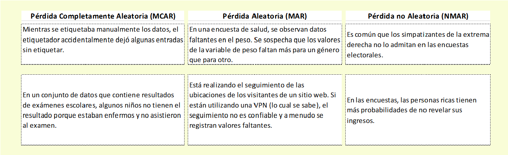

```{r setup, include=FALSE}
knitr::opts_chunk$set(echo = TRUE)
```


```{r}
rm(list = ls())
```

```{r, warning=FALSE, message=FALSE}
library(dplyr)
library(ggplot2)
biopics <- read.csv("~/edi_imp/datacamp_JB/handing/biopics.csv")
```


 
# Capítulo 1

Los datos faltantes son un problema común en los conjuntos de datos. El proceso de completar o rellenar los valores faltantes se conoce como imputación, y es una habilidad esencial para cualquiera que quiera producir predicciones precisas y destacarse del resto. En este curso, aprenderá a usar visualizaciones y pruebas estadísticas para reconocer patrones de datos faltantes, y a imputar datos utilizando una variedad de modelos estadísticos y de aprendizaje automático. También adquirirá habilidades para la toma de decisiones, lo que le ayudará a decidir qué método de imputación se adapta mejor a una situación particular. Por último, aprenderá a incorporar la incertidumbre de la imputación en su inferencia y predicciones, haciéndolos más robustos y confiables.

<iframe src="https://inechile-my.sharepoint.com/personal/jibustosm_ine_gob_cl/_layouts/15/embed.aspx?UniqueId=14c653a3-f98d-41fd-a74a-1080a6916067&embed=%7B%22ust%22%3Atrue%2C%22hv%22%3A%22CopyEmbedCode%22%7D&referrer=OneUpFileViewer&referrerScenario=EmbedDialog.Create" width="640" height="360" frameborder="0" scrolling="no" allowfullscreen title="Cap_1_s1.mp4"></iframe>

## Sesión 1

### Regresión lineal con datos incompletos

Los datos faltantes son un problema común y tratarlos de manera adecuada es extremadamente importante. Ignorar los puntos de datos faltantes o completarlos incorrectamente puede hacer que los modelos funcionen de maneras inesperadas y causar que las predicciones e inferencias estén sesgadas.

En este capítulo, trabajará con el conjunto de datos `biopics`. Contiene información sobre varias películas biográficas, incluyendo sus ingresos, características del tema y algunas otras variables. Sin embargo, algunos de los puntos de datos están faltando. Los datos originales vienen con el paquete R `fivethirtyeight`, pero en este curso, trabajará con una versión ligeramente preprocesada.

En este ejercicio, conocerá el conjunto de datos y ajustará un modelo de regresión lineal para explicar los ingresos de una película. ¡Comencemos!


### Actividad 

Muestra las primeras 10 observaciones de los datos `biopics` y familiarízate con las variables.

```{r}
# Print first 10 observations
head(biopics, 10)

# Get the number of missing values per variable
biopics %>%
	is.na() %>% 
	colSums()

# Fit linear regression to predict earnings
model_1 <- lm(earnings ~ country + year + sub_type, 
              data = biopics)

# Fit linear regression to predict earnings
model_2 <- lm(earnings ~ country + year + sub_type + sub_race, 
              data = biopics)

```

### Reconociendo los mecanismos de datos faltantes

En este ejercicio, se presentarán seis escenarios diferentes en los que faltan algunos datos. Intenta asignar a cada uno de ellos el mecanismo de datos faltantes más probable. Como recordatorio, aquí hay algunas pautas generales:

Si la razón de la falta de datos es puramente aleatoria, es MCAR.
Si la razón de la falta de datos puede explicarse por otra variable, es MAR.
Si la razón de la falta de datos depende del valor faltante en sí mismo, es MNAR.




### Prueba t para MAR: preparación de datos

¡Buen trabajo al clasificar los mecanismos de datos faltantes en el último ejercicio! De los tres, MAR es posiblemente el más importante de detectar, ya que muchos métodos de imputación asumen que los datos son MAR. Este ejercicio, por lo tanto, se centrará en la prueba de MAR.

Trabajarás con los datos familiares de `biopics`. El objetivo es probar si el número de valores faltantes en `earnings` difiere por género del sujeto. En este ejercicio, solo prepararás los datos para la prueba t. Primero, crearás una variable ficticia que indique la falta de datos en `earnings`. Luego, la dividirás por género filtrando los datos para mantener uno de los géneros y luego sacando la variable ficticia. Para filtrar, puede ser útil imprimir el `head()` de `biopics` en la consola y examinar la variable de género.


```{r}
# Create a dummy variable for missing earnings
biopics <- biopics %>% 
  mutate(missing_earnings = is.na(earnings))

# Pull the missing earnings dummy for males
missing_earnings_males <- biopics %>% 
  filter(sub_sex == "Male") %>% 
  pull(missing_earnings)

# Pull the missing earnings dummy for females
missing_earnings_females <- biopics %>% 
  filter(sub_sex == "Female") %>% 
  pull(missing_earnings)
```

### Prueba t para MAR: interpretación

En el ejercicio anterior, has preparado dos vectores con los valores faltantes de ingresos para cada género: missing_earnings_males y missing_earnings_females. Ambos están disponibles en tu espacio de trabajo. ¡Ahora puedes realizar la prueba t para verificar si sus medias difieren significativamente entre sí! ¡Realicemos algunas pruebas estadísticas serias!

```{r}
# Run the t-test
t.test(missing_earnings_males, missing_earnings_females)
```


## Sesión 2

<iframe src="https://inechile-my.sharepoint.com/personal/jibustosm_ine_gob_cl/_layouts/15/embed.aspx?UniqueId=2485fae1-8cf5-4218-9a43-cd2460aa6286&embed=%7B%22ust%22%3Atrue%2C%22hv%22%3A%22CopyEmbedCode%22%7D&referrer=OneUpFileViewer&referrerScenario=EmbedDialog.Create" width="640" height="360" frameborder="0" scrolling="no" allowfullscreen title="Cap1_s2.mp4"></iframe>

### Aggregation plot

El gráfico de agregación proporciona la respuesta a la pregunta básica que uno puede hacer sobre un conjunto de datos incompleto: ¿en qué combinaciones de variables faltan datos y con qué frecuencia? Es muy útil para obtener una visión general de alto nivel de los patrones de ausencia de datos. Por ejemplo, hace visible inmediatamente si hay alguna combinación de variables que faltan juntas con frecuencia, lo que podría sugerir alguna relación entre ellas.

En este ejercicio, primero dibujarás el gráfico de agregación para los datos de `biopics` y luego practicarás sacando conclusiones basadas en él. ¡Vamos a hacer algunos gráficos!

```{r}
# Load the VIM package
library(VIM)

# Draw an aggregation plot of biopics
biopics %>% 
	aggr(combined = TRUE, numbers = TRUE)
```

### Preguntas

Basado en el gráfico de agregación que acaba de crear, ¿cuál de las siguientes afirmaciones es falsa?

Posibles respuestas:

El 10% de las observaciones tienen valores faltantes tanto en `earnings` como en `sub_race`.

Hay más valores faltantes en `sub_race` que en `earnings`.

El 42% de las observaciones no tiene entradas faltantes.

Exactamente dos variables en los datos `biopics` tienen valores faltantes.

## Sesión 3

<iframe src="https://inechile-my.sharepoint.com/personal/jibustosm_ine_gob_cl/_layouts/15/embed.aspx?UniqueId=65581489-dcd4-45f7-9a04-b8de4c8ea862&embed=%7B%22ust%22%3Atrue%2C%22hv%22%3A%22CopyEmbedCode%22%7D&referrer=OneUpFileViewer&referrerScenario=EmbedDialog.Create" width="640" height="360" frameborder="0" scrolling="no" allowfullscreen title="Cap1_s3.mp4"></iframe>

### gráfico de Mosaico

El gráfico de agregación que has dibujado en el ejercicio anterior te dio una visión general de alto nivel de los datos faltantes. Si estás interesado en la interacción entre variables específicas, un gráfico de Mosaico es el camino a seguir. Te permite estudiar el porcentaje de valores faltantes en una variable para diferentes valores de la otra, lo cual es conceptualmente muy similar a los test t que has estado realizando en la lección anterior.

En este ejercicio, dibujarás un gráfico de Mosaico para investigar el porcentaje de datos faltantes en `earnings` para diferentes categorías de `sub_race`. ¿Hay más datos faltantes en `earnings` para algunas razas específicas del personaje principal de la película? ¡Vamos a descubrirlo! El paquete `VIM` ya ha sido cargado para ti.


```{r}
# Draw a spine plot to analyse missing values in earnings by sub_race

biopics %>% 
	dplyr::select(sub_race,earnings) %>%
	spineMiss()
```
### Preguntas

Basándose en la gráfica de Mosaico que acabas de crear, ¿cuál de las siguientes afirmaciones es falsa?

Opciones de respuesta:

En la gran mayoría de las películas, el personaje principal es blanco.

Cuando el sujeto principal es africano, es más probable que tengamos información completa sobre las ganancias.

En lo que respecta a las ganancias y la subraza, los datos parecen ser MAR.

La raza que aparece con menos frecuencia en los datos tiene alrededor del 40% de las ganancias faltantes. (incorrecta)

### Mosaic plot

La gráfica de Mosaico que has creado en el ejercicio anterior te permite estudiar los patrones de datos faltantes entre dos variables a la vez. Esta idea se generaliza a más variables en forma de un gráfico de mosaico.

En este ejercicio, comenzarás por crear una variable ficticia que indique si Estados Unidos participó en la producción de cada película. Para hacer esto, utilizarás la función `grepl()`, que verifica si la cadena pasada como su primer argumento está presente en el objeto pasado como su segundo argumento. Luego, dibujarás un gráfico de mosaico para ver si el género del sujeto se correlaciona con la cantidad de datos faltantes en `earnings` tanto para películas estadounidenses como no estadounidenses.

Los datos `biopics` y el paquete `VIM` ya están cargados para ti. ¡Vamos a hacer algunas gráficas exploratorias!

Ten en cuenta que se ha creado una función de propiedad `display_image()` para devolver la salida de la última versión del paquete `VIM`. Asegúrate de expandir la sección `Visor HTML`.


```{r}
# Prepare data for plotting and draw a mosaic plot
biopics %>%
	# Create a dummy variable for US-produced movies
	mutate(is_US_movie = grepl("US", country)) %>%
	# Draw mosaic plot
	mosaicMiss(highlight = "earnings", 
             plotvars = c("is_US_movie", "sub_sex"))

# Return plot from latest VIM package - expand the HTML viewer section
#display_image()
```
# Capítulo 2

## Sesión 1

<iframe src="https://inechile-my.sharepoint.com/personal/jibustosm_ine_gob_cl/_layouts/15/embed.aspx?UniqueId=f78f1a93-7207-4b6a-a12e-03b7aa0086ef&embed=%7B%22ust%22%3Atrue%2C%22hv%22%3A%22CopyEmbedCode%22%7D&referrer=OneUpFileViewer&referrerScenario=EmbedDialog.Create" width="640" height="360" frameborder="0" scrolling="no" allowfullscreen title="Cap2_s1.mp4"></iframe>

### Olfateando el peligro de la imputación media

Uno de los métodos de imputación más populares es la imputación media, en la cual los valores faltantes en una variable se reemplazan con la media de los valores observados en esta variable. Sin embargo, en muchos casos, este enfoque simple es una mala elección. A veces, una mirada rápida a los datos puede alertarte sobre los peligros de la imputación media.

En este capítulo, trabajarás con una submuestra de los datos del proyecto de Atmósfera Tropical Oceánica (`tao`). El conjunto de datos consiste en mediciones atmosféricas tomadas en dos períodos de tiempo diferentes en cinco ubicaciones distintas. Los datos vienen con el paquete `VIM`.

En este ejercicio, te familiarizarás con los datos y realizarás un análisis simple que indicará cuáles podrían ser las consecuencias de la imputación media. ¡Echemos un vistazo a los datos de `tao`!

```{r}
data(tao, package = "VIM")
names(tao)<-tolower(names(tao))
names(tao)<-sub("[.]", "_", names(tao))
names(tao)<-sub("[.]", "_", names(tao))

# Print first 10 observations
head(tao, 10)

# Get the number of missing values per column
tao %>%
  is.na() %>% 
  colSums()

# Calculate the number of missing values in air_temp per year
tao %>% 
  group_by(year) %>% 
  summarize(num_miss = sum(is.na(air_temp)))
```

### Imputación de la media en temperatura

Imputar la media en la temperatura puede ser arriesgado. Si la variable que se está imputando está correlacionada con otras variables, esta correlación podría ser destruida por los valores imputados. Lo viste en el ejercicio anterior cuando analizaste la variable `air_temp`.

Para averiguar si estas preocupaciones son válidas, en este ejercicio realizarás una imputación de la media en `air_temp`, creando también un indicador binario para mostrar dónde se imputan los valores. Será útil en el siguiente ejercicio, cuando evaluarás el desempeño de tu imputación. ¡Vamos a completar esos valores faltantes!

```{r}
tao_imp <- tao %>% 
  # Create a binary indicator for missing values in air_temp
  mutate(air_temp_imp = ifelse(is.na(air_temp), TRUE, FALSE)) %>%
  # Impute air_temp with its mean
  mutate(air_temp = ifelse(is.na(air_temp), mean(air_temp, na.rm = TRUE), air_temp))

# Print the first 10 rows of tao_imp
head(tao_imp, 10)
```

### Evaluar la calidad de la imputación con un gráfico de margen

En el último ejercicio, has imputado la media de `air_temp` y has agregado una variable indicadora para denotar cuáles valores fueron imputados, llamada `air_temp_imp`. Ahora es momento de ver qué tan bien funciona esto.

Al examinar los datos de `tao`, podrías haber notado que también contiene una variable llamada `sea_surface_temp`, que razonablemente se esperaría que esté positivamente correlacionada con `air_temp`. Si ese es el caso, esperarías que estas dos temperaturas sean altas o bajas al mismo tiempo. Imputar la temperatura media del aire cuando la temperatura del mar es alta o baja rompería esta relación.

Para averiguarlo, en este ejercicio seleccionarás las dos variables de temperatura y la variable indicadora y las usarás para dibujar un gráfico de margen. ¡Vamos a evaluar la imputación media!


```{r}
# Draw a margin plot of air_temp vs sea_surface_temp
tao_imp %>% 
  select(air_temp, sea_surface_temp, air_temp_imp) %>%
  marginplot(delimiter = "imp")
```

## Sesión 2

<iframe src="https://inechile-my.sharepoint.com/personal/jibustosm_ine_gob_cl/_layouts/15/embed.aspx?UniqueId=1cfa3390-9ab6-435c-a468-330f2b157ef9&embed=%7B%22ust%22%3Atrue%2C%22hv%22%3A%22CopyEmbedCode%22%7D&referrer=OneUpFileViewer&referrerScenario=EmbedDialog.Create" width="640" height="360" frameborder="0" scrolling="no" allowfullscreen title="Cap2_s2.mp4"></iframe>

### Vanilla hot-deck

La imputación por hot-deck es un método simple que reemplaza cada valor faltante en una variable por el último valor observado en esa variable. Es muy rápido, ya que solo se necesita una pasada por los datos, pero en su forma más simple, hot-deck a veces puede romper las relaciones entre las variables.

En este ejercicio, lo probarás en el conjunto de datos tao. Imputarás los valores faltantes en la columna de temperatura del aire `air_temp` por hot-deck y luego dibujarás un gráfico de margen para analizar la relación entre los valores imputados y la columna de temperatura de la superficie del mar `sea_surface_temp`. ¡Veamos cómo funciona!

```{r}
# Load VIM package
library(VIM)

# Impute air_temp in tao with hot-deck imputation
tao_imp <- hotdeck(tao, variable = "air_temp")

# Check the number of missing values in each variable
tao_imp %>% 
	is.na() %>% 
	colSums()

# Draw a margin plot of air_temp vs sea_surface_temp
tao_imp %>% 
	select(air_temp, sea_surface_temp, air_temp_imp) %>% 
	marginplot(delimiter = "imp")
```
 ¿Se ve bien la imputación? Observa las observaciones en la parte superior izquierda del gráfico con `air_temp` imputados y alta `sea_surface_temp`. Estas observaciones deben haber sido precedidas por observaciones con baja `air_temp` en el marco de datos, y por lo tanto, después de la imputación hot-deck, terminaron siendo valores atípicos con baja `air_temp` y alta `sea_surface_temp`.
 
### Hot-deck trucos y consejos I: imputando dentro de dominios

Un truco que puede ayudar cuando la imputación por hot-deck rompe las relaciones entre las variables es imputar dentro de dominios. Esto significa que si la variable a imputar está correlacionada con otra variable categórica, se puede ejecutar hot-deck por separado para cada una de sus categorías.

Por ejemplo, se podría esperar que la temperatura del aire dependa del tiempo, ya que estamos viendo que las temperaturas promedio aumentan debido al calentamiento global. El indicador de tiempo que tienes disponible en los datos de tao es una variable categórica, año. Primero, comprobaremos si la temperatura media del aire es diferente en cada uno de los dos años estudiados y luego ejecutaremos hot-deck dentro de los dominios de los años. Finalmente, volveremos a dibujar el gráfico de márgenes para evaluar el rendimiento de la imputación.

```{r}
# Calculate mean air_temp per year
tao %>% 
	group_by(year) %>% 
	summarize(average_air_temp = mean(air_temp, na.rm = TRUE))

# Hot-deck-impute air_temp in tao by year domain
tao_imp <- hotdeck(tao, variable = "air_temp", domain_var = "year")

# Draw a margin plot of air_temp vs sea_surface_temp
tao_imp %>% 
	select(air_temp, sea_surface_temp, air_temp_imp) %>% 
	marginplot(delimiter = "imp")
```
Los resultados se ven mucho mejor esta vez. Sin embargo, si observas la esquina superior derecha del gráfico, verás que la varianza en los valores imputados (naranja) es algo mayor que entre los valores observados (azul). ¡Veamos si podemos mejorar aún más en el próximo ejercicio!


### Hot-deck trucos y consejos II: ordenando por variables correlacionadas

Otro truco que puede mejorar el rendimiento de la imputación hot-deck es ordenar los datos por variables correlacionadas con la que queremos imputar.

Por ejemplo, en todos los gráficos de márgenes que ha estado dibujando recientemente, ha visto que la temperatura del aire está fuertemente correlacionada con la temperatura de la superficie del mar, lo cual tiene mucho sentido. Puede aprovechar este conocimiento para mejorar su imputación hot-deck. Si primero ordena los datos por sea_surface_temp, entonces cada valor imputado de air_temp vendrá de un donante con una sea_surface_temp similar. ¡Veamos cómo funcionará esto!

```{r}
# Hot-deck-impute air_temp in tao ordering by sea_surface_temp
tao_imp <- hotdeck(tao, variable = "air_temp", ord_var = "sea_surface_temp")

# Draw a margin plot of air_temp vs sea_surface_temp
tao_imp %>% 
	select(air_temp, sea_surface_temp, air_temp_imp) %>% 
	marginplot(delimiter = "imp")
```

Esta vez la imputación parece no afectar la relación entre las temperaturas del aire y la superficie del mar: si no fuera por los colores, probablemente no sabrías cuáles son los valores imputados. La imputación hot-deck, posiblemente mejorada con la imputación por dominios o el ordenamiento, es un método rápido y sencillo que puede funcionar bien en muchas situaciones. Sin embargo, a veces puede ser necesario un enfoque más complejo. 

## Sesión 3

<iframe src="https://inechile-my.sharepoint.com/personal/jibustosm_ine_gob_cl/_layouts/15/embed.aspx?UniqueId=87d51354-68c7-46ae-bbd9-4c0a35da474c&embed=%7B%22ust%22%3Atrue%2C%22hv%22%3A%22CopyEmbedCode%22%7D&referrer=OneUpFileViewer&referrerScenario=EmbedDialog.Create" width="640" height="360" frameborder="0" scrolling="no" allowfullscreen title="Cap2_s3.mp4"></iframe>

### Elegir el número de vecinos

La imputación de k-Nearest-Neighbors (o kNN) completa los valores faltantes en una observación en función de los valores que provienen de las k otras observaciones más similares a ella. El número de estas observaciones similares, llamadas vecinos, que se consideran es un parámetro que debe elegirse de antemano.

¿Cómo elegir k? Una forma es probar diferentes valores y ver cómo afectan las relaciones entre los datos imputados y observados.

Intentemos completar `humidity` en los datos de `tao` utilizando tres valores diferentes de k y ver cómo se ajustan los valores imputados a la relación entre `humidity` y `sea_surface_temp`.

Completar `humedad` con la imputación de kNN usando 30 vecinos y dibujar un `marginplot()` de `sea_surface_temp` vs `humidity`.

```{r}
# Impute humidity using 30 neighbors
tao_imp <- kNN(tao, k = 30, variable = "humidity")

# Draw a margin plot of sea_surface_temp vs humidity
tao_imp %>% 
	select(sea_surface_temp, humidity, humidity_imp) %>% 
	marginplot(delimiter = "imp", main = "k = 30")
```

Imputa `humidity` con imputación kNN usando 15 vecinos y dibujando `marginplot` de `sea_surface_temp` vs `humidity`.

```{r}
# Impute humidity using 15 neighbors
tao_imp <- kNN(tao, k = 15, variable = "humidity")

# Draw a margin plot of sea_surface_temp vs humidity
tao_imp %>% 
	select(sea_surface_temp, humidity, humidity_imp) %>% 
	marginplot(delimiter = "imp", main = "k = 15")
```

Imputa `humidity` con imputación kNN usando 5 vecinos y dibujando `marginplot` de `sea_surface_temp` vs `humidity`.


```{r}
# Impute humidity using 5 neighbors
tao_imp <- kNN(tao, k = 5, variable = "humidity")

# Draw a margin plot of sea_surface_temp vs humidity
tao_imp %>% 
	select(sea_surface_temp, humidity, humidity_imp) %>% 
	marginplot(delimiter = "imp", main = "k = 5")
```

### kNN trucos y consejos I: ponderando los donantes

Una variación de la imputación `kNN` que se aplica con frecuencia utiliza la llamada agregación ponderada por distancia. Lo que esto significa es que cuando agregamos los valores de los vecinos para obtener un reemplazo para un valor faltante, lo hacemos usando la media ponderada y las ponderaciones son las distancias invertidas de cada vecino. Como resultado, los vecinos más cercanos tienen más impacto en el valor imputado.

En este ejercicio, aplicarás la agregación ponderada por distancia mientras imputas los datos de `tao`. Esto solo requerirá pasar dos argumentos adicionales a la función `kNN()`. ¡Probémoslo!


```{r}
# Load the VIM package
library(VIM)

# Impute humidity with kNN using distance-weighted mean
tao_imp <- kNN(tao, 
               k = 5, 
               variable = "humidity", 
               numFun = weighted.mean,
               weightDist = TRUE)

tao_imp %>% 
	select(sea_surface_temp, humidity, humidity_imp) %>% 
	marginplot(delimiter = "imp")
```
### Trucos y consejos de kNN II: ordenar variables

Mientras el algoritmo de k-Nearest Neighbors recorre las variables en los datos para imputarlos, calcula las distancias entre observaciones utilizando otras variables, algunas de las cuales ya han sido imputadas en los pasos anteriores. Esto significa que si las variables ubicadas al principio de los datos tienen muchas valores faltantes, entonces el cálculo de la distancia posterior se basa en muchos valores imputados. Esto introduce ruido en el cálculo de la distancia.

Por esta razón, es una buena práctica ordenar las variables cada vez más por el número de valores faltantes antes de realizar la imputación kNN. De esta manera, cada cálculo de distancia se basa en tantos datos observados y tan pocos datos imputados como sea posible.

¡Vamos a probar esto en los datos de `tao`!

```{r}
# Get tao variable names sorted by number of NAs
vars_by_NAs <- tao %>%
  is.na() %>%
  colSums() %>%
  sort(decreasing = FALSE) %>% 
  names()

# Sort tao variables and feed it to kNN imputation
tao_imp <- tao %>% 
  select(vars_by_NAs) %>% 
  kNN(k= 5)

tao_imp %>% 
	select(sea_surface_temp, humidity, humidity_imp) %>% 
	marginplot(delimiter = "imp")
```
El kNN que acabas de programar debería ser más preciso y resistente a imputaciones defectuosas, así que recuerda ordenar tus variables primero antes de realizar la imputación con kNN. ¡Esto nos lleva al final de este capítulo! ¡Sigue adelante! ¡Nos vemos en el Capítulo 3, donde aprenderás a usar modelos estadísticos y de aprendizaje automático para imputar valores faltantes!

# Capítulo 3

## Sesión 1

<iframe src="https://inechile-my.sharepoint.com/personal/jibustosm_ine_gob_cl/_layouts/15/embed.aspx?UniqueId=97f92ec7-7bf2-4632-8ea2-c055fd31e269&embed=%7B%22ust%22%3Atrue%2C%22hv%22%3A%22CopyEmbedCode%22%7D&referrer=OneUpFileViewer&referrerScenario=EmbedDialog.Create" width="640" height="360" frameborder="0" scrolling="no" allowfullscreen title="Cap3_s1.mp4"></iframe>

### Imputación con regresión lineal

A veces, se puede utilizar el conocimiento del dominio, la investigación previa o simplemente el sentido común para describir las relaciones entre las variables en sus datos. En tales casos, la imputación basada en modelos es una gran solución, ya que le permite imputar cada variable de acuerdo con un modelo estadístico que puede especificar usted mismo, teniendo en cuenta cualquier suposición que pueda tener sobre cómo las variables impactan entre sí.

Para variables continuas, una elección de modelo popular es la regresión lineal. ¡No te restringe a relaciones lineales! Siempre puede incluir un cuadrado o un logaritmo de una variable en los predictores. En este ejercicio, trabajará con el paquete `simputation` para ejecutar una sola imputación de regresión lineal en los datos `tao` y analizar los resultados. ¡Vamos a intentarlo!


```{r, message=FALSE}
# Load the simputation package
library(simputation)

# Impute air_temp and humidity with linear regression
formula <- air_temp + humidity ~ year + latitude + sea_surface_temp
tao_imp <- impute_lm(tao, formula)
```


```{r}
# Load the simputation package
library(simputation)

# Impute air_temp and humidity with linear regression
formula <- air_temp + humidity ~ year + latitude + sea_surface_temp
tao_imp <- impute_lm(tao, formula)

# Check the number of missing values per column
tao_imp %>% 
  is.na() %>% 
  colSums()

# Print rows of tao_imp in which air_temp or humidity are still missing 
tao_imp %>% 
  filter(is.na(air_temp) | is.na(humidity))
```

La regresión lineal falla cuando al menos uno de los predictores está ausente. En este caso, fue `sea_surface_temp`. En el próximo ejercicio, lo solucionarás inicializando los valores faltantes antes de ejecutar `impute_lm()`.


### Inicialización de valores perdidos e iteración sobre variables

Como acabas de ver, la ejecución de `impute_lm()` podría no llenar todos los valores perdidos. Para asegurarte de imputar todos ellos, deberías inicializar los valores perdidos con un método simple, como la imputación de hot-deck que aprendiste en el capítulo anterior, que simplemente retroalimenta el último valor observado.

Además, una sola imputación generalmente no es suficiente. Se basa en los valores iniciales básicos y podría estar sesgada. Un enfoque adecuado es iterar sobre las variables, imputándolas una a la vez en las ubicaciones donde originalmente faltaban.

En este ejercicio, primero inicializarás los valores perdidos con la imputación de hot-deck y luego iterarás cinco veces sobre `air_temp` y `humidity` de los datos `tao` para imputarlos con regresión lineal. ¡Manos a la obra!


```{r}
# Initialize missing values with hot-deck
tao_imp <- hotdeck(tao)

# Create boolean masks for where air_temp and humidity are missing
missing_air_temp <- tao_imp$air_temp_imp
missing_humidity <- tao_imp$humidity_imp

for (i in 1:5) {
  # Set air_temp to NA in places where it was originally missing and re-impute it
  tao_imp$air_temp[missing_air_temp] <- NA
  tao_imp <- impute_lm(tao_imp, air_temp ~ year + latitude + sea_surface_temp + humidity)
  # Set humidity to NA in places where it was originally missing and re-impute it
  tao_imp$humidity[missing_humidity] <- NA
  tao_imp <- impute_lm(tao_imp, humidity ~ year + latitude + sea_surface_temp + air_temp)
}
```
¡Esa es una aproximación profesional a la imputación basada en modelos que acabas de codificar! Pero, ¿cómo sabemos que 5 es el número adecuado de iteraciones para ejecutar? ¡Veamos la convergencia en el siguiente ejercicio!


### Detectando convergencia

¡Excelente trabajo iterando sobre las variables en el ejercicio anterior! ¿Pero cuántas iteraciones son necesarias? Cuando los valores imputados no cambian con la nueva iteración, podemos detenernos.

Ahora extenderás tu código para calcular las diferencias entre las variables imputadas en las iteraciones subsiguientes. Para hacer esto, usarás la función de cambio porcentual absoluto promedio, definida para ti de la siguiente manera:

`mapc <- function(a, b) {
  mean(abs(b - a) / a, na.rm = TRUE)
}`

`mapc()` es una función que te devuelve un solo número que te dice cuánto difiere b de a. La usarás para verificar cuánto cambian las variables imputadas en las iteraciones siguientes. En base a esto, decidirás cuántas iteraciones son necesarias.

Las máscaras booleanas `missing_air_temp` y `missing_humidity` están disponibles para ti, al igual que los datos de `tao_imp` inicializados con hot-deck.


```{r}
mapc<- function(a, b) {
  mean(abs(b - a) / a, na.rm = TRUE)
}

```

```{r}
diff_air_temp <- c()
diff_humidity <- c()

for (i in 1:5) {
  # Assign the outcome of the previous iteration (or initialization) to prev_iter
  prev_iter <- tao_imp
  # Impute air_temp and humidity at originally missing locations
  tao_imp$air_temp[missing_air_temp] <- NA
  tao_imp <- impute_lm(tao_imp, air_temp ~ year + latitude + sea_surface_temp + humidity)
  tao_imp$humidity[missing_humidity] <- NA
  tao_imp <- impute_lm(tao_imp, humidity ~ year + latitude + sea_surface_temp + air_temp)
  # Calculate MAPC for air_temp and humidity and append them to previous iteration's MAPCs
  diff_air_temp <- c(diff_air_temp, mapc(prev_iter$air_temp, tao_imp$air_temp))
  diff_humidity <- c(diff_humidity, mapc(prev_iter$humidity, tao_imp$humidity))
}
```

### Question

Based on the differences stored in `diff_air_temp` and `diff_humidity`, what is the sufficient number of iterations to run?

To answer this question, you can print the two vectors in the console and analyze the numbers, or plot them using the function provided for you: just run `plot_diffs(diff_air_temp, diff_humidity)` in the console.


```{r}
plot_diffs <- function(a, b) {
  data.frame("mapc" = c(a, b),
             "Variable" = c(rep("air_temp", length(a)),
                            rep("humidity", length(b))),
             "Iterations" = c(1:length(a), 1:length(b))) %>% 
    ggplot(aes(Iterations, mapc, color = Variable)) +
    geom_line(size = 1.5) +
    ylab("Mean absolute percentage change") +
    ggtitle("Changes in imputed variables' values across iterations") +
    theme(legend.position = "bottom")
}
```


```{r}
plot_diffs(diff_air_temp, diff_humidity)
```
## Sesión 2

<iframe src="https://inechile-my.sharepoint.com/personal/jibustosm_ine_gob_cl/_layouts/15/embed.aspx?UniqueId=d15f9bf6-7ddf-433d-b6e8-f00faafa283e&embed=%7B%22ust%22%3Atrue%2C%22hv%22%3A%22CopyEmbedCode%22%7D&referrer=OneUpFileViewer&referrerScenario=EmbedDialog.Create" width="640" height="360" frameborder="0" scrolling="no" allowfullscreen title="video (35).mp4"></iframe>

###imputación de regresión logística

Una opción popular para imputar variables binarias es la regresión logística. Desafortunadamente, no hay una función similar a `impute_lm()` que lo haga. ¡Por eso escribirás una función tú mismo!

Llamemos a la función `impute_logreg()`. Su primer argumento será un marco de datos `df`, cuyos valores faltantes se han inicializado y solo contiene valores faltantes en la columna a imputar. El segundo argumento será una fórmula para el modelo de regresión logística.

La función hará lo siguiente:

Mantendrá las ubicaciones de los valores faltantes.

Construirá el modelo.

Realizará predicciones.

Reemplazará los valores faltantes con las predicciones.

No te preocupes por la línea que crea `imp_var` - esto es solo una forma de extraer el nombre de la columna a imputar de la fórmula. ¡Vamos a hacer algo de programación funcional!

```{r}
impute_logreg <- function(df, formula) {
  # Extract name of response variable
  imp_var <- as.character(formula[2])
  # Save locations where the response is missing
  missing_imp_var <- is.na(df[imp_var])
  # Fit logistic regression mode
  logreg_model <- glm(formula, data = df, family = binomial)
  # Predict the response and convert it to 0s and 1s
  preds <- predict(logreg_model, type = "response")
  preds <- ifelse(preds >= 0.5, 1, 0)
  # Impute missing values with predictions
  df[missing_imp_var, imp_var] <- preds[missing_imp_var]
  return(df)
}
```

La función que escribiste está completamente operativa y se puede enchufar en el bucle sobre las variables que viste en el capítulo anterior, al igual que `impute_lm()` del paquete `simputation`. Pronto, combinarás estos dos para imputar tanto variables continuas como binarias. Pero antes, mejoraremos tu `impute_logreg()` para que reproduzca mejor la variabilidad en los datos imputados.


### Dibujando desde una distribución condicional

Simplemente llamar a `predict()` en un modelo siempre devolverá el mismo valor para los mismos valores de los predictores. Esto da como resultado una pequeña variabilidad en los datos imputados. Para aumentarla y que la imputación replique la variabilidad de los datos originales, podemos extraer de la distribución condicional. Esto significa que en lugar de siempre predecir 1 cuando el modelo devuelve una probabilidad mayor que 0,5, podemos extraer la predicción de una distribución binomial descrita por la probabilidad devuelta por el modelo.

Trabajarás en el código que escribiste en el ejercicio anterior. La siguiente línea fue eliminada:

`preds <- ifelse(preds >= 0.5, 1, 0)`

Tu tarea es llenar su lugar con la creación de una distribución binomial. ¡Eso es solo una línea de código!

```{r}
 impute_logreg <- function(df, formula) {
  # Extract name of response variable
  imp_var <- as.character(formula[2])
  # Save locations where the response is missing
  missing_imp_var <- is.na(df[imp_var])
  # Fit logistic regression mode
  logreg_model <- glm(formula, data = df, family = binomial)
  # Predict the response
  preds <- predict(logreg_model, type = "response")
  # Sample the predictions from binomial distribution
  # preds <- ifelse(preds >= 0.5, 1, 0)
  preds <- rbinom(length(preds), size = 1, prob = preds)
  # Impute missing values with predictions
  df[missing_imp_var, imp_var] <- preds[missing_imp_var]
  return(df)
}
```

Dibujar la distribución condicional hará que la variabilidad de los datos imputados sea más similar a la del conjunto de datos observados originales. Con esta potente función en tus manos, ahora estás listo para diseñar un flujo de imputación basado en modelos que se encargue tanto de variables continuas como binarias. ¡Vamos a hacerlo en el siguiente ejercicio!

### Imputación basada en modelos con varios tipos de variables

¡Buen trabajo al escribir la función para implementar la imputación de regresión logística con dibujo de la distribución condicional! ¡Has codificado estadísticas bastante avanzadas! En este ejercicio, combinarás lo que has aprendido hasta ahora sobre imputación basada en modelos para imputar diferentes tipos de variables en los datos de tao.

Tu tarea es iterar sobre las variables como lo has hecho en el capítulo anterior e imputar dos variables:

`is_hot`, una nueva variable binaria que se creó a partir de `air_temp`, que es 1 si `air_temp` está a 26 grados o más y 0 de lo contrario;
`humidity`, una variable continua con la que ya estás familiarizado.
Tendrás que utilizar la función de regresión lineal que aprendiste antes, así como tu propia función para la regresión logística. ¡Vamos a ello!


```{r}
tao$is_hot<-ifelse(tao$air_temp>= 26, 1,0)
```


```{r}
# Initialize missing values with hot-deck
tao_imp <- hotdeck(tao)

# Create boolean masks for where is_hot and humidity are missing
missing_is_hot <- tao_imp$is_hot_imp
missing_humidity <- tao_imp$humidity_imp

for (i in 1:3) {
  # Set is_hot to NA in places where it was originally missing and re-impute it
  tao_imp$is_hot[missing_is_hot] <- NA
  tao_imp <- impute_logreg(tao_imp, is_hot ~ sea_surface_temp)
  # Set humidity to NA in places where it was originally missing and re-impute it
  tao_imp$humidity[missing_humidity] <- NA
  tao_imp <- impute_lm(tao_imp, humidity ~ sea_surface_temp + air_temp)
}
```

## Sesión 3

<iframe src="https://inechile-my.sharepoint.com/personal/jibustosm_ine_gob_cl/_layouts/15/embed.aspx?UniqueId=96468941-b396-4307-9514-a983b777a51a&embed=%7B%22ust%22%3Atrue%2C%22hv%22%3A%22CopyEmbedCode%22%7D&referrer=OneUpFileViewer&referrerScenario=EmbedDialog.Create" width="640" height="360" frameborder="0" scrolling="no" allowfullscreen title="Cap3_s3.mp4"></iframe>

### Imputación con bosques aleatorios

Un enfoque de aprendizaje automático para la imputación puede ser más preciso y más fácil de implementar en comparación con modelos estadísticos tradicionales. Primero, no requiere que especifiques relaciones entre variables. Además, los modelos de aprendizaje automático como los bosques aleatorios son capaces de descubrir relaciones altamente complejas y no lineales y explotarlas para predecir valores faltantes.

En este ejercicio, te familiarizarás con el paquete `missForest`, que construye un bosque aleatorio separado para predecir valores faltantes para cada variable, uno por uno. Llamarás a la función de imputación en los datos de películas biográficas, `biopics`, con los que has trabajado anteriormente en el curso y luego extraerás los datos completos, así como los errores de imputación estimados.

¡Plantemos algunos bosques aleatorios!
```{r}
biopics <- read.csv("~/edi_imp/datacamp_JB/handing/biopics.csv")
# Load the missForest package
library(missForest)

# Impute biopics data using missForest
imp_res <- missForest(biopics)

# Extract imputed data and check for missing values
imp_data <- imp_res$ximp
print(sum(is.na(imp_data)))

# Extract and print imputation errors
imp_err <- imp_res$OOBerror
print(imp_err)
```

### Variable-wise imputation errors

En el ejercicio anterior has extraído los errores de imputación estimados a partir de la salida de `missForest`. Esto te dio dos números:

el error cuadrático medio raíz normalizado (NRMSE) para todas las variables continuas;
la proporción de entradas falsamente clasificadas (PFC) para todas las variables categóricas.
Sin embargo, ¡podría darse el caso de que el modelo de imputación funcione muy bien para una variable continua y muy mal para otra! Para diagnosticar tales casos, basta con decirle a `missForest` que produzca estimaciones de error por variable. Esto se hace estableciendo el argumento `variablewise` en `TRUE`.

¡Los datos `biopics` y el paquete `missForest` ya han sido cargados para ti, así que echemos un vistazo más de cerca a los errores!


```{r}
# Impute biopics data with missForest computing per-variable errors
imp_res <- missForest(biopics, variablewise = TRUE)

# Extract and print imputation errors
per_variable_errors <- imp_res$OOBerror
print(per_variable_errors)

# Rename errors' columns to include variable names
names(per_variable_errors) <- paste(names(biopics), 
                                    names(per_variable_errors),
                                    sep = "_")

# Print the renamed errors
print(per_variable_errors)
```
Observa cómo produjiste una serie de medidas de error en lugar de las dos por defecto que has visto antes. ¡Ahora puedes evaluar la calidad de imputación para cada variable por separado! Esto es útil cuando necesitas saber cómo se desempeña el modelo para una variable en particular que deseas modelar o analizar más a fondo.

### Compromiso velocidad-precisión

En el último video, has visto que hay dos perillas que puedes ajustar para influir en el rendimiento de los bosques aleatorios:

Número de árboles de decisión en cada bosque.
Número de variables utilizadas para la división dentro de los árboles de decisión.
Aumentar cada uno de ellos puede mejorar la precisión del modelo de imputación, pero también requerirá más tiempo para ejecutarse. En este ejercicio, explorarás estas ideas por ti mismo ajustando `missForest()` a los datos de `biopics` dos veces con diferentes configuraciones. Mientras sigues las instrucciones, presta atención a los errores que imprimirás y al tiempo que tomará la ejecución del código.

```{r}
# Set number of trees to 5 and number of variables used for splitting to 2
imp_res <- missForest(biopics, mtry = 2, ntree = 5)

# Print the resulting imputation errors
print(imp_res$OOBerror)
```

```{r}
# Set number of trees to 50 and number of variables used for splitting to 6
imp_res <- missForest(biopics, mtry = 6, ntree = 50)

# Print the resulting imputation errors
print(imp_res$OOBerror)
```
Compara los errores y los tiempos de ejecución de los dos modelos de imputación. ¿Puedes ver una relación? Como dicen, "no hay nada gratuito". Para obtener una imputación más precisa, tuviste que invertir más tiempo de computación. ¡Felicitaciones por terminar el capítulo! Nos vemos en el capítulo final, donde aprenderás a incorporar la incertidumbre de la imputación en tus análisis y predicciones.

# Capítulo 4

## Sesión 1

<iframe src="https://inechile-my.sharepoint.com/personal/jibustosm_ine_gob_cl/_layouts/15/embed.aspx?UniqueId=ace0869c-215f-44e0-86f8-a7d69b3464c6&embed=%7B%22ust%22%3Atrue%2C%22hv%22%3A%22CopyEmbedCode%22%7D&referrer=OneUpFileViewer&referrerScenario=EmbedDialog.Create" width="640" height="360" frameborder="0" scrolling="no" allowfullscreen title="Cap4_s1.mp4"></iframe>

### Envolver la imputación y el modelado en una función

Siempre que realice cualquier análisis o modelado en datos imputados, debe tener en cuenta la incertidumbre de la imputación. Ejecutar un modelo en un conjunto de datos imputados solo una vez ignora el hecho de que la imputación estima los valores faltantes con incertidumbre. Los errores estándar de dicho modelo tienden a ser demasiado pequeños. La solución a esto es la imputación múltiple y una forma de implementarla es mediante el bootstrap.

En los próximos ejercicios, trabajará con los datos familiares de `biopics`. El objetivo es utilizar la imputación múltiple mediante bootstrap y la regresión lineal para ver si, en función de los datos disponibles, las películas biográficas con mujeres ganan menos que las de hombres.

Comencemos escribiendo una función que cree una muestra de bootstrap, la impute y ajuste un modelo de regresión lineal.

```{r}
calc_gender_coef <- function(data, indices) {
  # Get bootstrap sample
  data_boot <- data[indices, ]
  # Impute with kNN imputation
  data_imp <- kNN(data_boot, k = 5)
  # Fit linear regression
  linear_model <- lm(earnings ~ sub_sex + sub_type + year, data = data_imp)
  # Extract and return gender coefficient
  gender_coefficient <- coef(linear_model)[2]
  return(gender_coefficient)
}
```

La función `calc_gender_coef()` que acabas de programar toma los datos y los índices de bootstrap como entradas, y produce nuestra estadística de interés: el impacto del género en las ganancias de la regresión lineal. ¡Ahora puedes usar esta función en el algoritmo de bootstrapping!

### Corriendo con bootstrap

Buen trabajo escribiendo `calc_gender_coef()` en el último ejercicio! Esta función crea una muestra de bootstrap, la imputa y produce el coeficiente de regresión lineal que describe el impacto de que el tema de la película sea femenino en las ganancias de la película.

En este ejercicio, usarás el paquete `boot` para obtener una distribución de bootstrap de estos coeficientes. La propagación de esta distribución capturará la incertidumbre de la imputación. También verás cómo la distribución de bootstrap difiere de una imputación y regresión de una sola vez. ¡Vamos a hacer un poco de bootstrapping!


```{r}
# Load the boot library
library(boot)

# Run bootstrapping on biopics data
boot_results <- boot(biopics, statistic = calc_gender_coef, R = 50)

# Print and plot bootstrapping results
print(boot_results)
plot(boot_results)
```

¡Excelente bootstrapping! Si hubieras ejecutado la imputación `kNN` y el análisis de regresión en los datos de `biopics` solo una vez, habrías obtenido un coeficiente de -1.45 para las películas sobre mujeres (llamado "original" en la salida de la consola), lo que sugiere que las películas sobre mujeres ganan menos. Sin embargo, al corregir la incertidumbre de la imputación, ¡has obtenido una distribución que cubre tanto valores negativos como positivos!


### Bootstrapping intervalos de confianza

Después de haber generado la distribución del coeficiente del efecto femenino en el último ejercicio, ahora puedes usarla para estimar un intervalo de confianza. Esto te permitirá hacer la siguiente evaluación sobre tus datos: "Dada la incertidumbre de la imputación, estamos 95% seguros de que el efecto femenino en las ganancias se encuentra entre a y b", donde a y b son los límites inferior y superior del intervalo.

En el último ejercicio, ejecutaste la técnica de bootstrapping con `R = 50` réplicas. Sin embargo, en la mayoría de las aplicaciones esto no es suficiente. En este ejercicio, puedes utilizar los `boot_results` que se prepararon para ti utilizando 1000 réplicas. Primero, verás si la distribución de bootstrapping parece normal. Si es así, entonces podrás confiar en la distribución normal para calcular el intervalo de confianza.

```{r}
# Run bootstrapping on biopics data
#boot_results <- boot(biopics, statistic = calc_gender_coef, R = 1000)
```


```{r}
# Plot and print boot_results
plot(boot_results)
print(boot_results)

# Calculate and print confidence interval
boot_ci <- boot.ci(boot_results, conf = 0.95, type = "norm")
print(boot_ci)
```

A pesar de que la tendencia general parece ser una relación negativa, las réplicas de bootstrap muestran que algunas películas con protagonistas femeninas en realidad ganan más. Al tener en cuenta la incertidumbre de la imputación, no se puede estar al 100% seguro acerca de la dirección de esta relación, aunque un análisis único sugiera lo contrario.


## Sesión 2

<iframe src="https://inechile-my.sharepoint.com/personal/jibustosm_ine_gob_cl/_layouts/15/embed.aspx?UniqueId=2198a22f-9dde-4980-9acf-f27a7ed5b5c7&embed=%7B%22ust%22%3Atrue%2C%22hv%22%3A%22CopyEmbedCode%22%7D&referrer=OneUpFileViewer&referrerScenario=EmbedDialog.Create" width="640" height="360" frameborder="0" scrolling="no" allowfullscreen title="Cap4_s2.mp4"></iframe>

### El flujo de MICE: mice - with - pool

El flujo de `MICE` (imputación múltiple por ecuaciones encadenadas) nos permite estimar la incertidumbre de la imputación mediante la imputación de un conjunto de datos varias veces mediante la imputación basada en modelos, mientras se extrae de las distribuciones condicionales. De esta manera, cada conjunto de datos imputados es ligeramente diferente. Luego, se realiza un análisis en cada uno de ellos y se combinan los resultados, obteniendo las cantidades de interés junto con sus intervalos de confianza que reflejan la incertidumbre de la imputación.

En este ejercicio, practicarás el flujo típico de `MICE`: `mice()` - `with()` - `pool()`. Realizarás un análisis de regresión en los datos de `biopics` para ver qué tipo de ocupación de sujeto, `sub_type`, está asociada con mayores ingresos en películas. ¡Juguemos con `MICE`!


```{r}
# Load mice package
library(mice)

# Impute biopics with mice using 5 imputations
biopics_multiimp <- mice(biopics, m = 5, seed = 3108)

# Fit linear regression to each imputed data set 
lm_multiimp <- with(biopics_multiimp, lm(earnings ~ year + sub_type))

# Pool and summarize regression results
lm_pooled <- pool(lm_multiimp)
summary(lm_pooled, conf.int = TRUE, conf.level = 0.95)
```

En este caso, has seguido el flujo "mice-with-pool" para imputar, modelar y agrupar los resultados. Ahora, echa un vistazo a la salida en la consola: algunos `sub_types` tienen un impacto positivo en las ganancias. Sin embargo, al tener en cuenta la incertidumbre de la imputación con una confianza del 95%, nunca estamos seguros de estos efectos, ¡ya que los límites inferiores son negativos! Con una excepción: para `sub_typeAthlete / military`, tanto los límites inferiores como los superiores son positivos. Lo que podemos decir con seguridad es que ¡las películas sobre atletas militares son populares!


### Selección de modelos por defecto

MICE crea un modelo de imputación separado para cada variable en los datos. El tipo de modelo depende del tipo de variable en cuestión. Una forma popular de especificar los tipos de modelos que queremos usar es establecer un modelo predeterminado para cada uno de los cuatro tipos de variables.

Puede hacer esto pasando el argumento defaultMethod a `mice()`, que debe ser un vector de longitud 4 que contenga los métodos de imputación predeterminados para:

Variables continuas,
Variables binarias,
Variables categóricas (factores no ordenados),
Variables factoriales (factores ordenados).

En este ejercicio, aprovechará la documentación de mice para ver la lista de métodos disponibles y seleccionar los deseados para que el algoritmo los use. ¡Vamos a hacer selección de modelos!


```{r}
# Impute biopics using the methods specified in the instruction
biopics_multiimp <- mice(biopics, m = 20, 
                         defaultMethod = c("cart", "lda", "pmm", "polr"))

# Print biopics_multiimp
print(biopics_multiimp)
```

La capacidad de especificar modelos de imputación puede resultar útil cuando se observa que algunos métodos específicos no funcionan bien. Otro factor que influye en cómo funcionan los métodos de imputación es el conjunto de predictores que utilizan. En el siguiente ejercicio, veremos cómo establecer estos predictores.


### Usando una matriz predictora

Se trata de tomar decisiones importantes cuando se utiliza la imputación basada en modelos, como por ejemplo, qué variables deben incluirse como predictores y en qué modelos. En `mice()`, esto se rige por la matriz de predictores y, por defecto, todas las variables se utilizan para imputar todas las demás.

En caso de tener muchas variables en los datos o poco tiempo para realizar una selección adecuada del modelo, puede utilizar la funcionalidad de `mice` para crear una matriz de predictores basada en las correlaciones entre las variables. Esta matriz se puede pasar entonces a `mice()`. En este ejercicio, practicará exactamente esto: primero construirá una matriz de predictores de modo que cada variable se impute utilizando las variables más correlacionadas con ella; luego, alimentará su matriz de predictores a la función de imputación. ¡Vamos a intentar esta simple selección de modelos!

```{r}
# Create predictor matrix with minimum correlation of 0.1
pred_mat <- quickpred(biopics, mincor = 0.1)

# Impute biopics with mice
biopics_multiimp <- mice(biopics, 
                         m = 10, 
                         predictorMatrix = pred_mat,
                         seed = 3108)

# Print biopics_multiimp
print(biopics_multiimp)
```
## Sesión 3

<iframe src="https://inechile-my.sharepoint.com/personal/jibustosm_ine_gob_cl/_layouts/15/embed.aspx?UniqueId=187b8e2e-460d-490d-a02d-f9ccda959327&embed=%7B%22ust%22%3Atrue%2C%22hv%22%3A%22CopyEmbedCode%22%7D&referrer=OneUpFileViewer&referrerScenario=EmbedDialog.Create" width="640" height="360" frameborder="0" scrolling="no" allowfullscreen title="Cap4_s3.mp4"></iframe>

### Analizando los patrones de datos faltantes

El primer paso para trabajar con datos incompletos es obtener información sobre los patrones de ausencia de datos, y una buena manera de hacerlo es mediante visualizaciones. Comenzarás tu análisis de los datos de `África` empleando el paquete `VIM` para crear dos visualizaciones: el gráfico de agregación y el gráfico de Mosaico. Te dirán cuántos datos faltan, en qué variables y configuraciones, y si podemos decir algo sobre el mecanismo de ausencia de datos. ¡Comencemos con algunas gráficas!


```{r}
africa <- read.csv("~/edi_imp/datacamp_JB/handing/africa.csv", sep = ";")
```


```{r}
# Load VIM
library(VIM)


# Draw a combined aggregation plot of africa
africa %>%
  aggr(combined = TRUE, numbers = TRUE)
```

```{r}
# Draw a spine plot of country vs trade
africa %>% 
  select(country, trade) %>%
  spineMiss()
```

#### Pregunta

Basándose en el gráfico de Mosaico que acaba de crear, ¿cuál de las siguientes afirmaciones es VERDADERA?

Posibles respuestas

1. Hay más datos faltantes en el comercio para Camerún que para Burundi.

2. Hay más datos faltantes en `gdp_pc` para Burundi que para Camerún.

3. No hay ningún país con más del 20% de valores faltantes en comercio.

Correcto, ¡no hay tantos valores faltantes! Además, observe en el gráfico de Mosaico que los datos de África parecen ser MAR - al menos con respecto al PIB y al país, lo que significa que se pueden imputar.

###Imputando e inspeccionando resultados 

¡Buen trabajo al visualizar los datos faltantes en el ejercicio anterior! Ha descubierto que hay algunas entradas faltantes en el PIB, `gdp_pc`, y en el comercio como porcentaje del PIB, comercio. Además, sospecha que los datos son MAR, por lo que se pueden imputar. En este ejercicio, hará uso de la imputación múltiple del paquete `mice` para imputar los datos de `africa`. Luego, dibujará un gráfico de tiras de` gdp_pc` vs `trade` para ver si los datos imputados no rompen la relación entre estas variables. ¡Deje que mice haga el trabajo!


```{r}
# Load mice
library(mice)

# Impute africa with mice
africa_multiimp <- mice(africa, m = 5, defaultMethod = "cart", seed = 3108)

# Draw a stripplot of gdp_pc versus trade
stripplot(africa_multiimp, gdp_pc ~ trade | .imp, pch = 20, cex = 1)
```

Se observa que la imputación funciona bien: hay pequeños grupos en los gráficos de dispersión, que probablemente corresponden a diferentes países. Cada punto de datos imputado encaja en uno de los grupos, en lugar de ser un valor atípico en algún lugar entre los grupos. Después de haber realizado la imputación, ¡ahora puedes proceder con el modelado!


### Inferencia con datos imputados

En el último ejercicio, has utilizado `mice` para imputar los datos de `africa`. En este, implementarás los otros dos pasos del flujo de "mice - with - pool" que has aprendido anteriormente en el curso. El modelo de interés es una regresión lineal que explica el PIB, `gdp_pc`, con otras variables. Te interesa particularmente el coeficiente de libertades civiles, `civlib`. ¿Está más libertad asociada con un mayor crecimiento económico una vez que incorporamos la incertidumbre de la imputación? ¡Descubrámoslo!

```{r}
# Fit linear regression to each imputed data set
lm_multiimp <- with(africa_multiimp, lm(gdp_pc ~ country + year + trade + infl + civlib))

# Pool regression results
lm_pooled <- pool(lm_multiimp)

# Summarize pooled results
summary(lm_pooled, conf.int = TRUE, conf.level = 0.9)
```

#### Pregunta

Basándose en el resumen de los resultados de la regresión agrupada que acaba de imprimir en la consola, ¿cuál de las siguientes afirmaciones sobre las libertades civiles en África es falsa?

Respuestas posibles

1. En promedio, más libertad está asociada con un PIB más alto.

2. Hay un 5% de probabilidad de que el coeficiente de civlib en la regresión de gdp_pc sea mayor que 342.154078.

3. Basado en el intervalo de confianza del 90%, estamos seguros de que el impacto de civlib en gdp_pc es positivo.

Correcto, ¡esta es falsa! Dado que los límites inferior y superior tienen signos diferentes, no podemos estar seguros de la dirección del efecto. Felicitaciones, has recorrido un largo camino y aprendido mucho. ¡Bien hecho! Resumamos todo en el último video del curso.


# Comentarios finales

<iframe src="https://inechile-my.sharepoint.com/personal/jibustosm_ine_gob_cl/_layouts/15/embed.aspx?UniqueId=c73c5f54-742e-4805-86a6-d4641279c64f&embed=%7B%22ust%22%3Atrue%2C%22hv%22%3A%22CopyEmbedCode%22%7D&referrer=OneUpFileViewer&referrerScenario=EmbedDialog.Create" width="640" height="360" frameborder="0" scrolling="no" allowfullscreen title="Cap4_s4.mp4"></iframe>


1. Observaciones finales
¡Felicidades por llegar hasta el final del curso! Recapitulemos lo que has aprendido.

2. Lo que sabes
En el Capítulo 1, viste cómo modelar datos incompletos puede ser problemático y que requiere un tratamiento especial. También aprendiste acerca de los tres mecanismos de datos faltantes y cómo obtener información sobre los patrones de datos faltantes mediante visualizaciones del paquete VIM y pruebas estadísticas. En el Capítulo 2, cubrimos la imputación basada en donantes. Primero, viste por qué la imputación media es típicamente una mala elección. Luego, aprendiste a utilizar la imputación de hot-deck y kNN del paquete VIM, junto con algunos trucos que hacen que funcionen aún mejor.

3. Lo que sabes
En el Capítulo 3, aprendiste el enfoque de imputación basado en modelos de hacer un bucle sobre variables e imputarlas hasta la convergencia. También viste cómo aumentar la variabilidad de los datos imputados dibujando de distribuciones condicionales. Finalmente, aprendiste acerca de la imputación basada en árboles con el paquete missForest. En el Capítulo 4, viste dos métodos para incorporar la incertidumbre de la imputación en el modelado: el bootstrapping utilizando el paquete boot y la imputación múltiple mediante ecuaciones encadenadas utilizando el paquete mice.

4. ¿Qué método de imputación elegir?
Aprendiste sobre muchos métodos diferentes de imputación. ¿Cuál elegir y cuándo? Aquí hay algunas pautas generales. Si tienes muchos datos o si tu imputación debe ejecutarse en tiempo real en producción, es mejor usar hot-deck rápido. Si sospechas relaciones específicas entre las variables basadas en el conocimiento del dominio, puedes usar este conocimiento en la imputación basada en modelos. De lo contrario, si la imputación no necesita ser muy rápida y las relaciones entre las variables no son obvias, un enfoque de aprendizaje automático como kNN o imputación basada en árboles es tu mejor opción.

5. ¿Cómo estimar la incertidumbre de la imputación?
También aprendiste sobre dos métodos para estimar la incertidumbre de la imputación: bootstrapping y mice. ¿Cuál elegir? Una vez más, permíteme ofrecer algunas pautas generales. Si tu aplicación debe ser relativamente rápida o si tienes ideas sobre qué modelos usar y cómo especificarlos, entonces mice es la mejor opción. De lo contrario, si deseas utilizar un método no paramétrico como kNN o hot-deck, o simplemente no quieres preocuparte por los supuestos de modelos específicos, el bootstrap podría ser una mejor opción.

6. Siguientes pasos
Una última cosa antes de que te vayas. Si deseas profundizar aún más en el conocimiento de la imputación, te sugiero que busques en Google "miceVignettes". Los autores del paquete "mice" proporcionan una serie de seis viñetas con código R y ejemplos que abordan temas como la imputación pasiva, el post-procesamiento de datos imputados, la imputación de datos multinivel o el análisis de sensibilidad. Si absorbes fácilmente el conocimiento de los libros, entonces "Flexible Imputation of Missing Data" de Stef van Buuren es una lectura obligatoria. También utiliza el paquete "mice". Finalmente, hay otros excelentes paquetes de R que vale la pena explorar y que no tuvimos tiempo de cubrir en este curso, como Amelia o mi, que permiten la imputación de series de tiempo y datos de panel.

7. ¡Felicidades y buena suerte!
Una vez más, felicidades por terminar el curso y gracias por acompañarme. Espero que el conocimiento y las habilidades que has adquirido te faciliten el trabajo con datos incompletos y te hagan más productivo. ¡Buena suerte!